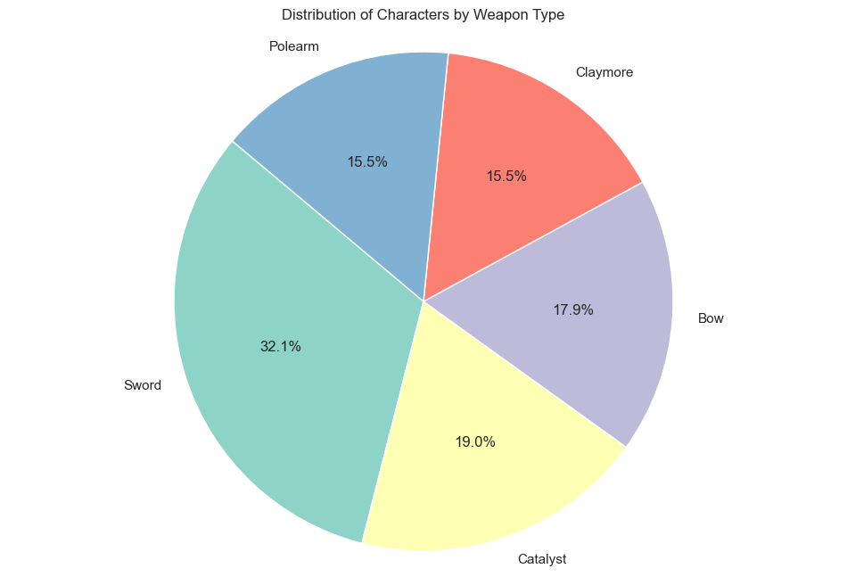
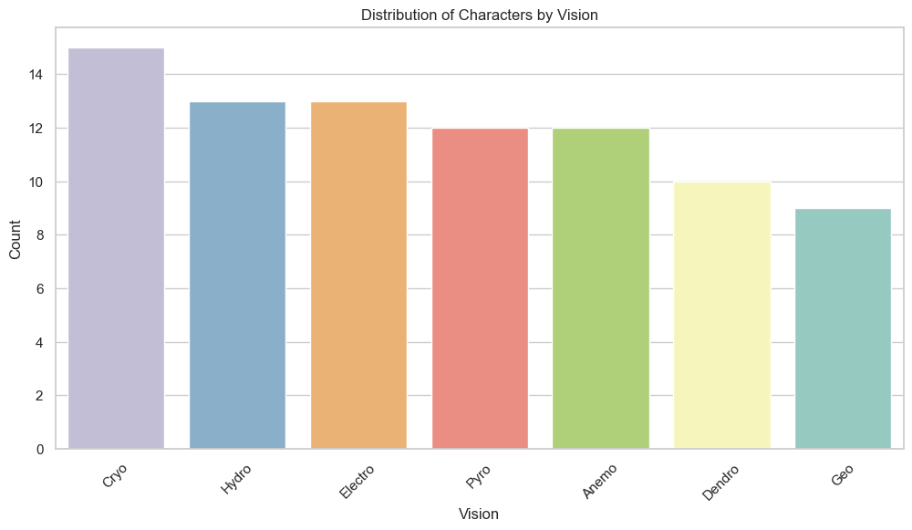
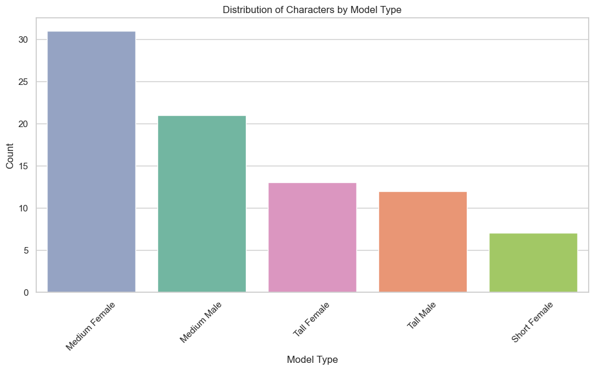
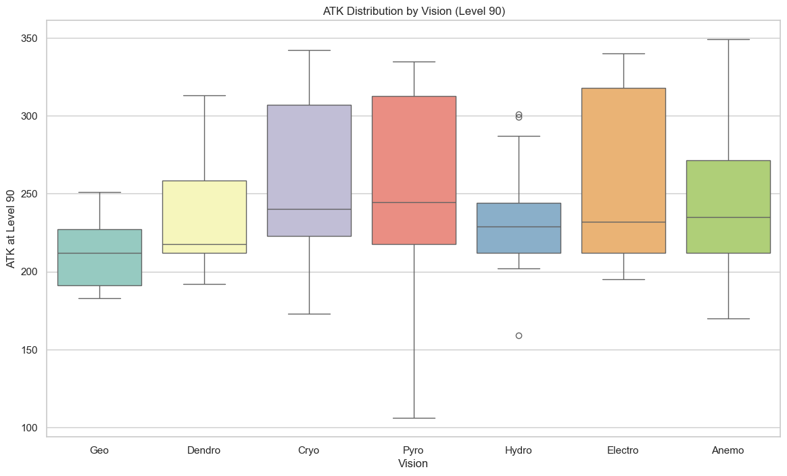
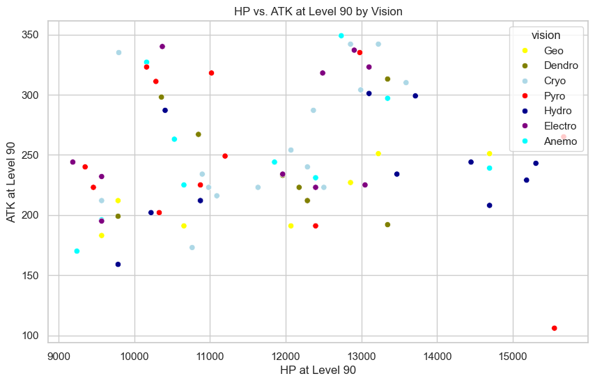
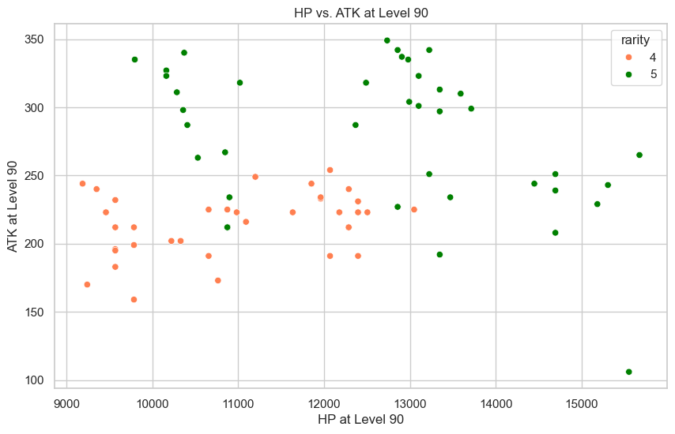

# Assignment 3: A Baby Project
## Genshin Dataset
### Student: Anh Le Vi Luong


```python
# Showcasing all of what is within the dataset. 
import pandas as pd
pd.set_option('display.max_rows', None)
pd.set_option('display.max_columns', None)
```


```python
genshin = pd.read_csv('genshin.csv', encoding='latin1')
(genshin)
```


<div>
<style scoped>
    .dataframe tbody tr th:only-of-type {
        vertical-align: middle;
    }

    .dataframe tbody tr th {
        vertical-align: top;
    }

    .dataframe thead th {
        text-align: right;
    }
</style>
<table border="1" class="dataframe">
  <thead>
    <tr style="text-align: right;">
      <th></th>
      <th>character_name</th>
      <th>rarity</th>
      <th>region</th>
      <th>vision</th>
      <th>arkhe</th>
      <th>weapon_type</th>
      <th>model</th>
      <th>constellation</th>
      <th>birthday</th>
      <th>special_dish</th>
      <th>affiliation</th>
      <th>release_date</th>
      <th>limited</th>
      <th>voice_eng</th>
      <th>voice_cn</th>
      <th>voice_jp</th>
      <th>voice_kr</th>
      <th>ascension</th>
      <th>ascension_specialty</th>
      <th>ascension_material</th>
      <th>ascension_boss</th>
      <th>talent_material</th>
      <th>talent_book_1-2</th>
      <th>talent_book_2-3</th>
      <th>talent_book_3-4</th>
      <th>talent_book_4-5</th>
      <th>talent_book_5-6</th>
      <th>talent_book_6-7</th>
      <th>talent_book_7-8</th>
      <th>talent_book_8-9</th>
      <th>talent_book_9-10</th>
      <th>talent_weekly</th>
      <th>hp_90_90</th>
      <th>atk_90_90</th>
      <th>def_90_90</th>
      <th>hp_80_90</th>
      <th>atk_80_90</th>
      <th>def_80_90</th>
      <th>hp_80_80</th>
      <th>atk_80_80</th>
      <th>def_80_80</th>
      <th>hp_70_80</th>
      <th>atk_70_80</th>
      <th>def_70_80</th>
      <th>hp_70_70</th>
      <th>atk_70_70</th>
      <th>def_70_70</th>
      <th>hp_60_70</th>
      <th>atk_60_70</th>
      <th>def_60_70</th>
      <th>hp_60_60</th>
      <th>atk_60_60</th>
      <th>def_60_60</th>
      <th>hp_50_60</th>
      <th>atk_50_60</th>
      <th>def_50_60</th>
      <th>hp_50_50</th>
      <th>atk_50_50</th>
      <th>def_50_50</th>
      <th>hp_40_50</th>
      <th>atk_40_50</th>
      <th>def_40_50</th>
      <th>hp_40_40</th>
      <th>atk_40_40</th>
      <th>def_40_40</th>
      <th>hp_20_40</th>
      <th>atk_20_40</th>
      <th>def_20_40</th>
      <th>hp_20_20</th>
      <th>atk_20_20</th>
      <th>def_20_20</th>
      <th>hp_1_20</th>
      <th>atk_1_20</th>
      <th>def_1_20</th>
      <th>spsecial_0</th>
      <th>special_1</th>
      <th>special_2</th>
      <th>special_3</th>
      <th>special_4</th>
      <th>special_5</th>
      <th>special_6</th>
    </tr>
  </thead>
  <tbody>
    <tr>
      <th>0</th>
      <td>Albedo</td>
      <td>5</td>
      <td>Mondstadt</td>
      <td>Geo</td>
      <td>NaN</td>
      <td>Sword</td>
      <td>Medium Male</td>
      <td>Princeps Cretaceus</td>
      <td>13-Sep</td>
      <td>Woodland Dream</td>
      <td>Knights of Favonius</td>
      <td>12/23/20</td>
      <td>True</td>
      <td>Khoi Dao</td>
      <td>Mace</td>
      <td>Kenji Nojima (????)</td>
      <td>Kim Myung-jun (???)</td>
      <td>Geo DMG Bonus</td>
      <td>Cecilia</td>
      <td>Divining Scroll</td>
      <td>Basalt Pillar</td>
      <td>Divining Scroll</td>
      <td>Teachings of Ballad</td>
      <td>Guide to Ballad</td>
      <td>Guide to Ballad</td>
      <td>Guide to Ballad</td>
      <td>Guide to Ballad</td>
      <td>Philosophies of Ballad</td>
      <td>Philosophies of Ballad</td>
      <td>Philosophies of Ballad</td>
      <td>Philosophies of Ballad</td>
      <td>Tusk of Monoceros Caeli</td>
      <td>13226</td>
      <td>251</td>
      <td>876</td>
      <td>12296</td>
      <td>233</td>
      <td>815</td>
      <td>11669</td>
      <td>222</td>
      <td>773</td>
      <td>10746</td>
      <td>204</td>
      <td>712</td>
      <td>10119</td>
      <td>192</td>
      <td>670</td>
      <td>9207</td>
      <td>175</td>
      <td>610</td>
      <td>8579</td>
      <td>163</td>
      <td>568</td>
      <td>7675</td>
      <td>146</td>
      <td>508</td>
      <td>6839</td>
      <td>130</td>
      <td>453</td>
      <td>5944</td>
      <td>113</td>
      <td>394</td>
      <td>5317</td>
      <td>101</td>
      <td>352</td>
      <td>3554</td>
      <td>68</td>
      <td>235</td>
      <td>2671</td>
      <td>51</td>
      <td>177</td>
      <td>1030</td>
      <td>20</td>
      <td>68</td>
      <td>0.0%</td>
      <td>0.0%</td>
      <td>7.2%</td>
      <td>14.4%</td>
      <td>14.4%</td>
      <td>21.6%</td>
      <td>28.8%</td>
    </tr>
    <tr>
      <th>1</th>
      <td>Alhaitham</td>
      <td>5</td>
      <td>Sumeru</td>
      <td>Dendro</td>
      <td>NaN</td>
      <td>Sword</td>
      <td>Tall Male</td>
      <td>Vultur Volans</td>
      <td>11-Feb</td>
      <td>Ideal Circumstance</td>
      <td>Sumeru Akademiya</td>
      <td>01/18/23</td>
      <td>True</td>
      <td>Nazeeh Tarsha</td>
      <td>Yang Chaoran (???)</td>
      <td>Umehara Yuuichirou (?? ???)</td>
      <td>Jun Seung Hwa (???)</td>
      <td>Dendro DMG Bonus</td>
      <td>Sand Grease Pupa</td>
      <td>Faded Red Satin</td>
      <td>Pseudo-Stamens</td>
      <td>Faded Red Satin</td>
      <td>Teachings of Ingenuity</td>
      <td>Guide to Ingenuity</td>
      <td>Guide to Ingenuity</td>
      <td>Guide to Ingenuity</td>
      <td>Guide to Ingenuity</td>
      <td>Philosophies of Ingenuity</td>
      <td>Philosophies of Ingenuity</td>
      <td>Philosophies of Ingenuity</td>
      <td>Philosophies of Ingenuity</td>
      <td>Mirror of Mushin</td>
      <td>13348</td>
      <td>313</td>
      <td>781</td>
      <td>12409</td>
      <td>291</td>
      <td>726</td>
      <td>11776</td>
      <td>276</td>
      <td>689</td>
      <td>10845</td>
      <td>254</td>
      <td>635</td>
      <td>10212</td>
      <td>239</td>
      <td>598</td>
      <td>9291</td>
      <td>218</td>
      <td>544</td>
      <td>8658</td>
      <td>203</td>
      <td>507</td>
      <td>7746</td>
      <td>181</td>
      <td>453</td>
      <td>6902</td>
      <td>162</td>
      <td>404</td>
      <td>5999</td>
      <td>140</td>
      <td>351</td>
      <td>5366</td>
      <td>125</td>
      <td>314</td>
      <td>3586</td>
      <td>84</td>
      <td>210</td>
      <td>2695</td>
      <td>63</td>
      <td>157</td>
      <td>1039</td>
      <td>24</td>
      <td>60</td>
      <td>0.0%</td>
      <td>0.0%</td>
      <td>7.2%</td>
      <td>14.4%</td>
      <td>14.4%</td>
      <td>21.6%</td>
      <td>28.8%</td>
    </tr>
    <tr>
      <th>2</th>
      <td>Aloy</td>
      <td>5</td>
      <td>NaN</td>
      <td>Cryo</td>
      <td>NaN</td>
      <td>Bow</td>
      <td>Medium Female</td>
      <td>Nora Fortis</td>
      <td>4-Apr</td>
      <td>Satiety Gel</td>
      <td>Wandering Heroine</td>
      <td>09/01/21</td>
      <td>NaN</td>
      <td>Giselle Fernandez</td>
      <td>Mufei (??)</td>
      <td>Ayahi Takagaki (?? ??)</td>
      <td>Jo Hyeon-jeong (???)</td>
      <td>Cryo DMG Bonus</td>
      <td>Crystal Marrow</td>
      <td>Spectral Husk</td>
      <td>Crystalline Bloom</td>
      <td>Spectral Husk</td>
      <td>Teachings of Freedom</td>
      <td>Guide to Freedom</td>
      <td>Guide to Freedom</td>
      <td>Guide to Freedom</td>
      <td>Guide to Freedom</td>
      <td>Philosophies of Freedom</td>
      <td>Philosophies of Freedom</td>
      <td>Philosophies of Freedom</td>
      <td>Philosophies of Freedom</td>
      <td>Molten Moment</td>
      <td>10899</td>
      <td>234</td>
      <td>676</td>
      <td>10133</td>
      <td>217</td>
      <td>629</td>
      <td>9616</td>
      <td>206</td>
      <td>597</td>
      <td>8856</td>
      <td>190</td>
      <td>550</td>
      <td>8339</td>
      <td>179</td>
      <td>517</td>
      <td>7587</td>
      <td>163</td>
      <td>471</td>
      <td>7070</td>
      <td>152</td>
      <td>439</td>
      <td>6325</td>
      <td>136</td>
      <td>393</td>
      <td>5636</td>
      <td>121</td>
      <td>350</td>
      <td>4899</td>
      <td>105</td>
      <td>304</td>
      <td>4382</td>
      <td>94</td>
      <td>272</td>
      <td>2928</td>
      <td>63</td>
      <td>182</td>
      <td>2201</td>
      <td>47</td>
      <td>137</td>
      <td>848</td>
      <td>18</td>
      <td>53</td>
      <td>0.0%</td>
      <td>0.0%</td>
      <td>7.2%</td>
      <td>14.4%</td>
      <td>14.4%</td>
      <td>21.6%</td>
      <td>28.8%</td>
    </tr>
    <tr>
      <th>3</th>
      <td>Amber</td>
      <td>4</td>
      <td>Mondstadt</td>
      <td>Pyro</td>
      <td>NaN</td>
      <td>Bow</td>
      <td>Medium Female</td>
      <td>Lepus</td>
      <td>10-Aug</td>
      <td>Outrider's Champion Steak!</td>
      <td>Knights of Favonius</td>
      <td>09/28/20</td>
      <td>False</td>
      <td>Kelly Baskin</td>
      <td>Shujin Cai (???)</td>
      <td>Manaka Iwami (?????)</td>
      <td>Kim Yeon-woo (???)</td>
      <td>ATK</td>
      <td>Small Lamp Grass</td>
      <td>Firm Arrowhead</td>
      <td>Everflame Seed</td>
      <td>Firm Arrowhead</td>
      <td>Teachings of Freedom</td>
      <td>Guide to Freedom</td>
      <td>Guide to Freedom</td>
      <td>Guide to Freedom</td>
      <td>Guide to Freedom</td>
      <td>Philosophies of Freedom</td>
      <td>Philosophies of Freedom</td>
      <td>Philosophies of Freedom</td>
      <td>Philosophies of Freedom</td>
      <td>Dvalin's Sigh</td>
      <td>9461</td>
      <td>223</td>
      <td>601</td>
      <td>8806</td>
      <td>208</td>
      <td>559</td>
      <td>8385</td>
      <td>198</td>
      <td>532</td>
      <td>7730</td>
      <td>182</td>
      <td>491</td>
      <td>7309</td>
      <td>172</td>
      <td>464</td>
      <td>6654</td>
      <td>157</td>
      <td>422</td>
      <td>6233</td>
      <td>147</td>
      <td>396</td>
      <td>5578</td>
      <td>131</td>
      <td>354</td>
      <td>5016</td>
      <td>118</td>
      <td>318</td>
      <td>4361</td>
      <td>103</td>
      <td>277</td>
      <td>3940</td>
      <td>93</td>
      <td>250</td>
      <td>2630</td>
      <td>62</td>
      <td>167</td>
      <td>2038</td>
      <td>48</td>
      <td>129</td>
      <td>793</td>
      <td>19</td>
      <td>50</td>
      <td>0.0%</td>
      <td>0.0%</td>
      <td>6.0%</td>
      <td>12.0%</td>
      <td>12.0%</td>
      <td>18.0%</td>
      <td>24.0%</td>
    </tr>
    <tr>
      <th>4</th>
      <td>Arataki Itto</td>
      <td>5</td>
      <td>Inazuma</td>
      <td>Geo</td>
      <td>NaN</td>
      <td>Claymore</td>
      <td>Tall Male</td>
      <td>Taurus Iracundus</td>
      <td>1-Jun</td>
      <td>Way of the Strong</td>
      <td>Arataki Gang</td>
      <td>12/14/21</td>
      <td>True</td>
      <td>Max Mittelman</td>
      <td>Zhaokun Liu (???)</td>
      <td>Takanori Nishikawa (????)</td>
      <td>Song Joon-seok (???)</td>
      <td>CRIT Rate</td>
      <td>Onikabuto</td>
      <td>Slime Condensate</td>
      <td>Riftborn Regalia</td>
      <td>Slime Condensate</td>
      <td>Teachings of Elegance</td>
      <td>Guide to Elegance</td>
      <td>Guide to Elegance</td>
      <td>Guide to Elegance</td>
      <td>Guide to Elegance</td>
      <td>Philosophies of Elegance</td>
      <td>Philosophies of Elegance</td>
      <td>Philosophies of Elegance</td>
      <td>Philosophies of Elegance</td>
      <td>Ashen Heart</td>
      <td>12858</td>
      <td>227</td>
      <td>959</td>
      <td>11954</td>
      <td>211</td>
      <td>892</td>
      <td>11345</td>
      <td>199</td>
      <td>846</td>
      <td>10448</td>
      <td>185</td>
      <td>779</td>
      <td>9838</td>
      <td>174</td>
      <td>734</td>
      <td>8951</td>
      <td>158</td>
      <td>668</td>
      <td>8341</td>
      <td>147</td>
      <td>622</td>
      <td>7462</td>
      <td>132</td>
      <td>557</td>
      <td>6649</td>
      <td>117</td>
      <td>496</td>
      <td>5779</td>
      <td>102</td>
      <td>431</td>
      <td>5170</td>
      <td>91</td>
      <td>386</td>
      <td>3455</td>
      <td>61</td>
      <td>258</td>
      <td>2597</td>
      <td>46</td>
      <td>194</td>
      <td>1001</td>
      <td>18</td>
      <td>75</td>
      <td>0.0%</td>
      <td>0.0%</td>
      <td>4.8%</td>
      <td>9.6%</td>
      <td>9.6%</td>
      <td>14.4%</td>
      <td>19.2%</td>
    </tr>
    <tr>
      <th>5</th>
      <td>Baizhu</td>
      <td>5</td>
      <td>Liyue</td>
      <td>Dendro</td>
      <td>NaN</td>
      <td>Catalyst</td>
      <td>Tall Male</td>
      <td>Lagenaria</td>
      <td>25-Apr</td>
      <td>Heat-Quelling Soup</td>
      <td>Bubu Pharmacy</td>
      <td>05/02/23</td>
      <td>True</td>
      <td>Sean Durrie, Xanthe Huynh</td>
      <td>Qin Qiege (???), Wang Xiaotong (???)</td>
      <td>Yusa Koji (?? ??), Shoji Yui (????)</td>
      <td>Lee Hosan (???), Changsheng: Jang Mi (??)</td>
      <td>HP</td>
      <td>Violetgrass</td>
      <td>Fungal Spores</td>
      <td>Evergloom Ring</td>
      <td>Fungal Spores</td>
      <td>Teachings of Gold</td>
      <td>Guide to Gold</td>
      <td>Guide to Gold</td>
      <td>Guide to Gold</td>
      <td>Guide to Gold</td>
      <td>Philosophies of Gold</td>
      <td>Philosophies of Gold</td>
      <td>Philosophies of Gold</td>
      <td>Philosophies of Gold</td>
      <td>Worldspan Fern</td>
      <td>13348</td>
      <td>192</td>
      <td>499</td>
      <td>12409</td>
      <td>179</td>
      <td>464</td>
      <td>11776</td>
      <td>169</td>
      <td>440</td>
      <td>10845</td>
      <td>156</td>
      <td>405</td>
      <td>10212</td>
      <td>147</td>
      <td>382</td>
      <td>9291</td>
      <td>134</td>
      <td>347</td>
      <td>8658</td>
      <td>124</td>
      <td>324</td>
      <td>7746</td>
      <td>111</td>
      <td>289</td>
      <td>6902</td>
      <td>99</td>
      <td>258</td>
      <td>5999</td>
      <td>86</td>
      <td>224</td>
      <td>5366</td>
      <td>77</td>
      <td>200</td>
      <td>3586</td>
      <td>51</td>
      <td>134</td>
      <td>2695</td>
      <td>38</td>
      <td>100</td>
      <td>1039</td>
      <td>14</td>
      <td>38</td>
      <td>0.0%</td>
      <td>0.0%</td>
      <td>7.2%</td>
      <td>14.4%</td>
      <td>14.4%</td>
      <td>21.6%</td>
      <td>28.8%</td>
    </tr>
    <tr>
      <th>6</th>
      <td>Barbara</td>
      <td>4</td>
      <td>Mondstadt</td>
      <td>Hydro</td>
      <td>NaN</td>
      <td>Catalyst</td>
      <td>Medium Female</td>
      <td>Crater</td>
      <td>5-Jul</td>
      <td>Spicy Stew</td>
      <td>Church of Favonius</td>
      <td>09/28/20</td>
      <td>False</td>
      <td>Laura Stahl</td>
      <td>Yuanyuan Song (???)</td>
      <td>Akari Kit? (????)</td>
      <td>Yun Ah-yeong (???)</td>
      <td>HP</td>
      <td>Philanemo Mushroom</td>
      <td>Divining Scroll</td>
      <td>Cleansing Heart</td>
      <td>Divining Scroll</td>
      <td>Teachings of Freedom</td>
      <td>Guide to Freedom</td>
      <td>Guide to Freedom</td>
      <td>Guide to Freedom</td>
      <td>Guide to Freedom</td>
      <td>Philosophies of Freedom</td>
      <td>Philosophies of Freedom</td>
      <td>Philosophies of Freedom</td>
      <td>Philosophies of Freedom</td>
      <td>Ring of Boreas</td>
      <td>9787</td>
      <td>159</td>
      <td>669</td>
      <td>9110</td>
      <td>148</td>
      <td>623</td>
      <td>8674</td>
      <td>141</td>
      <td>593</td>
      <td>7996</td>
      <td>130</td>
      <td>546</td>
      <td>7561</td>
      <td>123</td>
      <td>517</td>
      <td>6884</td>
      <td>112</td>
      <td>470</td>
      <td>6448</td>
      <td>105</td>
      <td>441</td>
      <td>5770</td>
      <td>94</td>
      <td>394</td>
      <td>5189</td>
      <td>84</td>
      <td>355</td>
      <td>4512</td>
      <td>73</td>
      <td>308</td>
      <td>4076</td>
      <td>66</td>
      <td>279</td>
      <td>2721</td>
      <td>44</td>
      <td>186</td>
      <td>2108</td>
      <td>34</td>
      <td>144</td>
      <td>821</td>
      <td>13</td>
      <td>56</td>
      <td>0.0%</td>
      <td>0.0%</td>
      <td>6.0%</td>
      <td>12.0%</td>
      <td>12.0%</td>
      <td>18.0%</td>
      <td>24.0%</td>
    </tr>
    <tr>
      <th>7</th>
      <td>Beidou</td>
      <td>4</td>
      <td>Liyue</td>
      <td>Electro</td>
      <td>NaN</td>
      <td>Claymore</td>
      <td>Tall Female</td>
      <td>Victor Mare</td>
      <td>14-Feb</td>
      <td>Flash-Fried Filet</td>
      <td>The Crux</td>
      <td>09/28/20</td>
      <td>False</td>
      <td>Allegra Clark</td>
      <td>Yajing Tang (???)</td>
      <td>Ami Koshimizu (?????)</td>
      <td>Jeong Yoo-mi (???)</td>
      <td>Electro DMG Bonus</td>
      <td>Noctilucous Jade</td>
      <td>Treasure Hoarder Insignia</td>
      <td>Lightning Prism</td>
      <td>Treasure Hoarder Insignia</td>
      <td>Teachings of Gold</td>
      <td>Guide to Gold</td>
      <td>Guide to Gold</td>
      <td>Guide to Gold</td>
      <td>Guide to Gold</td>
      <td>Philosophies of Gold</td>
      <td>Philosophies of Gold</td>
      <td>Philosophies of Gold</td>
      <td>Philosophies of Gold</td>
      <td>Dvalin's Sigh</td>
      <td>13050</td>
      <td>225</td>
      <td>648</td>
      <td>12146</td>
      <td>210</td>
      <td>603</td>
      <td>11565</td>
      <td>200</td>
      <td>575</td>
      <td>10662</td>
      <td>184</td>
      <td>530</td>
      <td>10081</td>
      <td>174</td>
      <td>501</td>
      <td>9178</td>
      <td>158</td>
      <td>456</td>
      <td>8597</td>
      <td>148</td>
      <td>427</td>
      <td>7694</td>
      <td>133</td>
      <td>382</td>
      <td>6919</td>
      <td>119</td>
      <td>344</td>
      <td>6015</td>
      <td>104</td>
      <td>299</td>
      <td>5435</td>
      <td>94</td>
      <td>270</td>
      <td>3628</td>
      <td>63</td>
      <td>180</td>
      <td>2811</td>
      <td>48</td>
      <td>140</td>
      <td>1094</td>
      <td>19</td>
      <td>54</td>
      <td>0.0%</td>
      <td>0.0%</td>
      <td>6.0%</td>
      <td>12.0%</td>
      <td>12.0%</td>
      <td>18.0%</td>
      <td>24.0%</td>
    </tr>
    <tr>
      <th>8</th>
      <td>Bennett</td>
      <td>4</td>
      <td>Mondstadt</td>
      <td>Pyro</td>
      <td>NaN</td>
      <td>Sword</td>
      <td>Medium Male</td>
      <td>Rota Calamitas</td>
      <td>1-Feb</td>
      <td>Teyvat Charred Egg</td>
      <td>Adventurers' Guild</td>
      <td>09/28/20</td>
      <td>False</td>
      <td>Cristina Vee Valenzuela</td>
      <td>Xueting Mu (???)</td>
      <td>Ry?ta ?saka (????)</td>
      <td>Song Ha-rim (???)</td>
      <td>Energy Recharge</td>
      <td>Windwheel Aster</td>
      <td>Treasure Hoarder Insignia</td>
      <td>Everflame Seed</td>
      <td>Treasure Hoarder Insignia</td>
      <td>Teachings of Resistance</td>
      <td>Guide to Resistance</td>
      <td>Guide to Resistance</td>
      <td>Guide to Resistance</td>
      <td>Guide to Resistance</td>
      <td>Philosophies of Resistance</td>
      <td>Philosophies of Resistance</td>
      <td>Philosophies of Resistance</td>
      <td>Philosophies of Resistance</td>
      <td>Dvalin's Plume</td>
      <td>12397</td>
      <td>191</td>
      <td>771</td>
      <td>11539</td>
      <td>178</td>
      <td>718</td>
      <td>10987</td>
      <td>169</td>
      <td>684</td>
      <td>10129</td>
      <td>156</td>
      <td>630</td>
      <td>9577</td>
      <td>148</td>
      <td>596</td>
      <td>8719</td>
      <td>134</td>
      <td>542</td>
      <td>8168</td>
      <td>126</td>
      <td>508</td>
      <td>7309</td>
      <td>113</td>
      <td>455</td>
      <td>6573</td>
      <td>101</td>
      <td>409</td>
      <td>5715</td>
      <td>88</td>
      <td>356</td>
      <td>5163</td>
      <td>80</td>
      <td>321</td>
      <td>3447</td>
      <td>53</td>
      <td>214</td>
      <td>2670</td>
      <td>41</td>
      <td>166</td>
      <td>1039</td>
      <td>16</td>
      <td>65</td>
      <td>0.0%</td>
      <td>0.0%</td>
      <td>6.7%</td>
      <td>13.3%</td>
      <td>13.3%</td>
      <td>20.0%</td>
      <td>26.7%</td>
    </tr>
    <tr>
      <th>9</th>
      <td>Candace</td>
      <td>4</td>
      <td>Sumeru</td>
      <td>Hydro</td>
      <td>NaN</td>
      <td>Polearm</td>
      <td>Tall Female</td>
      <td>Sagitta Scutum</td>
      <td>3-May</td>
      <td>Utmost Care</td>
      <td>Aaru Village</td>
      <td>09/28/22</td>
      <td>False</td>
      <td>Shara Kirby</td>
      <td>Zhang Qi (??)</td>
      <td>Yuzuki Ryoka (?? ??)</td>
      <td>Jeon Yeongsu (???)</td>
      <td>HP</td>
      <td>Redcrest</td>
      <td>Faded Red Satin</td>
      <td>Light Guiding Tetrahedron</td>
      <td>Faded Red Satin</td>
      <td>Teachings of Admonition</td>
      <td>Guide to Admonition</td>
      <td>Guide to Admonition</td>
      <td>Guide to Admonition</td>
      <td>Guide to Admonition</td>
      <td>Philosophies of Admonition</td>
      <td>Philosophies of Admonition</td>
      <td>Philosophies of Admonition</td>
      <td>Philosophies of Admonition</td>
      <td>Tears of the Calamitous God</td>
      <td>10874</td>
      <td>212</td>
      <td>682</td>
      <td>10121</td>
      <td>197</td>
      <td>635</td>
      <td>9637</td>
      <td>188</td>
      <td>604</td>
      <td>8884</td>
      <td>173</td>
      <td>557</td>
      <td>8400</td>
      <td>164</td>
      <td>527</td>
      <td>7648</td>
      <td>149</td>
      <td>480</td>
      <td>7164</td>
      <td>139</td>
      <td>449</td>
      <td>6411</td>
      <td>125</td>
      <td>402</td>
      <td>5766</td>
      <td>112</td>
      <td>361</td>
      <td>5012</td>
      <td>97</td>
      <td>314</td>
      <td>4528</td>
      <td>88</td>
      <td>284</td>
      <td>3023</td>
      <td>59</td>
      <td>189</td>
      <td>2342</td>
      <td>45</td>
      <td>147</td>
      <td>911</td>
      <td>17</td>
      <td>57</td>
      <td>0.0%</td>
      <td>0.0%</td>
      <td>6.0%</td>
      <td>12.0%</td>
      <td>12.0%</td>
      <td>18.0%</td>
      <td>24.0%</td>
    </tr>
    <tr>
      <th>10</th>
      <td>Charlotte</td>
      <td>4</td>
      <td>Fontaine</td>
      <td>Cryo</td>
      <td>Pneuma</td>
      <td>Catalyst</td>
      <td>Medium Female</td>
      <td>Hualina Veritas</td>
      <td>10-Apr</td>
      <td>Exclusive Scoop: Gourmet Column</td>
      <td>The Steambird</td>
      <td>11/08/23</td>
      <td>False</td>
      <td>Maya Aoki Tuttle</td>
      <td>Ruan Congqing (???)</td>
      <td>Waki Azumi (?????)</td>
      <td>Shin On-yu (???)</td>
      <td>ATK</td>
      <td>Beryl Conch</td>
      <td>Meshing Gear</td>
      <td>"Tourbillon Device"</td>
      <td>Meshing Gear</td>
      <td>Teachings of Justice</td>
      <td>Guide to Justice</td>
      <td>Guide to Justice</td>
      <td>Guide to Justice</td>
      <td>Guide to Justice</td>
      <td>Philosophies of Justice</td>
      <td>Philosophies of Justice</td>
      <td>Philosophies of Justice</td>
      <td>Philosophies of Justice</td>
      <td>Lightless Silk String</td>
      <td>10766</td>
      <td>173</td>
      <td>546</td>
      <td>10020</td>
      <td>161</td>
      <td>508</td>
      <td>9541</td>
      <td>153</td>
      <td>483</td>
      <td>8795</td>
      <td>141</td>
      <td>446</td>
      <td>8316</td>
      <td>133</td>
      <td>421</td>
      <td>7571</td>
      <td>121</td>
      <td>384</td>
      <td>7092</td>
      <td>114</td>
      <td>359</td>
      <td>6347</td>
      <td>102</td>
      <td>321</td>
      <td>5708</td>
      <td>91</td>
      <td>289</td>
      <td>4962</td>
      <td>79</td>
      <td>251</td>
      <td>4483</td>
      <td>72</td>
      <td>227</td>
      <td>2993</td>
      <td>48</td>
      <td>151</td>
      <td>2318</td>
      <td>37</td>
      <td>117</td>
      <td>902</td>
      <td>14</td>
      <td>45</td>
      <td>0.0%</td>
      <td>0.0%</td>
      <td>6.0%</td>
      <td>12.0%</td>
      <td>12.0%</td>
      <td>18.0%</td>
      <td>24.0%</td>
    </tr>
    <tr>
      <th>11</th>
      <td>Chongyun</td>
      <td>4</td>
      <td>Liyue</td>
      <td>Cryo</td>
      <td>NaN</td>
      <td>Claymore</td>
      <td>Medium Male</td>
      <td>Nubis Caesor</td>
      <td>7-Sep</td>
      <td>Cold Noodles with Mountain Delicacies</td>
      <td>Tianheng Thaumaturges</td>
      <td>09/28/20</td>
      <td>False</td>
      <td>Beau Bridgland</td>
      <td>kinsen</td>
      <td>Soma Saito (????)</td>
      <td>Yang Jeong-hwa (???)</td>
      <td>ATK</td>
      <td>Cor Lapis</td>
      <td>Damaged Mask</td>
      <td>Hoarfrost Core</td>
      <td>Damaged Mask</td>
      <td>Teachings of Diligence</td>
      <td>Guide to Diligence</td>
      <td>Guide to Diligence</td>
      <td>Guide to Diligence</td>
      <td>Guide to Diligence</td>
      <td>Philosophies of Diligence</td>
      <td>Philosophies of Diligence</td>
      <td>Philosophies of Diligence</td>
      <td>Philosophies of Diligence</td>
      <td>Dvalin's Sigh</td>
      <td>10984</td>
      <td>223</td>
      <td>648</td>
      <td>10223</td>
      <td>208</td>
      <td>603</td>
      <td>9734</td>
      <td>198</td>
      <td>575</td>
      <td>8974</td>
      <td>182</td>
      <td>530</td>
      <td>8485</td>
      <td>172</td>
      <td>501</td>
      <td>7725</td>
      <td>157</td>
      <td>456</td>
      <td>7236</td>
      <td>147</td>
      <td>427</td>
      <td>6475</td>
      <td>131</td>
      <td>382</td>
      <td>5824</td>
      <td>118</td>
      <td>344</td>
      <td>5063</td>
      <td>103</td>
      <td>299</td>
      <td>4574</td>
      <td>93</td>
      <td>270</td>
      <td>3054</td>
      <td>62</td>
      <td>180</td>
      <td>2366</td>
      <td>48</td>
      <td>140</td>
      <td>1003</td>
      <td>19</td>
      <td>54</td>
      <td>0.0%</td>
      <td>0.0%</td>
      <td>6.0%</td>
      <td>12.0%</td>
      <td>12.0%</td>
      <td>18.0%</td>
      <td>24.0%</td>
    </tr>
    <tr>
      <th>12</th>
      <td>Collei</td>
      <td>4</td>
      <td>Sumeru</td>
      <td>Dendro</td>
      <td>NaN</td>
      <td>Bow</td>
      <td>Medium Female</td>
      <td>Leptailurus Cervarius</td>
      <td>8-May</td>
      <td>Yearning</td>
      <td>Gandharva Ville</td>
      <td>08/24/22</td>
      <td>False</td>
      <td>Christina Costello</td>
      <td>Qin Wenjing (???)</td>
      <td>Maekawa Ryoko (?? ??)</td>
      <td>Bang Siu (???)</td>
      <td>ATK</td>
      <td>Rukkhashava Mushrooms</td>
      <td>Firm Arrowhead</td>
      <td>Majestic Hooked Beak</td>
      <td>Firm Arrowhead</td>
      <td>Teachings of Praxis</td>
      <td>Guide to Praxis</td>
      <td>Guide to Praxis</td>
      <td>Guide to Praxis</td>
      <td>Guide to Praxis</td>
      <td>Philosophies of Praxis</td>
      <td>Philosophies of Praxis</td>
      <td>Philosophies of Praxis</td>
      <td>Philosophies of Praxis</td>
      <td>Tears of the Calamitous God</td>
      <td>9787</td>
      <td>199</td>
      <td>600</td>
      <td>9109</td>
      <td>185</td>
      <td>559</td>
      <td>8674</td>
      <td>176</td>
      <td>532</td>
      <td>7996</td>
      <td>163</td>
      <td>490</td>
      <td>7560</td>
      <td>154</td>
      <td>463</td>
      <td>6883</td>
      <td>140</td>
      <td>422</td>
      <td>6448</td>
      <td>131</td>
      <td>395</td>
      <td>5770</td>
      <td>117</td>
      <td>354</td>
      <td>5189</td>
      <td>105</td>
      <td>318</td>
      <td>4511</td>
      <td>92</td>
      <td>276</td>
      <td>4076</td>
      <td>83</td>
      <td>250</td>
      <td>2721</td>
      <td>55</td>
      <td>166</td>
      <td>2108</td>
      <td>43</td>
      <td>129</td>
      <td>820</td>
      <td>16</td>
      <td>50</td>
      <td>0.0%</td>
      <td>0.0%</td>
      <td>6.0%</td>
      <td>12.0%</td>
      <td>12.0%</td>
      <td>18.0%</td>
      <td>24.0%</td>
    </tr>
    <tr>
      <th>13</th>
      <td>Cyno</td>
      <td>5</td>
      <td>Sumeru</td>
      <td>Electro</td>
      <td>NaN</td>
      <td>Polearm</td>
      <td>Medium Male</td>
      <td>Lupus Aureus</td>
      <td>23-Jun</td>
      <td>Duel Soul</td>
      <td>Temple of Silence</td>
      <td>09/28/22</td>
      <td>True</td>
      <td>Alejandro Saab</td>
      <td>Li Qingyang (???)</td>
      <td>Irino Miyu (?? ??)</td>
      <td>Lee Woo-ri (???)</td>
      <td>CRIT DMG</td>
      <td>Scarab</td>
      <td>Divining Scroll</td>
      <td>Thunderclap Fruitcore</td>
      <td>Divining Scroll</td>
      <td>Teachings of Admonition</td>
      <td>Guide to Admonition</td>
      <td>Guide to Admonition</td>
      <td>Guide to Admonition</td>
      <td>Guide to Admonition</td>
      <td>Philosophies of Admonition</td>
      <td>Philosophies of Admonition</td>
      <td>Philosophies of Admonition</td>
      <td>Philosophies of Admonition</td>
      <td>Mudra of the Malefic General</td>
      <td>12490</td>
      <td>318</td>
      <td>859</td>
      <td>11612</td>
      <td>295</td>
      <td>798</td>
      <td>11020</td>
      <td>280</td>
      <td>758</td>
      <td>10149</td>
      <td>258</td>
      <td>698</td>
      <td>9556</td>
      <td>243</td>
      <td>657</td>
      <td>8695</td>
      <td>221</td>
      <td>598</td>
      <td>8102</td>
      <td>206</td>
      <td>557</td>
      <td>7249</td>
      <td>184</td>
      <td>498</td>
      <td>6459</td>
      <td>164</td>
      <td>444</td>
      <td>5614</td>
      <td>142</td>
      <td>386</td>
      <td>5021</td>
      <td>127</td>
      <td>345</td>
      <td>3356</td>
      <td>85</td>
      <td>230</td>
      <td>2522</td>
      <td>64</td>
      <td>173</td>
      <td>972</td>
      <td>21</td>
      <td>66</td>
      <td>0.0%</td>
      <td>0.0%</td>
      <td>9.6%</td>
      <td>19.2%</td>
      <td>19.2%</td>
      <td>28.8%</td>
      <td>38.4%</td>
    </tr>
    <tr>
      <th>14</th>
      <td>Dehya</td>
      <td>5</td>
      <td>Sumeru</td>
      <td>Pyro</td>
      <td>NaN</td>
      <td>Claymore</td>
      <td>Tall Female</td>
      <td>Mantichora</td>
      <td>7-Apr</td>
      <td>Goldflame Tajine</td>
      <td>The Eremites</td>
      <td>03/01/23</td>
      <td>False</td>
      <td>Amber May</td>
      <td>Chen Yu (??)</td>
      <td>Fukuhara Ayaka (????)</td>
      <td>Kim Hyeon-sim (???)</td>
      <td>HP</td>
      <td>Sand Grease Pupa</td>
      <td>Faded Red Satin</td>
      <td>Light Guiding Tetrahedron</td>
      <td>Faded Red Satin</td>
      <td>Teachings of Praxis</td>
      <td>Guide to Praxis</td>
      <td>Guide to Praxis</td>
      <td>Guide to Praxis</td>
      <td>Guide to Praxis</td>
      <td>Philosophies of Praxis</td>
      <td>Philosophies of Praxis</td>
      <td>Philosophies of Praxis</td>
      <td>Philosophies of Praxis</td>
      <td>Puppet Strings</td>
      <td>15674</td>
      <td>265</td>
      <td>627</td>
      <td>14572</td>
      <td>246</td>
      <td>583</td>
      <td>13829</td>
      <td>234</td>
      <td>553</td>
      <td>12736</td>
      <td>215</td>
      <td>510</td>
      <td>11992</td>
      <td>203</td>
      <td>480</td>
      <td>10911</td>
      <td>184</td>
      <td>437</td>
      <td>10168</td>
      <td>172</td>
      <td>407</td>
      <td>9096</td>
      <td>154</td>
      <td>364</td>
      <td>8105</td>
      <td>137</td>
      <td>324</td>
      <td>7045</td>
      <td>119</td>
      <td>282</td>
      <td>6301</td>
      <td>106</td>
      <td>252</td>
      <td>4211</td>
      <td>71</td>
      <td>168</td>
      <td>3165</td>
      <td>53</td>
      <td>126</td>
      <td>1220</td>
      <td>20</td>
      <td>48</td>
      <td>0.0%</td>
      <td>0.0%</td>
      <td>7.2%</td>
      <td>14.4%</td>
      <td>14.4%</td>
      <td>21.6%</td>
      <td>28.8%</td>
    </tr>
    <tr>
      <th>15</th>
      <td>Diluc</td>
      <td>5</td>
      <td>Mondstadt</td>
      <td>Pyro</td>
      <td>NaN</td>
      <td>Claymore</td>
      <td>Tall Male</td>
      <td>Noctua</td>
      <td>30-Apr</td>
      <td>"Once Upon a Time in Mondstadt"</td>
      <td>Dawn Winery</td>
      <td>09/28/20</td>
      <td>False</td>
      <td>Sean Chiplock</td>
      <td>Yang Ma (??)</td>
      <td>Kensho Ono (????)</td>
      <td>Choi Seung-hoon (???)</td>
      <td>CRIT Rate</td>
      <td>Small Lamp Grass</td>
      <td>Recruit's Insignia</td>
      <td>Everflame Seed</td>
      <td>Recruit's Insignia</td>
      <td>Teachings of Resistance</td>
      <td>Guide to Resistance</td>
      <td>Guide to Resistance</td>
      <td>Guide to Resistance</td>
      <td>Guide to Resistance</td>
      <td>Philosophies of Resistance</td>
      <td>Philosophies of Resistance</td>
      <td>Philosophies of Resistance</td>
      <td>Philosophies of Resistance</td>
      <td>Dvalin's Plume</td>
      <td>12981</td>
      <td>335</td>
      <td>784</td>
      <td>12068</td>
      <td>311</td>
      <td>729</td>
      <td>11453</td>
      <td>295</td>
      <td>692</td>
      <td>10547</td>
      <td>272</td>
      <td>637</td>
      <td>9932</td>
      <td>256</td>
      <td>600</td>
      <td>9036</td>
      <td>233</td>
      <td>546</td>
      <td>8421</td>
      <td>217</td>
      <td>509</td>
      <td>7533</td>
      <td>194</td>
      <td>455</td>
      <td>6712</td>
      <td>173</td>
      <td>405</td>
      <td>5834</td>
      <td>151</td>
      <td>352</td>
      <td>5219</td>
      <td>135</td>
      <td>315</td>
      <td>3488</td>
      <td>90</td>
      <td>211</td>
      <td>2621</td>
      <td>68</td>
      <td>158</td>
      <td>1011</td>
      <td>26</td>
      <td>61</td>
      <td>0.0%</td>
      <td>0.0%</td>
      <td>4.8%</td>
      <td>9.6%</td>
      <td>9.6%</td>
      <td>14.4%</td>
      <td>19.2%</td>
    </tr>
    <tr>
      <th>16</th>
      <td>Diona</td>
      <td>4</td>
      <td>Mondstadt</td>
      <td>Cryo</td>
      <td>NaN</td>
      <td>Bow</td>
      <td>Short Female</td>
      <td>Feles</td>
      <td>18-Jan</td>
      <td>Definitely Not Bar Food!</td>
      <td>The Cat's Tail</td>
      <td>11/11/20</td>
      <td>False</td>
      <td>Dina Sherman</td>
      <td>Nuoya (??)</td>
      <td>Shiori Izawa (????)</td>
      <td>Woo Jeong-sin (???)</td>
      <td>Cryo DMG Bonus</td>
      <td>Calla Lily</td>
      <td>Firm Arrowhead</td>
      <td>Hoarfrost Core</td>
      <td>Firm Arrowhead</td>
      <td>Teachings of Freedom</td>
      <td>Guide to Freedom</td>
      <td>Guide to Freedom</td>
      <td>Guide to Freedom</td>
      <td>Guide to Freedom</td>
      <td>Philosophies of Freedom</td>
      <td>Philosophies of Freedom</td>
      <td>Philosophies of Freedom</td>
      <td>Philosophies of Freedom</td>
      <td>Shard of a Foul Legacy</td>
      <td>9570</td>
      <td>212</td>
      <td>601</td>
      <td>8907</td>
      <td>198</td>
      <td>559</td>
      <td>8481</td>
      <td>188</td>
      <td>532</td>
      <td>7818</td>
      <td>174</td>
      <td>491</td>
      <td>7393</td>
      <td>164</td>
      <td>464</td>
      <td>6731</td>
      <td>149</td>
      <td>422</td>
      <td>6305</td>
      <td>140</td>
      <td>396</td>
      <td>5642</td>
      <td>125</td>
      <td>354</td>
      <td>5074</td>
      <td>113</td>
      <td>318</td>
      <td>4411</td>
      <td>98</td>
      <td>277</td>
      <td>3985</td>
      <td>88</td>
      <td>250</td>
      <td>2661</td>
      <td>59</td>
      <td>167</td>
      <td>2061</td>
      <td>46</td>
      <td>129</td>
      <td>802</td>
      <td>18</td>
      <td>50</td>
      <td>0.0%</td>
      <td>0.0%</td>
      <td>6.0%</td>
      <td>12.0%</td>
      <td>12.0%</td>
      <td>18.0%</td>
      <td>24.0%</td>
    </tr>
    <tr>
      <th>17</th>
      <td>Dori</td>
      <td>4</td>
      <td>Sumeru</td>
      <td>Electro</td>
      <td>NaN</td>
      <td>Claymore</td>
      <td>Short Female</td>
      <td>Magicae Lucerna</td>
      <td>21-Dec</td>
      <td>Show Me the Mora</td>
      <td>The Palace of Alcazarzaray</td>
      <td>09/09/22</td>
      <td>False</td>
      <td>Anjali Kunapaneni</td>
      <td>Wang Xiaotong (???)</td>
      <td>Kaneda Tomoko (????)</td>
      <td>Lee Myeong-ho (???)</td>
      <td>HP</td>
      <td>Kalpalata Lotus</td>
      <td>Faded Red Satin</td>
      <td>Thunderclap Fruitcore</td>
      <td>Faded Red Satin</td>
      <td>Teachings of Ingenuity</td>
      <td>Guide to Ingenuity</td>
      <td>Guide to Ingenuity</td>
      <td>Guide to Ingenuity</td>
      <td>Guide to Ingenuity</td>
      <td>Philosophies of Ingenuity</td>
      <td>Philosophies of Ingenuity</td>
      <td>Philosophies of Ingenuity</td>
      <td>Philosophies of Ingenuity</td>
      <td>Bloodjade Branch</td>
      <td>12397</td>
      <td>223</td>
      <td>723</td>
      <td>11538</td>
      <td>207</td>
      <td>673</td>
      <td>10987</td>
      <td>197</td>
      <td>641</td>
      <td>10128</td>
      <td>182</td>
      <td>591</td>
      <td>9576</td>
      <td>172</td>
      <td>558</td>
      <td>8719</td>
      <td>156</td>
      <td>508</td>
      <td>8167</td>
      <td>146</td>
      <td>476</td>
      <td>7308</td>
      <td>131</td>
      <td>426</td>
      <td>6573</td>
      <td>118</td>
      <td>383</td>
      <td>5714</td>
      <td>102</td>
      <td>333</td>
      <td>5162</td>
      <td>92</td>
      <td>301</td>
      <td>3446</td>
      <td>62</td>
      <td>201</td>
      <td>2670</td>
      <td>48</td>
      <td>155</td>
      <td>1039</td>
      <td>18</td>
      <td>60</td>
      <td>0.0%</td>
      <td>0.0%</td>
      <td>6.0%</td>
      <td>12.0%</td>
      <td>12.0%</td>
      <td>18.0%</td>
      <td>24.0%</td>
    </tr>
    <tr>
      <th>18</th>
      <td>Eula</td>
      <td>5</td>
      <td>Mondstadt</td>
      <td>Cryo</td>
      <td>NaN</td>
      <td>Claymore</td>
      <td>Tall Female</td>
      <td>Aphros Delos</td>
      <td>25-Oct</td>
      <td>Stormcrest Pie</td>
      <td>Knights of Favonius</td>
      <td>05/18/21</td>
      <td>True</td>
      <td>Suzie Yeung</td>
      <td>Ziyin (??)</td>
      <td>Rina Sato (????)</td>
      <td>Kim Hyeon-ji (???)</td>
      <td>CRIT DMG</td>
      <td>Dandelion Seed</td>
      <td>Damaged Mask</td>
      <td>Crystalline Bloom</td>
      <td>Damaged Mask</td>
      <td>Teachings of Resistance</td>
      <td>Guide to Resistance</td>
      <td>Guide to Resistance</td>
      <td>Guide to Resistance</td>
      <td>Guide to Resistance</td>
      <td>Philosophies of Resistance</td>
      <td>Philosophies of Resistance</td>
      <td>Philosophies of Resistance</td>
      <td>Philosophies of Resistance</td>
      <td>Dragon Lord's Crown</td>
      <td>13226</td>
      <td>342</td>
      <td>751</td>
      <td>12296</td>
      <td>318</td>
      <td>698</td>
      <td>11669</td>
      <td>302</td>
      <td>662</td>
      <td>10746</td>
      <td>278</td>
      <td>610</td>
      <td>10119</td>
      <td>262</td>
      <td>574</td>
      <td>9207</td>
      <td>238</td>
      <td>523</td>
      <td>8579</td>
      <td>222</td>
      <td>487</td>
      <td>7675</td>
      <td>199</td>
      <td>436</td>
      <td>6839</td>
      <td>177</td>
      <td>388</td>
      <td>5944</td>
      <td>154</td>
      <td>337</td>
      <td>5317</td>
      <td>138</td>
      <td>302</td>
      <td>3554</td>
      <td>92</td>
      <td>202</td>
      <td>2671</td>
      <td>69</td>
      <td>152</td>
      <td>1030</td>
      <td>27</td>
      <td>58</td>
      <td>0.0%</td>
      <td>0.0%</td>
      <td>9.6%</td>
      <td>19.2%</td>
      <td>19.2%</td>
      <td>28.8%</td>
      <td>38.4%</td>
    </tr>
    <tr>
      <th>19</th>
      <td>Faruzan</td>
      <td>4</td>
      <td>Sumeru</td>
      <td>Anemo</td>
      <td>NaN</td>
      <td>Bow</td>
      <td>Medium Female</td>
      <td>Flosculi Implexi</td>
      <td>20-Aug</td>
      <td>Traditionally-Made Charcoal-Baked Ajilenakh Cake</td>
      <td>Haravatat</td>
      <td>12/07/23</td>
      <td>False</td>
      <td>Chandni Parekh</td>
      <td>Yan Mengmeng (???)</td>
      <td>Horie Yui (?? ??)</td>
      <td>Kim You-rim (???)</td>
      <td>ATK</td>
      <td>Henna Berry</td>
      <td>Faded Red Satin</td>
      <td>Light Guiding Tetrahedron</td>
      <td>Faded Red Satin</td>
      <td>Teachings of Admonition</td>
      <td>Guide to Admonition</td>
      <td>Guide to Admonition</td>
      <td>Guide to Admonition</td>
      <td>Guide to Admonition</td>
      <td>Philosophies of Admonition</td>
      <td>Philosophies of Admonition</td>
      <td>Philosophies of Admonition</td>
      <td>Philosophies of Admonition</td>
      <td>Puppet Strings</td>
      <td>9569</td>
      <td>196</td>
      <td>627</td>
      <td>8907</td>
      <td>182</td>
      <td>584</td>
      <td>8481</td>
      <td>174</td>
      <td>556</td>
      <td>7818</td>
      <td>160</td>
      <td>513</td>
      <td>7392</td>
      <td>151</td>
      <td>485</td>
      <td>6730</td>
      <td>138</td>
      <td>441</td>
      <td>6304</td>
      <td>129</td>
      <td>413</td>
      <td>5641</td>
      <td>115</td>
      <td>370</td>
      <td>5074</td>
      <td>104</td>
      <td>332</td>
      <td>4411</td>
      <td>90</td>
      <td>289</td>
      <td>3985</td>
      <td>81</td>
      <td>261</td>
      <td>2660</td>
      <td>54</td>
      <td>174</td>
      <td>2061</td>
      <td>42</td>
      <td>135</td>
      <td>802</td>
      <td>16</td>
      <td>52</td>
      <td>0.0%</td>
      <td>0.0%</td>
      <td>6.0%</td>
      <td>12.0%</td>
      <td>12.0%</td>
      <td>18.0%</td>
      <td>24.0%</td>
    </tr>
    <tr>
      <th>20</th>
      <td>Fischl</td>
      <td>4</td>
      <td>Mondstadt</td>
      <td>Electro</td>
      <td>NaN</td>
      <td>Bow</td>
      <td>Medium Female</td>
      <td>Corvus</td>
      <td>27-May</td>
      <td>Die Heilige Sinfonie</td>
      <td>Adventurers' Guild</td>
      <td>09/28/20</td>
      <td>False</td>
      <td>Brittany Cox, Ben Pronsky</td>
      <td>Mace,  Yuantao Li (???), Zhao Yuecheng (???)</td>
      <td>Maaya Uchida (????), Yasunori Masutani (????)</td>
      <td>Park Go-woon (???), Lee Hyun (??)</td>
      <td>ATK</td>
      <td>Small Lamp Grass</td>
      <td>Firm Arrowhead</td>
      <td>Lightning Prism</td>
      <td>Firm Arrowhead</td>
      <td>Teachings of Ballad</td>
      <td>Guide to Ballad</td>
      <td>Guide to Ballad</td>
      <td>Guide to Ballad</td>
      <td>Guide to Ballad</td>
      <td>Philosophies of Ballad</td>
      <td>Philosophies of Ballad</td>
      <td>Philosophies of Ballad</td>
      <td>Philosophies of Ballad</td>
      <td>Spirit Locket of Boreas</td>
      <td>9189</td>
      <td>244</td>
      <td>594</td>
      <td>8553</td>
      <td>227</td>
      <td>553</td>
      <td>8144</td>
      <td>216</td>
      <td>526</td>
      <td>7508</td>
      <td>200</td>
      <td>485</td>
      <td>7099</td>
      <td>189</td>
      <td>459</td>
      <td>6463</td>
      <td>172</td>
      <td>418</td>
      <td>6054</td>
      <td>161</td>
      <td>391</td>
      <td>5418</td>
      <td>144</td>
      <td>350</td>
      <td>4872</td>
      <td>130</td>
      <td>315</td>
      <td>4236</td>
      <td>113</td>
      <td>274</td>
      <td>3827</td>
      <td>102</td>
      <td>247</td>
      <td>2555</td>
      <td>68</td>
      <td>165</td>
      <td>1979</td>
      <td>53</td>
      <td>128</td>
      <td>770</td>
      <td>20</td>
      <td>50</td>
      <td>0.0%</td>
      <td>0.0%</td>
      <td>6.0%</td>
      <td>12.0%</td>
      <td>12.0%</td>
      <td>18.0%</td>
      <td>24.0%</td>
    </tr>
    <tr>
      <th>21</th>
      <td>Freminet</td>
      <td>4</td>
      <td>Fontaine</td>
      <td>Cryo</td>
      <td>Pneuma</td>
      <td>Claymore</td>
      <td>Medium Male</td>
      <td>Automaton</td>
      <td>24-Sep</td>
      <td>"Seabird's Sojourn"</td>
      <td>Hotel Bouffes d'ete</td>
      <td>09/05/23</td>
      <td>False</td>
      <td>Paul Castro Jr.</td>
      <td>Jinli (??)</td>
      <td>Toki Shunichi (????)</td>
      <td>Lee Joo-Seung (???)</td>
      <td>ATK</td>
      <td>Romaritime Flower</td>
      <td>Transoceanic Pearl</td>
      <td>Artificed Spare Clockwork Component - Coppelius</td>
      <td>Transoceanic Pearl</td>
      <td>Teachings of Justice</td>
      <td>Guide to Justice</td>
      <td>Guide to Justice</td>
      <td>Guide to Justice</td>
      <td>Guide to Justice</td>
      <td>Philosophies of Justice</td>
      <td>Philosophies of Justice</td>
      <td>Philosophies of Justice</td>
      <td>Philosophies of Justice</td>
      <td>Worldspan Fern</td>
      <td>12071</td>
      <td>254</td>
      <td>708</td>
      <td>11235</td>
      <td>237</td>
      <td>659</td>
      <td>10697</td>
      <td>225</td>
      <td>627</td>
      <td>9861</td>
      <td>208</td>
      <td>578</td>
      <td>9324</td>
      <td>196</td>
      <td>547</td>
      <td>8489</td>
      <td>179</td>
      <td>498</td>
      <td>7952</td>
      <td>167</td>
      <td>466</td>
      <td>7116</td>
      <td>150</td>
      <td>417</td>
      <td>6400</td>
      <td>135</td>
      <td>375</td>
      <td>5564</td>
      <td>117</td>
      <td>326</td>
      <td>5027</td>
      <td>106</td>
      <td>295</td>
      <td>3356</td>
      <td>70</td>
      <td>196</td>
      <td>2600</td>
      <td>54</td>
      <td>152</td>
      <td>1012</td>
      <td>21</td>
      <td>59</td>
      <td>0.0%</td>
      <td>0.0%</td>
      <td>6.0%</td>
      <td>12.0%</td>
      <td>12.0%</td>
      <td>18.0%</td>
      <td>24.0%</td>
    </tr>
    <tr>
      <th>22</th>
      <td>Furina</td>
      <td>5</td>
      <td>Fontaine</td>
      <td>Hydro</td>
      <td>Both</td>
      <td>Sword</td>
      <td>Medium Female</td>
      <td>Animula Choragi</td>
      <td>13-Oct</td>
      <td>"Pour la Justice"</td>
      <td>Court of Fontaine</td>
      <td>11/08/23</td>
      <td>True</td>
      <td>Amber Lee Connors</td>
      <td>Qian Chen (??)</td>
      <td>Minase Inori (?????)</td>
      <td>Kim Ha-yeong (???)</td>
      <td>CRIT Rate</td>
      <td>Lakelight Lily</td>
      <td>Whopperflower Nectar</td>
      <td>Water That Failed To Transcend</td>
      <td>Whopperflower Nectar</td>
      <td>Teachings of Justice</td>
      <td>Guide to Justice</td>
      <td>Guide to Justice</td>
      <td>Guide to Justice</td>
      <td>Guide to Justice</td>
      <td>Philosophies of Justice</td>
      <td>Philosophies of Justice</td>
      <td>Philosophies of Justice</td>
      <td>Philosophies of Justice</td>
      <td>Lightless Mass</td>
      <td>15307</td>
      <td>243</td>
      <td>695</td>
      <td>14231</td>
      <td>226</td>
      <td>646</td>
      <td>13505</td>
      <td>215</td>
      <td>613</td>
      <td>12437</td>
      <td>198</td>
      <td>565</td>
      <td>11711</td>
      <td>186</td>
      <td>532</td>
      <td>10655</td>
      <td>169</td>
      <td>484</td>
      <td>9929</td>
      <td>158</td>
      <td>451</td>
      <td>8883</td>
      <td>141</td>
      <td>403</td>
      <td>7915</td>
      <td>126</td>
      <td>359</td>
      <td>6880</td>
      <td>109</td>
      <td>312</td>
      <td>6154</td>
      <td>98</td>
      <td>279</td>
      <td>4112</td>
      <td>65</td>
      <td>186</td>
      <td>3091</td>
      <td>49</td>
      <td>140</td>
      <td>1191</td>
      <td>18</td>
      <td>54</td>
      <td>0.0%</td>
      <td>0.0%</td>
      <td>4.8%</td>
      <td>9.6%</td>
      <td>9.6%</td>
      <td>14.4%</td>
      <td>19.2%</td>
    </tr>
    <tr>
      <th>23</th>
      <td>Ganyu</td>
      <td>5</td>
      <td>Liyue</td>
      <td>Cryo</td>
      <td>NaN</td>
      <td>Bow</td>
      <td>Medium Female</td>
      <td>Sinae Unicornis</td>
      <td>2-Dec</td>
      <td>Prosperous Peace</td>
      <td>Yuehai Pavilion</td>
      <td>01/12/21</td>
      <td>True</td>
      <td>Jennifer Losi</td>
      <td>Su Lin (??)</td>
      <td>Reina Ueda (????)</td>
      <td>Kim Sun-hye (???)</td>
      <td>CRIT DMG</td>
      <td>Qingxin</td>
      <td>Whopperflower Nectar</td>
      <td>Hoarfrost Core</td>
      <td>Whopperflower Nectar</td>
      <td>Teachings of Diligence</td>
      <td>Guide to Diligence</td>
      <td>Guide to Diligence</td>
      <td>Guide to Diligence</td>
      <td>Guide to Diligence</td>
      <td>Philosophies of Diligence</td>
      <td>Philosophies of Diligence</td>
      <td>Philosophies of Diligence</td>
      <td>Philosophies of Diligence</td>
      <td>Shadow of the Warrior</td>
      <td>9797</td>
      <td>335</td>
      <td>630</td>
      <td>9108</td>
      <td>311</td>
      <td>586</td>
      <td>8643</td>
      <td>295</td>
      <td>556</td>
      <td>7960</td>
      <td>272</td>
      <td>512</td>
      <td>7495</td>
      <td>256</td>
      <td>482</td>
      <td>6820</td>
      <td>233</td>
      <td>439</td>
      <td>6355</td>
      <td>217</td>
      <td>409</td>
      <td>5686</td>
      <td>194</td>
      <td>366</td>
      <td>5066</td>
      <td>173</td>
      <td>326</td>
      <td>4403</td>
      <td>151</td>
      <td>283</td>
      <td>3939</td>
      <td>135</td>
      <td>253</td>
      <td>2632</td>
      <td>90</td>
      <td>169</td>
      <td>1978</td>
      <td>68</td>
      <td>127</td>
      <td>763</td>
      <td>26</td>
      <td>49</td>
      <td>0.0%</td>
      <td>0.0%</td>
      <td>9.6%</td>
      <td>19.2%</td>
      <td>19.2%</td>
      <td>28.8%</td>
      <td>38.4%</td>
    </tr>
    <tr>
      <th>24</th>
      <td>Gorou</td>
      <td>4</td>
      <td>Inazuma</td>
      <td>Geo</td>
      <td>NaN</td>
      <td>Bow</td>
      <td>Medium Male</td>
      <td>Canis Bellatoris</td>
      <td>18-May</td>
      <td>Victorious Legend</td>
      <td>Watatsumi Island</td>
      <td>12/14/21</td>
      <td>False</td>
      <td>Cory Yee</td>
      <td>Yang Xinran (???)</td>
      <td>Tasuku Hatanaka (?? ?)</td>
      <td>Lee Sae-byeok (???)</td>
      <td>Geo DMG Bonus</td>
      <td>Sango Pearl</td>
      <td>Spectral Husk</td>
      <td>Perpetual Heart</td>
      <td>Spectral Husk</td>
      <td>Teachings of Light</td>
      <td>Guide to Light</td>
      <td>Guide to Light</td>
      <td>Guide to Light</td>
      <td>Guide to Light</td>
      <td>Philosophies of Light</td>
      <td>Philosophies of Light</td>
      <td>Philosophies of Light</td>
      <td>Philosophies of Light</td>
      <td>Molten Moment</td>
      <td>9570</td>
      <td>183</td>
      <td>648</td>
      <td>8907</td>
      <td>170</td>
      <td>603</td>
      <td>8481</td>
      <td>162</td>
      <td>575</td>
      <td>7818</td>
      <td>149</td>
      <td>530</td>
      <td>7393</td>
      <td>141</td>
      <td>501</td>
      <td>6731</td>
      <td>128</td>
      <td>456</td>
      <td>6305</td>
      <td>120</td>
      <td>427</td>
      <td>5642</td>
      <td>108</td>
      <td>382</td>
      <td>5074</td>
      <td>97</td>
      <td>344</td>
      <td>4411</td>
      <td>84</td>
      <td>299</td>
      <td>3985</td>
      <td>76</td>
      <td>270</td>
      <td>2661</td>
      <td>51</td>
      <td>180</td>
      <td>2061</td>
      <td>39</td>
      <td>140</td>
      <td>802</td>
      <td>15</td>
      <td>54</td>
      <td>0.0%</td>
      <td>0.0%</td>
      <td>6.0%</td>
      <td>12.0%</td>
      <td>12.0%</td>
      <td>18.0%</td>
      <td>24.0%</td>
    </tr>
    <tr>
      <th>25</th>
      <td>Hu Tao</td>
      <td>5</td>
      <td>Liyue</td>
      <td>Pyro</td>
      <td>NaN</td>
      <td>Polearm</td>
      <td>Medium Female</td>
      <td>Papilio Charontis</td>
      <td>15-Jul</td>
      <td>Ghostly March</td>
      <td>Wangsheng Funeral Parlor</td>
      <td>03/02/21</td>
      <td>True</td>
      <td>Brianna Knickerbocker</td>
      <td>Dian Tao (??)</td>
      <td>Rie Takahashi (????)</td>
      <td>Kim Ha-ru (???)</td>
      <td>CRIT DMG</td>
      <td>Silk Flower</td>
      <td>Whopperflower Nectar</td>
      <td>Juvenile Jade</td>
      <td>Whopperflower Nectar</td>
      <td>Teachings of Diligence</td>
      <td>Guide to Diligence</td>
      <td>Guide to Diligence</td>
      <td>Guide to Diligence</td>
      <td>Guide to Diligence</td>
      <td>Philosophies of Diligence</td>
      <td>Philosophies of Diligence</td>
      <td>Philosophies of Diligence</td>
      <td>Philosophies of Diligence</td>
      <td>Shard of a Foul Legacy</td>
      <td>15552</td>
      <td>106</td>
      <td>876</td>
      <td>14459</td>
      <td>99</td>
      <td>815</td>
      <td>13721</td>
      <td>94</td>
      <td>773</td>
      <td>12637</td>
      <td>86</td>
      <td>712</td>
      <td>11899</td>
      <td>81</td>
      <td>670</td>
      <td>10826</td>
      <td>74</td>
      <td>610</td>
      <td>10089</td>
      <td>69</td>
      <td>568</td>
      <td>9026</td>
      <td>62</td>
      <td>508</td>
      <td>8042</td>
      <td>55</td>
      <td>453</td>
      <td>6990</td>
      <td>48</td>
      <td>394</td>
      <td>6253</td>
      <td>43</td>
      <td>352</td>
      <td>4179</td>
      <td>29</td>
      <td>235</td>
      <td>3141</td>
      <td>21</td>
      <td>177</td>
      <td>1211</td>
      <td>8</td>
      <td>68</td>
      <td>0.0%</td>
      <td>0.0%</td>
      <td>9.6%</td>
      <td>19.2%</td>
      <td>19.2%</td>
      <td>28.8%</td>
      <td>38.4%</td>
    </tr>
    <tr>
      <th>26</th>
      <td>Jean</td>
      <td>5</td>
      <td>Mondstadt</td>
      <td>Anemo</td>
      <td>NaN</td>
      <td>Sword</td>
      <td>Tall Female</td>
      <td>Leo Minor</td>
      <td>14-Mar</td>
      <td>Invigorating Pizza</td>
      <td>Knights of Favonius</td>
      <td>09/28/20</td>
      <td>False</td>
      <td>Stephanie Southerland</td>
      <td>Su Lin (??)</td>
      <td>Chiwa Sait? (????)</td>
      <td>Ahn Young-mi (???)</td>
      <td>Healing Bonus</td>
      <td>Dandelion Seed</td>
      <td>Damaged Mask</td>
      <td>Hurricane Seed</td>
      <td>Damaged Mask</td>
      <td>Teachings of Resistance</td>
      <td>Guide to Resistance</td>
      <td>Guide to Resistance</td>
      <td>Guide to Resistance</td>
      <td>Guide to Resistance</td>
      <td>Philosophies of Resistance</td>
      <td>Philosophies of Resistance</td>
      <td>Philosophies of Resistance</td>
      <td>Philosophies of Resistance</td>
      <td>Dvalin's Plume</td>
      <td>14695</td>
      <td>239</td>
      <td>769</td>
      <td>13662</td>
      <td>222</td>
      <td>715</td>
      <td>12965</td>
      <td>211</td>
      <td>678</td>
      <td>11940</td>
      <td>194</td>
      <td>624</td>
      <td>11243</td>
      <td>183</td>
      <td>588</td>
      <td>10230</td>
      <td>166</td>
      <td>535</td>
      <td>9533</td>
      <td>155</td>
      <td>499</td>
      <td>8528</td>
      <td>139</td>
      <td>446</td>
      <td>7599</td>
      <td>124</td>
      <td>397</td>
      <td>6605</td>
      <td>108</td>
      <td>345</td>
      <td>5908</td>
      <td>96</td>
      <td>309</td>
      <td>3948</td>
      <td>64</td>
      <td>206</td>
      <td>2967</td>
      <td>48</td>
      <td>155</td>
      <td>1144</td>
      <td>19</td>
      <td>60</td>
      <td>0.0%</td>
      <td>0.0%</td>
      <td>5.5%</td>
      <td>11.1%</td>
      <td>11.1%</td>
      <td>16.6%</td>
      <td>22.2%</td>
    </tr>
    <tr>
      <th>27</th>
      <td>Kaedehara Kazuha</td>
      <td>5</td>
      <td>Inazuma</td>
      <td>Anemo</td>
      <td>NaN</td>
      <td>Sword</td>
      <td>Medium Male</td>
      <td>Acer Palmatum</td>
      <td>29-Oct</td>
      <td>All-Weather Beauty</td>
      <td>The Crux</td>
      <td>06/29/21</td>
      <td>True</td>
      <td>Mark Whitten</td>
      <td>Banma (??)</td>
      <td>Nobunaga Shimazaki (?? ??)</td>
      <td>Kim Shin-woo (???)</td>
      <td>Elemental Mastery</td>
      <td>Sea Ganoderma</td>
      <td>Treasure Hoarder Insignia</td>
      <td>Marionette Core</td>
      <td>Treasure Hoarder Insignia</td>
      <td>Teachings of Diligence</td>
      <td>Guide to Diligence</td>
      <td>Guide to Diligence</td>
      <td>Guide to Diligence</td>
      <td>Guide to Diligence</td>
      <td>Philosophies of Diligence</td>
      <td>Philosophies of Diligence</td>
      <td>Philosophies of Diligence</td>
      <td>Philosophies of Diligence</td>
      <td>Gilded Scale</td>
      <td>13348</td>
      <td>297</td>
      <td>807</td>
      <td>12410</td>
      <td>276</td>
      <td>750</td>
      <td>11777</td>
      <td>262</td>
      <td>712</td>
      <td>10846</td>
      <td>241</td>
      <td>656</td>
      <td>10213</td>
      <td>227</td>
      <td>617</td>
      <td>9292</td>
      <td>206</td>
      <td>562</td>
      <td>8659</td>
      <td>192</td>
      <td>523</td>
      <td>7747</td>
      <td>172</td>
      <td>468</td>
      <td>6902</td>
      <td>153</td>
      <td>417</td>
      <td>5999</td>
      <td>133</td>
      <td>363</td>
      <td>5366</td>
      <td>119</td>
      <td>324</td>
      <td>3586</td>
      <td>80</td>
      <td>217</td>
      <td>2695</td>
      <td>60</td>
      <td>163</td>
      <td>1039</td>
      <td>23</td>
      <td>63</td>
      <td>0.0</td>
      <td>0.0</td>
      <td>28.8</td>
      <td>57.6</td>
      <td>57.6</td>
      <td>86.4</td>
      <td>115.2</td>
    </tr>
    <tr>
      <th>28</th>
      <td>Kaeya</td>
      <td>4</td>
      <td>Mondstadt</td>
      <td>Cryo</td>
      <td>NaN</td>
      <td>Sword</td>
      <td>Tall Male</td>
      <td>Pavo Ocellus</td>
      <td>30-Nov</td>
      <td>Fruity Skewers</td>
      <td>Knights of Favonius</td>
      <td>09/28/20</td>
      <td>False</td>
      <td>Josey Montana McCoy</td>
      <td>Ye Sun (??)</td>
      <td>Kohsuke Toriumi (????)</td>
      <td>Jeong Joo-won (???)</td>
      <td>Energy Recharge</td>
      <td>Calla Lily</td>
      <td>Treasure Hoarder Insignia</td>
      <td>Hoarfrost Core</td>
      <td>Treasure Hoarder Insignia</td>
      <td>Teachings of Ballad</td>
      <td>Guide to Ballad</td>
      <td>Guide to Ballad</td>
      <td>Guide to Ballad</td>
      <td>Guide to Ballad</td>
      <td>Philosophies of Ballad</td>
      <td>Philosophies of Ballad</td>
      <td>Philosophies of Ballad</td>
      <td>Philosophies of Ballad</td>
      <td>Spirit Locket of Boreas</td>
      <td>11636</td>
      <td>223</td>
      <td>792</td>
      <td>10830</td>
      <td>208</td>
      <td>737</td>
      <td>10312</td>
      <td>198</td>
      <td>702</td>
      <td>9508</td>
      <td>182</td>
      <td>647</td>
      <td>8990</td>
      <td>172</td>
      <td>612</td>
      <td>8184</td>
      <td>157</td>
      <td>557</td>
      <td>7666</td>
      <td>147</td>
      <td>522</td>
      <td>6860</td>
      <td>131</td>
      <td>467</td>
      <td>6170</td>
      <td>118</td>
      <td>420</td>
      <td>5364</td>
      <td>103</td>
      <td>365</td>
      <td>4846</td>
      <td>93</td>
      <td>330</td>
      <td>3235</td>
      <td>62</td>
      <td>220</td>
      <td>2506</td>
      <td>48</td>
      <td>171</td>
      <td>976</td>
      <td>19</td>
      <td>66</td>
      <td>0.0%</td>
      <td>0.0%</td>
      <td>6.7%</td>
      <td>13.3%</td>
      <td>13.3%</td>
      <td>20.0%</td>
      <td>26.7%</td>
    </tr>
    <tr>
      <th>29</th>
      <td>Kamisato Ayaka</td>
      <td>5</td>
      <td>Inazuma</td>
      <td>Cryo</td>
      <td>NaN</td>
      <td>Sword</td>
      <td>Medium Female</td>
      <td>Grus Nivis</td>
      <td>28-Sep</td>
      <td>"Snow on the Hearth"</td>
      <td>Yashiro Commission</td>
      <td>07/21/21</td>
      <td>True</td>
      <td>Erica Mendez</td>
      <td>Xiao N (?N)</td>
      <td>Saori Hayami (????)</td>
      <td>Lee Yu-ri (???)</td>
      <td>CRIT DMG</td>
      <td>Sakura Bloom</td>
      <td>Old Handguard</td>
      <td>Perpetual Heart</td>
      <td>Old Handguard</td>
      <td>Teachings of Elegance</td>
      <td>Guide to Elegance</td>
      <td>Guide to Elegance</td>
      <td>Guide to Elegance</td>
      <td>Guide to Elegance</td>
      <td>Philosophies of Elegance</td>
      <td>Philosophies of Elegance</td>
      <td>Philosophies of Elegance</td>
      <td>Philosophies of Elegance</td>
      <td>Bloodjade Branch</td>
      <td>12858</td>
      <td>342</td>
      <td>784</td>
      <td>11954</td>
      <td>318</td>
      <td>729</td>
      <td>11345</td>
      <td>302</td>
      <td>692</td>
      <td>10448</td>
      <td>278</td>
      <td>637</td>
      <td>9838</td>
      <td>262</td>
      <td>600</td>
      <td>8951</td>
      <td>238</td>
      <td>546</td>
      <td>8341</td>
      <td>222</td>
      <td>509</td>
      <td>7462</td>
      <td>198</td>
      <td>455</td>
      <td>6649</td>
      <td>177</td>
      <td>405</td>
      <td>5779</td>
      <td>154</td>
      <td>352</td>
      <td>5170</td>
      <td>138</td>
      <td>315</td>
      <td>3455</td>
      <td>92</td>
      <td>211</td>
      <td>2597</td>
      <td>79</td>
      <td>158</td>
      <td>1001</td>
      <td>27</td>
      <td>61</td>
      <td>0.0%</td>
      <td>0.0%</td>
      <td>9.6%</td>
      <td>19.2%</td>
      <td>19.2%</td>
      <td>28.8%</td>
      <td>38.4%</td>
    </tr>
    <tr>
      <th>30</th>
      <td>Kamisato Ayato</td>
      <td>5</td>
      <td>Inazuma</td>
      <td>Hydro</td>
      <td>NaN</td>
      <td>Sword</td>
      <td>Tall Male</td>
      <td>Cypressus Custos</td>
      <td>26-Mar</td>
      <td>Quiet Elegance</td>
      <td>Yashiro Commission</td>
      <td>04/30/22</td>
      <td>True</td>
      <td>Chris Hackney</td>
      <td>Zhaolu (??)</td>
      <td>Akira Ishida (?? ?)</td>
      <td>Jang Min-hyeok (???)</td>
      <td>CRIT DMG</td>
      <td>Sakura Bloom</td>
      <td>Old Handguard</td>
      <td>Dew of Repudation</td>
      <td>Old Handguard</td>
      <td>Teachings of Elegance</td>
      <td>Guide to Elegance</td>
      <td>Guide to Elegance</td>
      <td>Guide to Elegance</td>
      <td>Guide to Elegance</td>
      <td>Philosophies of Elegance</td>
      <td>Philosophies of Elegance</td>
      <td>Philosophies of Elegance</td>
      <td>Philosophies of Elegance</td>
      <td>Mudra of the Malefic General</td>
      <td>13715</td>
      <td>299</td>
      <td>769</td>
      <td>12751</td>
      <td>278</td>
      <td>715</td>
      <td>12101</td>
      <td>264</td>
      <td>678</td>
      <td>11144</td>
      <td>243</td>
      <td>624</td>
      <td>10494</td>
      <td>229</td>
      <td>588</td>
      <td>9548</td>
      <td>208</td>
      <td>535</td>
      <td>8897</td>
      <td>194</td>
      <td>499</td>
      <td>7960</td>
      <td>174</td>
      <td>446</td>
      <td>1092</td>
      <td>155</td>
      <td>397</td>
      <td>6165</td>
      <td>135</td>
      <td>345</td>
      <td>5514</td>
      <td>120</td>
      <td>309</td>
      <td>3685</td>
      <td>81</td>
      <td>206</td>
      <td>2770</td>
      <td>61</td>
      <td>155</td>
      <td>1068</td>
      <td>24</td>
      <td>60</td>
      <td>0.0%</td>
      <td>0.0%</td>
      <td>9.6%</td>
      <td>19.2%</td>
      <td>19.2%</td>
      <td>28.8%</td>
      <td>38.4%</td>
    </tr>
    <tr>
      <th>31</th>
      <td>Kaveh</td>
      <td>4</td>
      <td>Sumeru</td>
      <td>Dendro</td>
      <td>NaN</td>
      <td>Claymore</td>
      <td>Tall Male</td>
      <td>Paradisaea</td>
      <td>9-Jul</td>
      <td>The Endeavor</td>
      <td>Independent Design Studio</td>
      <td>05/02/23</td>
      <td>False</td>
      <td>Ben Balmaceda</td>
      <td>Liu Sanmu (???)</td>
      <td>Uchida Yuma (?? ??)</td>
      <td>Lee Jung-min (???)</td>
      <td>Elemental Mastery</td>
      <td>Mourning Flower</td>
      <td>Fungal Spores</td>
      <td>Quelled Creeper</td>
      <td>Fungal Spores</td>
      <td>Teachings of Ingenuity</td>
      <td>Guide to Ingenuity</td>
      <td>Guide to Ingenuity</td>
      <td>Guide to Ingenuity</td>
      <td>Guide to Ingenuity</td>
      <td>Philosophies of Ingenuity</td>
      <td>Philosophies of Ingenuity</td>
      <td>Philosophies of Ingenuity</td>
      <td>Philosophies of Ingenuity</td>
      <td>Primordial Greenbloom</td>
      <td>11962</td>
      <td>233</td>
      <td>750</td>
      <td>11133</td>
      <td>217</td>
      <td>698</td>
      <td>10601</td>
      <td>207</td>
      <td>665</td>
      <td>9773</td>
      <td>190</td>
      <td>613</td>
      <td>9240</td>
      <td>180</td>
      <td>579</td>
      <td>8413</td>
      <td>164</td>
      <td>528</td>
      <td>7880</td>
      <td>153</td>
      <td>494</td>
      <td>7052</td>
      <td>137</td>
      <td>442</td>
      <td>6342</td>
      <td>123</td>
      <td>398</td>
      <td>5514</td>
      <td>107</td>
      <td>346</td>
      <td>4981</td>
      <td>97</td>
      <td>312</td>
      <td>3325</td>
      <td>64</td>
      <td>208</td>
      <td>2576</td>
      <td>50</td>
      <td>161</td>
      <td>1002</td>
      <td>19</td>
      <td>62</td>
      <td>0.0</td>
      <td>0.0</td>
      <td>24.0</td>
      <td>48.0</td>
      <td>48.0</td>
      <td>72.0</td>
      <td>96.0</td>
    </tr>
    <tr>
      <th>32</th>
      <td>Keqing</td>
      <td>5</td>
      <td>Liyue</td>
      <td>Electro</td>
      <td>NaN</td>
      <td>Sword</td>
      <td>Medium Female</td>
      <td>Trulla Cementarii</td>
      <td>20-Nov</td>
      <td>Survival Grilled Fish</td>
      <td>Liyue Qixing</td>
      <td>09/28/20</td>
      <td>False</td>
      <td>Kayli Mills</td>
      <td>Ying Xie (??)</td>
      <td>Eri Kitamura (?????)</td>
      <td>Lee Bo-hee (???)</td>
      <td>CRIT DMG</td>
      <td>Cor Lapis</td>
      <td>Whopperflower Nectar</td>
      <td>Lightning Prism</td>
      <td>Whopperflower Nectar</td>
      <td>Teachings of Prosperity</td>
      <td>Guide to Prosperity</td>
      <td>Guide to Prosperity</td>
      <td>Guide to Prosperity</td>
      <td>Guide to Prosperity</td>
      <td>Philosophies of Prosperity</td>
      <td>Philosophies of Prosperity</td>
      <td>Philosophies of Prosperity</td>
      <td>Philosophies of Prosperity</td>
      <td>Ring of Boreas</td>
      <td>13103</td>
      <td>323</td>
      <td>799</td>
      <td>12182</td>
      <td>300</td>
      <td>743</td>
      <td>11561</td>
      <td>285</td>
      <td>705</td>
      <td>10647</td>
      <td>262</td>
      <td>649</td>
      <td>10025</td>
      <td>247</td>
      <td>612</td>
      <td>9121</td>
      <td>225</td>
      <td>556</td>
      <td>8500</td>
      <td>209</td>
      <td>519</td>
      <td>7604</td>
      <td>187</td>
      <td>464</td>
      <td>6776</td>
      <td>167</td>
      <td>413</td>
      <td>5889</td>
      <td>145</td>
      <td>359</td>
      <td>5268</td>
      <td>130</td>
      <td>321</td>
      <td>3521</td>
      <td>87</td>
      <td>215</td>
      <td>2646</td>
      <td>65</td>
      <td>161</td>
      <td>1020</td>
      <td>25</td>
      <td>62</td>
      <td>0.0%</td>
      <td>0.0%</td>
      <td>9.6%</td>
      <td>19.2%</td>
      <td>19.2%</td>
      <td>28.8%</td>
      <td>38.4%</td>
    </tr>
    <tr>
      <th>33</th>
      <td>Kirara</td>
      <td>4</td>
      <td>Inazuma</td>
      <td>Dendro</td>
      <td>NaN</td>
      <td>Sword</td>
      <td>Medium Female</td>
      <td>Arcella</td>
      <td>22-Jan</td>
      <td>Energizing Bento</td>
      <td>Komaniya Express</td>
      <td>05/24/23</td>
      <td>False</td>
      <td>Julia Gu</td>
      <td>Sun Yanqi (???)</td>
      <td>Suzushiro Sayumi (?? ??)</td>
      <td>Kang Eun-ae (???)</td>
      <td>HP</td>
      <td>Amakumo Fruit</td>
      <td>Spectral Husk</td>
      <td>Evergloom Ring</td>
      <td>Spectral Husk</td>
      <td>Teachings of Transience</td>
      <td>Guide to Transience</td>
      <td>Guide to Transience</td>
      <td>Guide to Transience</td>
      <td>Guide to Transience</td>
      <td>Philosophies of Transience</td>
      <td>Philosophies of Transience</td>
      <td>Philosophies of Transience</td>
      <td>Philosophies of Transience</td>
      <td>Everamber</td>
      <td>12179</td>
      <td>223</td>
      <td>546</td>
      <td>11336</td>
      <td>207</td>
      <td>508</td>
      <td>10794</td>
      <td>197</td>
      <td>483</td>
      <td>9950</td>
      <td>182</td>
      <td>446</td>
      <td>9408</td>
      <td>172</td>
      <td>421</td>
      <td>8566</td>
      <td>156</td>
      <td>384</td>
      <td>8024</td>
      <td>146</td>
      <td>359</td>
      <td>7180</td>
      <td>131</td>
      <td>321</td>
      <td>6457</td>
      <td>118</td>
      <td>289</td>
      <td>5614</td>
      <td>102</td>
      <td>251</td>
      <td>5072</td>
      <td>92</td>
      <td>227</td>
      <td>3386</td>
      <td>62</td>
      <td>151</td>
      <td>2623</td>
      <td>48</td>
      <td>117</td>
      <td>1021</td>
      <td>18</td>
      <td>45</td>
      <td>0.0%</td>
      <td>0.0%</td>
      <td>6.0%</td>
      <td>12.0%</td>
      <td>12.0%</td>
      <td>18.0%</td>
      <td>24.0%</td>
    </tr>
    <tr>
      <th>34</th>
      <td>Klee</td>
      <td>5</td>
      <td>Mondstadt</td>
      <td>Pyro</td>
      <td>NaN</td>
      <td>Catalyst</td>
      <td>Short Female</td>
      <td>Trifolium</td>
      <td>27-Jul</td>
      <td>Fish-Flavored Toast</td>
      <td>Knights of Favonius</td>
      <td>10/20/20</td>
      <td>True</td>
      <td>Poonam Basu</td>
      <td>Hualing (??)</td>
      <td>Misaki Kuno (????)</td>
      <td>Bang Yeon-ji (???)</td>
      <td>Pyro DMG Bonus</td>
      <td>Philanemo Mushroom</td>
      <td>Divining Scroll</td>
      <td>Everflame Seed</td>
      <td>Divining Scroll</td>
      <td>Teachings of Freedom</td>
      <td>Guide to Freedom</td>
      <td>Guide to Freedom</td>
      <td>Guide to Freedom</td>
      <td>Guide to Freedom</td>
      <td>Philosophies of Freedom</td>
      <td>Philosophies of Freedom</td>
      <td>Philosophies of Freedom</td>
      <td>Philosophies of Freedom</td>
      <td>Ring of Boreas</td>
      <td>10287</td>
      <td>311</td>
      <td>615</td>
      <td>9563</td>
      <td>289</td>
      <td>572</td>
      <td>9076</td>
      <td>274</td>
      <td>542</td>
      <td>8358</td>
      <td>253</td>
      <td>500</td>
      <td>7870</td>
      <td>238</td>
      <td>470</td>
      <td>7161</td>
      <td>216</td>
      <td>428</td>
      <td>6673</td>
      <td>202</td>
      <td>399</td>
      <td>5970</td>
      <td>180</td>
      <td>357</td>
      <td>5319</td>
      <td>161</td>
      <td>318</td>
      <td>4623</td>
      <td>140</td>
      <td>276</td>
      <td>4136</td>
      <td>125</td>
      <td>247</td>
      <td>2764</td>
      <td>84</td>
      <td>165</td>
      <td>2077</td>
      <td>63</td>
      <td>124</td>
      <td>801</td>
      <td>24</td>
      <td>48</td>
      <td>0.0%</td>
      <td>0.0%</td>
      <td>7.2%</td>
      <td>14.4%</td>
      <td>14.4%</td>
      <td>21.6%</td>
      <td>28.8%</td>
    </tr>
    <tr>
      <th>35</th>
      <td>Kujou Sara</td>
      <td>4</td>
      <td>Inazuma</td>
      <td>Electro</td>
      <td>NaN</td>
      <td>Bow</td>
      <td>Tall Female</td>
      <td>Flabellum</td>
      <td>14-Jul</td>
      <td>Faith Eternal</td>
      <td>Tenryou Commission</td>
      <td>09/01/21</td>
      <td>False</td>
      <td>Jeannie Tirado</td>
      <td>Yang Menglu (???)</td>
      <td>Asami Seto (?????)</td>
      <td>Mun Ji-yeong (???)</td>
      <td>ATK</td>
      <td>Dendrobium</td>
      <td>Damaged Mask</td>
      <td>Storm Beads</td>
      <td>Damaged Mask</td>
      <td>Teachings of Elegance</td>
      <td>Guide to Elegance</td>
      <td>Guide to Elegance</td>
      <td>Guide to Elegance</td>
      <td>Guide to Elegance</td>
      <td>Philosophies of Elegance</td>
      <td>Philosophies of Elegance</td>
      <td>Philosophies of Elegance</td>
      <td>Philosophies of Elegance</td>
      <td>Ashen Heart</td>
      <td>9570</td>
      <td>195</td>
      <td>628</td>
      <td>8907</td>
      <td>182</td>
      <td>584</td>
      <td>8481</td>
      <td>173</td>
      <td>556</td>
      <td>7818</td>
      <td>160</td>
      <td>513</td>
      <td>7393</td>
      <td>151</td>
      <td>485</td>
      <td>6731</td>
      <td>137</td>
      <td>442</td>
      <td>6305</td>
      <td>129</td>
      <td>414</td>
      <td>5642</td>
      <td>115</td>
      <td>370</td>
      <td>5074</td>
      <td>104</td>
      <td>333</td>
      <td>4411</td>
      <td>90</td>
      <td>289</td>
      <td>3985</td>
      <td>81</td>
      <td>262</td>
      <td>2661</td>
      <td>54</td>
      <td>175</td>
      <td>2061</td>
      <td>42</td>
      <td>135</td>
      <td>802</td>
      <td>16</td>
      <td>53</td>
      <td>0.0%</td>
      <td>0.0%</td>
      <td>6.0%</td>
      <td>12.0%</td>
      <td>12.0%</td>
      <td>18.0%</td>
      <td>24.0%</td>
    </tr>
    <tr>
      <th>36</th>
      <td>Kuki Shinobu</td>
      <td>4</td>
      <td>Inazuma</td>
      <td>Electro</td>
      <td>NaN</td>
      <td>Sword</td>
      <td>Medium Female</td>
      <td>Tribulatio Demptio</td>
      <td>27-Jul</td>
      <td>Omurice Waltz</td>
      <td>Arataki Gang</td>
      <td>06/21/22</td>
      <td>False</td>
      <td>Kira Buckland</td>
      <td>Yang Ning (??)</td>
      <td>Kaori Mizuhashi (?? ???)</td>
      <td>Kim Yool (??)</td>
      <td>HP</td>
      <td>Naku Weed</td>
      <td>Spectral Husk</td>
      <td>Runic Fang</td>
      <td>Spectral Husk</td>
      <td>Teachings of Elegance</td>
      <td>Guide to Elegance</td>
      <td>Guide to Elegance</td>
      <td>Guide to Elegance</td>
      <td>Guide to Elegance</td>
      <td>Philosophies of Elegance</td>
      <td>Philosophies of Elegance</td>
      <td>Philosophies of Elegance</td>
      <td>Philosophies of Elegance</td>
      <td>Tears of the Calamitous God</td>
      <td>12288</td>
      <td>212</td>
      <td>750</td>
      <td>11437</td>
      <td>197</td>
      <td>698</td>
      <td>10890</td>
      <td>188</td>
      <td>665</td>
      <td>10039</td>
      <td>173</td>
      <td>613</td>
      <td>9492</td>
      <td>164</td>
      <td>579</td>
      <td>8642</td>
      <td>149</td>
      <td>528</td>
      <td>8095</td>
      <td>139</td>
      <td>494</td>
      <td>7244</td>
      <td>125</td>
      <td>442</td>
      <td>6515</td>
      <td>112</td>
      <td>398</td>
      <td>5664</td>
      <td>97</td>
      <td>346</td>
      <td>5117</td>
      <td>88</td>
      <td>312</td>
      <td>3416</td>
      <td>59</td>
      <td>208</td>
      <td>2646</td>
      <td>45</td>
      <td>161</td>
      <td>1030</td>
      <td>17</td>
      <td>62</td>
      <td>0.0%</td>
      <td>0.0%</td>
      <td>6.0%</td>
      <td>12.0%</td>
      <td>12.0%</td>
      <td>18.0%</td>
      <td>24.0%</td>
    </tr>
    <tr>
      <th>37</th>
      <td>Layla</td>
      <td>4</td>
      <td>Sumeru</td>
      <td>Cryo</td>
      <td>NaN</td>
      <td>Sword</td>
      <td>Medium Female</td>
      <td>Luscinia</td>
      <td>19-Dec</td>
      <td>Extravagant Slumber</td>
      <td>Rtawahist</td>
      <td>11/18/22</td>
      <td>False</td>
      <td>Ashely Biski</td>
      <td>Hou Xiaofei (???)</td>
      <td>Tomita Miyu (????)</td>
      <td>Kang Sae-Bom (???)</td>
      <td>HP</td>
      <td>Nilotpala Lotus</td>
      <td>Divining Scroll</td>
      <td>Perpetual Caliber</td>
      <td>Divining Scroll</td>
      <td>Teachings of Ingenuity</td>
      <td>Guide to Ingenuity</td>
      <td>Guide to Ingenuity</td>
      <td>Guide to Ingenuity</td>
      <td>Guide to Ingenuity</td>
      <td>Philosophies of Ingenuity</td>
      <td>Philosophies of Ingenuity</td>
      <td>Philosophies of Ingenuity</td>
      <td>Philosophies of Ingenuity</td>
      <td>Mirror of Mushin</td>
      <td>11092</td>
      <td>216</td>
      <td>655</td>
      <td>10324</td>
      <td>201</td>
      <td>609</td>
      <td>9830</td>
      <td>191</td>
      <td>580</td>
      <td>9062</td>
      <td>176</td>
      <td>535</td>
      <td>8568</td>
      <td>167</td>
      <td>506</td>
      <td>7801</td>
      <td>152</td>
      <td>460</td>
      <td>7307</td>
      <td>142</td>
      <td>431</td>
      <td>6539</td>
      <td>127</td>
      <td>386</td>
      <td>5881</td>
      <td>114</td>
      <td>347</td>
      <td>5113</td>
      <td>99</td>
      <td>302</td>
      <td>4619</td>
      <td>90</td>
      <td>272</td>
      <td>3084</td>
      <td>60</td>
      <td>182</td>
      <td>2389</td>
      <td>46</td>
      <td>141</td>
      <td>930</td>
      <td>18</td>
      <td>54</td>
      <td>0.0%</td>
      <td>0.0%</td>
      <td>6.0%</td>
      <td>12.0%</td>
      <td>12.0%</td>
      <td>18.0%</td>
      <td>24.0%</td>
    </tr>
    <tr>
      <th>38</th>
      <td>Lisa</td>
      <td>4</td>
      <td>Mondstadt</td>
      <td>Electro</td>
      <td>NaN</td>
      <td>Catalyst</td>
      <td>Tall Female</td>
      <td>Tempus Fugit</td>
      <td>9-Jun</td>
      <td>Mysterious Bolognese</td>
      <td>Knights of Favonius</td>
      <td>09/28/20</td>
      <td>False</td>
      <td>Mara Junot</td>
      <td>Ke Zhong (??)</td>
      <td>Rie Tanaka (????)</td>
      <td>Park Go-woon (???)</td>
      <td>Elemental Mastery</td>
      <td>Valberry</td>
      <td>Slime Condensate</td>
      <td>Lightning Prism</td>
      <td>Slime Condensate</td>
      <td>Teachings of Ballad</td>
      <td>Guide to Ballad</td>
      <td>Guide to Ballad</td>
      <td>Guide to Ballad</td>
      <td>Guide to Ballad</td>
      <td>Philosophies of Ballad</td>
      <td>Philosophies of Ballad</td>
      <td>Philosophies of Ballad</td>
      <td>Philosophies of Ballad</td>
      <td>Dvalin's Claw</td>
      <td>9570</td>
      <td>232</td>
      <td>573</td>
      <td>8907</td>
      <td>215</td>
      <td>534</td>
      <td>8481</td>
      <td>205</td>
      <td>508</td>
      <td>7818</td>
      <td>189</td>
      <td>468</td>
      <td>7393</td>
      <td>179</td>
      <td>443</td>
      <td>6731</td>
      <td>163</td>
      <td>403</td>
      <td>6305</td>
      <td>153</td>
      <td>378</td>
      <td>5642</td>
      <td>136</td>
      <td>338</td>
      <td>5074</td>
      <td>123</td>
      <td>304</td>
      <td>4411</td>
      <td>107</td>
      <td>264</td>
      <td>3985</td>
      <td>96</td>
      <td>239</td>
      <td>2661</td>
      <td>64</td>
      <td>159</td>
      <td>2061</td>
      <td>50</td>
      <td>123</td>
      <td>802</td>
      <td>19</td>
      <td>48</td>
      <td>0.0</td>
      <td>0.0</td>
      <td>24.0</td>
      <td>48.0</td>
      <td>48.0</td>
      <td>72.0</td>
      <td>96.0</td>
    </tr>
    <tr>
      <th>39</th>
      <td>Lynette</td>
      <td>4</td>
      <td>Fontaine</td>
      <td>Anemo</td>
      <td>Ousia</td>
      <td>Sword</td>
      <td>Medium Female</td>
      <td>Felis Alba</td>
      <td>2-Feb</td>
      <td>A Leisurely Sip</td>
      <td>Hotel Bouffes d'ete</td>
      <td>08/16/23</td>
      <td>False</td>
      <td>Anairis Quiñones</td>
      <td>Kekewei (???)</td>
      <td>Sasahara Yu (???)</td>
      <td>Lee Myung-hwa (???)</td>
      <td>Anemo DMG Bonus</td>
      <td>Lumidouce Bell</td>
      <td>Meshing Gear</td>
      <td>Artificed Spare Clockwork Component - Coppelia</td>
      <td>Meshing Gear</td>
      <td>Teachings of Order</td>
      <td>Guide to Order</td>
      <td>Guide to Order</td>
      <td>Guide to Order</td>
      <td>Guide to Order</td>
      <td>Philosophies of Order</td>
      <td>Philosophies of Order</td>
      <td>Philosophies of Order</td>
      <td>Philosophies of Order</td>
      <td>Everamber</td>
      <td>12397</td>
      <td>231</td>
      <td>711</td>
      <td>11538</td>
      <td>215</td>
      <td>662</td>
      <td>10987</td>
      <td>205</td>
      <td>630</td>
      <td>10128</td>
      <td>189</td>
      <td>581</td>
      <td>9576</td>
      <td>178</td>
      <td>549</td>
      <td>8719</td>
      <td>162</td>
      <td>500</td>
      <td>8167</td>
      <td>152</td>
      <td>468</td>
      <td>7308</td>
      <td>136</td>
      <td>419</td>
      <td>6573</td>
      <td>122</td>
      <td>377</td>
      <td>5714</td>
      <td>106</td>
      <td>328</td>
      <td>5162</td>
      <td>96</td>
      <td>296</td>
      <td>3446</td>
      <td>64</td>
      <td>197</td>
      <td>2670</td>
      <td>49</td>
      <td>153</td>
      <td>1039</td>
      <td>19</td>
      <td>59</td>
      <td>0.0%</td>
      <td>0.0%</td>
      <td>6.0%</td>
      <td>12.0%</td>
      <td>12.0%</td>
      <td>18.0%</td>
      <td>24.0%</td>
    </tr>
    <tr>
      <th>40</th>
      <td>Lyney</td>
      <td>5</td>
      <td>Fontaine</td>
      <td>Pyro</td>
      <td>Pneuma</td>
      <td>Bow</td>
      <td>Medium Male</td>
      <td>Felis Fuscus</td>
      <td>2-Feb</td>
      <td>Cubic Tricks</td>
      <td>Hotel Bouffes d'ete</td>
      <td>08/16/23</td>
      <td>True</td>
      <td>Daman Mills</td>
      <td>Jinli (??)</td>
      <td>Shimono Hiro (???)</td>
      <td>Park Song-young (???)</td>
      <td>CRIT Rate</td>
      <td>Rainbow Rose</td>
      <td>Recruit's Insignia</td>
      <td>Emperor's Resolution</td>
      <td>Recruit's Insignia</td>
      <td>Teachings of Equity</td>
      <td>Guide to Equity</td>
      <td>Guide to Equity</td>
      <td>Guide to Equity</td>
      <td>Guide to Equity</td>
      <td>Philosophies of Equity</td>
      <td>Philosophies of Equity</td>
      <td>Philosophies of Equity</td>
      <td>Philosophies of Equity</td>
      <td>Primordial Greenbloom</td>
      <td>11021</td>
      <td>318</td>
      <td>537</td>
      <td>10246</td>
      <td>295</td>
      <td>500</td>
      <td>9723</td>
      <td>280</td>
      <td>474</td>
      <td>8955</td>
      <td>258</td>
      <td>437</td>
      <td>8432</td>
      <td>243</td>
      <td>411</td>
      <td>7672</td>
      <td>221</td>
      <td>374</td>
      <td>7149</td>
      <td>206</td>
      <td>348</td>
      <td>6396</td>
      <td>184</td>
      <td>312</td>
      <td>5699</td>
      <td>164</td>
      <td>278</td>
      <td>4953</td>
      <td>142</td>
      <td>241</td>
      <td>4431</td>
      <td>127</td>
      <td>216</td>
      <td>2961</td>
      <td>85</td>
      <td>144</td>
      <td>2225</td>
      <td>64</td>
      <td>108</td>
      <td>857</td>
      <td>24</td>
      <td>41</td>
      <td>0.0%</td>
      <td>0.0%</td>
      <td>4.8%</td>
      <td>9.6%</td>
      <td>9.6%</td>
      <td>14.4%</td>
      <td>19.2%</td>
    </tr>
    <tr>
      <th>41</th>
      <td>Mika</td>
      <td>4</td>
      <td>Mondstadt</td>
      <td>Cryo</td>
      <td>NaN</td>
      <td>Polearm</td>
      <td>Medium Male</td>
      <td>Palumbus</td>
      <td>11-Aug</td>
      <td>Surveyor's Breakfast Sandwich</td>
      <td>Knights of Favonius</td>
      <td>03/21/23</td>
      <td>False</td>
      <td>Robb Moreira</td>
      <td>Deng Youxi (???)</td>
      <td>Sanpei Y?ko (?????)</td>
      <td>Yoon Eun-seo (???)</td>
      <td>HP</td>
      <td>Wolfhook</td>
      <td>Recruit's Insignia</td>
      <td>Pseudo-Stamens</td>
      <td>Recruit's Insignia</td>
      <td>Teachings of Ballad</td>
      <td>Guide to Ballad</td>
      <td>Guide to Ballad</td>
      <td>Guide to Ballad</td>
      <td>Guide to Ballad</td>
      <td>Philosophies of Ballad</td>
      <td>Philosophies of Ballad</td>
      <td>Philosophies of Ballad</td>
      <td>Philosophies of Ballad</td>
      <td>Mirror of Mushin</td>
      <td>12506</td>
      <td>223</td>
      <td>713</td>
      <td>11640</td>
      <td>207</td>
      <td>663</td>
      <td>11083</td>
      <td>197</td>
      <td>632</td>
      <td>10217</td>
      <td>182</td>
      <td>582</td>
      <td>9660</td>
      <td>172</td>
      <td>550</td>
      <td>8795</td>
      <td>156</td>
      <td>501</td>
      <td>8239</td>
      <td>146</td>
      <td>469</td>
      <td>7373</td>
      <td>131</td>
      <td>420</td>
      <td>6630</td>
      <td>118</td>
      <td>378</td>
      <td>5764</td>
      <td>102</td>
      <td>328</td>
      <td>5208</td>
      <td>92</td>
      <td>297</td>
      <td>3477</td>
      <td>62</td>
      <td>198</td>
      <td>2693</td>
      <td>48</td>
      <td>153</td>
      <td>1048</td>
      <td>18</td>
      <td>59</td>
      <td>0.0%</td>
      <td>0.0%</td>
      <td>6.0%</td>
      <td>12.0%</td>
      <td>12.0%</td>
      <td>18.0%</td>
      <td>24.0%</td>
    </tr>
    <tr>
      <th>42</th>
      <td>Mona</td>
      <td>5</td>
      <td>Mondstadt</td>
      <td>Hydro</td>
      <td>NaN</td>
      <td>Catalyst</td>
      <td>Medium Female</td>
      <td>Astrolabos</td>
      <td>31-Aug</td>
      <td>Der Weisheit Letzter Schluss (Life)</td>
      <td>Mondstadt</td>
      <td>09/28/20</td>
      <td>False</td>
      <td>Felecia Angelle</td>
      <td>Tingting Chen (???)</td>
      <td>Konomi Kohara (????)</td>
      <td>Woo Jeong-sin (???)</td>
      <td>Energy Recharge</td>
      <td>Philanemo Mushroom</td>
      <td>Whopperflower Nectar</td>
      <td>Cleansing Heart</td>
      <td>Whopperflower Nectar</td>
      <td>Teachings of Resistance</td>
      <td>Guide to Resistance</td>
      <td>Guide to Resistance</td>
      <td>Guide to Resistance</td>
      <td>Guide to Resistance</td>
      <td>Philosophies of Resistance</td>
      <td>Philosophies of Resistance</td>
      <td>Philosophies of Resistance</td>
      <td>Philosophies of Resistance</td>
      <td>Ring of Boreas</td>
      <td>10409</td>
      <td>287</td>
      <td>653</td>
      <td>9677</td>
      <td>267</td>
      <td>607</td>
      <td>9184</td>
      <td>253</td>
      <td>576</td>
      <td>8458</td>
      <td>233</td>
      <td>531</td>
      <td>7964</td>
      <td>220</td>
      <td>500</td>
      <td>7246</td>
      <td>200</td>
      <td>455</td>
      <td>6752</td>
      <td>186</td>
      <td>424</td>
      <td>6041</td>
      <td>167</td>
      <td>379</td>
      <td>5383</td>
      <td>148</td>
      <td>338</td>
      <td>4678</td>
      <td>129</td>
      <td>294</td>
      <td>4185</td>
      <td>115</td>
      <td>263</td>
      <td>2797</td>
      <td>77</td>
      <td>176</td>
      <td>2102</td>
      <td>58</td>
      <td>132</td>
      <td>810</td>
      <td>22</td>
      <td>51</td>
      <td>0.0%</td>
      <td>0.0%</td>
      <td>8.0%</td>
      <td>16.0%</td>
      <td>16.0%</td>
      <td>24.0%</td>
      <td>32.0%</td>
    </tr>
    <tr>
      <th>43</th>
      <td>Nahida</td>
      <td>5</td>
      <td>Sumeru</td>
      <td>Dendro</td>
      <td>NaN</td>
      <td>Catalyst</td>
      <td>Short Female</td>
      <td>Sapientia Oromasdis</td>
      <td>27-Oct</td>
      <td>Halvamazd</td>
      <td>Sumeru City</td>
      <td>11/02/22</td>
      <td>True</td>
      <td>Kimberley Anne Campbell</td>
      <td>Hualing (??)</td>
      <td>Tamura Yukari (?????)</td>
      <td>Park Shi-Yoon (???)</td>
      <td>Elemental Mastery</td>
      <td>Kalpalata Lotus</td>
      <td>Fungal Spores</td>
      <td>Quelled Creeper</td>
      <td>Fungal Spores</td>
      <td>Teachings of Ingenuity</td>
      <td>Guide to Ingenuity</td>
      <td>Guide to Ingenuity</td>
      <td>Guide to Ingenuity</td>
      <td>Guide to Ingenuity</td>
      <td>Philosophies of Ingenuity</td>
      <td>Philosophies of Ingenuity</td>
      <td>Philosophies of Ingenuity</td>
      <td>Philosophies of Ingenuity</td>
      <td>Puppet Strings</td>
      <td>10360</td>
      <td>298</td>
      <td>630</td>
      <td>9631</td>
      <td>277</td>
      <td>585</td>
      <td>9140</td>
      <td>263</td>
      <td>556</td>
      <td>8417</td>
      <td>242</td>
      <td>512</td>
      <td>7926</td>
      <td>228</td>
      <td>482</td>
      <td>7211</td>
      <td>208</td>
      <td>438</td>
      <td>6720</td>
      <td>193</td>
      <td>408</td>
      <td>6012</td>
      <td>173</td>
      <td>365</td>
      <td>5357</td>
      <td>154</td>
      <td>325</td>
      <td>4656</td>
      <td>134</td>
      <td>283</td>
      <td>4165</td>
      <td>120</td>
      <td>253</td>
      <td>2783</td>
      <td>80</td>
      <td>169</td>
      <td>2092</td>
      <td>60</td>
      <td>127</td>
      <td>806</td>
      <td>23</td>
      <td>49</td>
      <td>0.0</td>
      <td>0.0</td>
      <td>28.8</td>
      <td>57.6</td>
      <td>57.6</td>
      <td>86.4</td>
      <td>115.2</td>
    </tr>
    <tr>
      <th>44</th>
      <td>Nilou</td>
      <td>5</td>
      <td>Sumeru</td>
      <td>Hydro</td>
      <td>NaN</td>
      <td>Sword</td>
      <td>Medium Female</td>
      <td>Lotos Somno</td>
      <td>3-Dec</td>
      <td>Swirling Steps</td>
      <td>Zubayr Theater</td>
      <td>10/14/22</td>
      <td>True</td>
      <td>Dani Chambers</td>
      <td>Zisu Jiuyue (????)</td>
      <td>Kanemoto Hisako (????)</td>
      <td>Chae Rim (??)</td>
      <td>HP</td>
      <td>Padisarah</td>
      <td>Fungal Spores</td>
      <td>Perpetual Caliber</td>
      <td>Fungal Spores</td>
      <td>Teachings of Praxis</td>
      <td>Guide to Praxis</td>
      <td>Guide to Praxis</td>
      <td>Guide to Praxis</td>
      <td>Guide to Praxis</td>
      <td>Philosophies of Praxis</td>
      <td>Philosophies of Praxis</td>
      <td>Philosophies of Praxis</td>
      <td>Philosophies of Praxis</td>
      <td>Tears of the Calamitous God</td>
      <td>15184</td>
      <td>229</td>
      <td>728</td>
      <td>14117</td>
      <td>213</td>
      <td>677</td>
      <td>13397</td>
      <td>202</td>
      <td>642</td>
      <td>12338</td>
      <td>186</td>
      <td>591</td>
      <td>11617</td>
      <td>175</td>
      <td>557</td>
      <td>10570</td>
      <td>159</td>
      <td>507</td>
      <td>9850</td>
      <td>148</td>
      <td>472</td>
      <td>8812</td>
      <td>133</td>
      <td>422</td>
      <td>7852</td>
      <td>118</td>
      <td>376</td>
      <td>6825</td>
      <td>103</td>
      <td>327</td>
      <td>6104</td>
      <td>92</td>
      <td>292</td>
      <td>4079</td>
      <td>61</td>
      <td>195</td>
      <td>3066</td>
      <td>46</td>
      <td>147</td>
      <td>1182</td>
      <td>17</td>
      <td>56</td>
      <td>0.0%</td>
      <td>0.0%</td>
      <td>7.2%</td>
      <td>14.4%</td>
      <td>14.4%</td>
      <td>21.6%</td>
      <td>28.8%</td>
    </tr>
    <tr>
      <th>45</th>
      <td>Ningguang</td>
      <td>4</td>
      <td>Liyue</td>
      <td>Geo</td>
      <td>NaN</td>
      <td>Catalyst</td>
      <td>Tall Female</td>
      <td>Opus Aequilibrium</td>
      <td>26-Aug</td>
      <td>Qiankun Mora Meat</td>
      <td>Liyue Qixing</td>
      <td>09/28/20</td>
      <td>False</td>
      <td>Erin Ebers</td>
      <td>Mingya Du (???)</td>
      <td>Sayaka Ohara (?????)</td>
      <td>Gwak Gyu-mi (???)</td>
      <td>Geo DMG Bonus</td>
      <td>Glaze Lily</td>
      <td>Recruit's Insignia</td>
      <td>Basalt Pillar</td>
      <td>Recruit's Insignia</td>
      <td>Teachings of Prosperity</td>
      <td>Guide to Prosperity</td>
      <td>Guide to Prosperity</td>
      <td>Guide to Prosperity</td>
      <td>Guide to Prosperity</td>
      <td>Philosophies of Prosperity</td>
      <td>Philosophies of Prosperity</td>
      <td>Philosophies of Prosperity</td>
      <td>Philosophies of Prosperity</td>
      <td>Spirit Locket of Boreas</td>
      <td>9787</td>
      <td>212</td>
      <td>573</td>
      <td>9110</td>
      <td>198</td>
      <td>534</td>
      <td>8674</td>
      <td>188</td>
      <td>508</td>
      <td>7996</td>
      <td>174</td>
      <td>468</td>
      <td>7561</td>
      <td>164</td>
      <td>443</td>
      <td>6884</td>
      <td>149</td>
      <td>403</td>
      <td>6448</td>
      <td>140</td>
      <td>378</td>
      <td>5770</td>
      <td>125</td>
      <td>338</td>
      <td>5189</td>
      <td>113</td>
      <td>304</td>
      <td>4512</td>
      <td>98</td>
      <td>264</td>
      <td>4076</td>
      <td>88</td>
      <td>239</td>
      <td>2721</td>
      <td>59</td>
      <td>159</td>
      <td>2108</td>
      <td>46</td>
      <td>123</td>
      <td>821</td>
      <td>18</td>
      <td>48</td>
      <td>0.0%</td>
      <td>0.0%</td>
      <td>6.0%</td>
      <td>12.0%</td>
      <td>12.0%</td>
      <td>18.0%</td>
      <td>24.0%</td>
    </tr>
    <tr>
      <th>46</th>
      <td>Noelle</td>
      <td>4</td>
      <td>Mondstadt</td>
      <td>Geo</td>
      <td>NaN</td>
      <td>Claymore</td>
      <td>Medium Female</td>
      <td>Parma Cordis</td>
      <td>21-Mar</td>
      <td>Lighter-Than-Air Pancake</td>
      <td>Knights of Favonius</td>
      <td>09/28/20</td>
      <td>False</td>
      <td>Laura Faye Smith</td>
      <td>Yanning (??)</td>
      <td>Kanon Takao (????)</td>
      <td>Lee Bo-hee (???)</td>
      <td>DEF</td>
      <td>Valberry</td>
      <td>Damaged Mask</td>
      <td>Basalt Pillar</td>
      <td>Damaged Mask</td>
      <td>Teachings of Resistance</td>
      <td>Guide to Resistance</td>
      <td>Guide to Resistance</td>
      <td>Guide to Resistance</td>
      <td>Guide to Resistance</td>
      <td>Philosophies of Resistance</td>
      <td>Philosophies of Resistance</td>
      <td>Philosophies of Resistance</td>
      <td>Philosophies of Resistance</td>
      <td>Dvalin's Claw</td>
      <td>12071</td>
      <td>191</td>
      <td>799</td>
      <td>11235</td>
      <td>178</td>
      <td>743</td>
      <td>10698</td>
      <td>169</td>
      <td>708</td>
      <td>9862</td>
      <td>156</td>
      <td>652</td>
      <td>9325</td>
      <td>148</td>
      <td>617</td>
      <td>8490</td>
      <td>134</td>
      <td>562</td>
      <td>7953</td>
      <td>126</td>
      <td>526</td>
      <td>7117</td>
      <td>113</td>
      <td>471</td>
      <td>6400</td>
      <td>101</td>
      <td>423</td>
      <td>5564</td>
      <td>88</td>
      <td>368</td>
      <td>5027</td>
      <td>80</td>
      <td>333</td>
      <td>3356</td>
      <td>53</td>
      <td>222</td>
      <td>2600</td>
      <td>41</td>
      <td>172</td>
      <td>1012</td>
      <td>16</td>
      <td>67</td>
      <td>0.0%</td>
      <td>0.0%</td>
      <td>7.5%</td>
      <td>15.0%</td>
      <td>15.0%</td>
      <td>22.5%</td>
      <td>30.0%</td>
    </tr>
    <tr>
      <th>47</th>
      <td>Neuvillette</td>
      <td>5</td>
      <td>Fontaine</td>
      <td>Hydro</td>
      <td>Pneuma</td>
      <td>Catalyst</td>
      <td>Tall Male</td>
      <td>Leviathan Judicator</td>
      <td>18-Dec</td>
      <td>"Consomme Purete"</td>
      <td>Court of Fontaine</td>
      <td>09/27/23</td>
      <td>True</td>
      <td>Ray Chase</td>
      <td>Sang Yuze (???)</td>
      <td>Kamiya Hiroshi (????)</td>
      <td>Kwak Yoon-sang (???)</td>
      <td>CRIT DMG</td>
      <td>Lumitoile</td>
      <td>Transoceanic Pearl</td>
      <td>Fontemer Unihorn</td>
      <td>Transoceanic Pearl</td>
      <td>Teachings of Equity</td>
      <td>Guide to Equity</td>
      <td>Guide to Equity</td>
      <td>Guide to Equity</td>
      <td>Guide to Equity</td>
      <td>Philosophies of Equity</td>
      <td>Philosophies of Equity</td>
      <td>Philosophies of Equity</td>
      <td>Philosophies of Equity</td>
      <td>Everamber</td>
      <td>14695</td>
      <td>208</td>
      <td>576</td>
      <td>13662</td>
      <td>193</td>
      <td>535</td>
      <td>12965</td>
      <td>183</td>
      <td>508</td>
      <td>11940</td>
      <td>169</td>
      <td>468</td>
      <td>11243</td>
      <td>159</td>
      <td>441</td>
      <td>10229</td>
      <td>145</td>
      <td>401</td>
      <td>9532</td>
      <td>135</td>
      <td>373</td>
      <td>8528</td>
      <td>120</td>
      <td>334</td>
      <td>7599</td>
      <td>107</td>
      <td>298</td>
      <td>6604</td>
      <td>93</td>
      <td>259</td>
      <td>5908</td>
      <td>83</td>
      <td>231</td>
      <td>3948</td>
      <td>55</td>
      <td>154</td>
      <td>2967</td>
      <td>42</td>
      <td>116</td>
      <td>1143</td>
      <td>16</td>
      <td>44</td>
      <td>0.0%</td>
      <td>0.0%</td>
      <td>9.6%</td>
      <td>19.2%</td>
      <td>19.2%</td>
      <td>28.8%</td>
      <td>38.4%</td>
    </tr>
    <tr>
      <th>48</th>
      <td>Qiqi</td>
      <td>5</td>
      <td>Liyue</td>
      <td>Cryo</td>
      <td>NaN</td>
      <td>Sword</td>
      <td>Short Female</td>
      <td>Pristina Nova</td>
      <td>3-Mar</td>
      <td>No Tomorrow</td>
      <td>Bubu Pharmacy</td>
      <td>09/28/20</td>
      <td>False</td>
      <td>Christie Cate</td>
      <td>Yanning (??)</td>
      <td>Yukari Tamura (?????)</td>
      <td>Lee Seul (??)</td>
      <td>Healing Bonus</td>
      <td>Violetgrass</td>
      <td>Divining Scroll</td>
      <td>Hoarfrost Core</td>
      <td>Divining Scroll</td>
      <td>Teachings of Prosperity</td>
      <td>Guide to Prosperity</td>
      <td>Guide to Prosperity</td>
      <td>Guide to Prosperity</td>
      <td>Guide to Prosperity</td>
      <td>Philosophies of Prosperity</td>
      <td>Philosophies of Prosperity</td>
      <td>Philosophies of Prosperity</td>
      <td>Philosophies of Prosperity</td>
      <td>Tail of Boreas</td>
      <td>12368</td>
      <td>287</td>
      <td>922</td>
      <td>11499</td>
      <td>267</td>
      <td>857</td>
      <td>10912</td>
      <td>253</td>
      <td>814</td>
      <td>10050</td>
      <td>233</td>
      <td>749</td>
      <td>9463</td>
      <td>220</td>
      <td>706</td>
      <td>8610</td>
      <td>200</td>
      <td>642</td>
      <td>8023</td>
      <td>186</td>
      <td>598</td>
      <td>7178</td>
      <td>167</td>
      <td>535</td>
      <td>6396</td>
      <td>148</td>
      <td>477</td>
      <td>5559</td>
      <td>129</td>
      <td>415</td>
      <td>4973</td>
      <td>115</td>
      <td>371</td>
      <td>3323</td>
      <td>77</td>
      <td>248</td>
      <td>2498</td>
      <td>58</td>
      <td>186</td>
      <td>963</td>
      <td>22</td>
      <td>72</td>
      <td>0.0%</td>
      <td>0.0%</td>
      <td>5.5%</td>
      <td>11.1%</td>
      <td>11.1%</td>
      <td>16.6%</td>
      <td>22.2%</td>
    </tr>
    <tr>
      <th>49</th>
      <td>Raiden Shogun</td>
      <td>5</td>
      <td>Inazuma</td>
      <td>Electro</td>
      <td>NaN</td>
      <td>Polearm</td>
      <td>Tall Female</td>
      <td>Imperatrix Umbrosa</td>
      <td>26-Jun</td>
      <td>NaN</td>
      <td>Inazuma City</td>
      <td>09/01/21</td>
      <td>True</td>
      <td>Anne Yatco</td>
      <td>Juhuahua (???)</td>
      <td>Miyuki Sawashiro (?????)</td>
      <td>Park Ji-yoon (???)</td>
      <td>Energy Recharge</td>
      <td>Amakumo Fruit</td>
      <td>Old Handguard</td>
      <td>Storm Beads</td>
      <td>Old Handguard</td>
      <td>Teachings of Light</td>
      <td>Guide to Light</td>
      <td>Guide to Light</td>
      <td>Guide to Light</td>
      <td>Guide to Light</td>
      <td>Philosophies of Light</td>
      <td>Philosophies of Light</td>
      <td>Philosophies of Light</td>
      <td>Philosophies of Light</td>
      <td>Molten Moment</td>
      <td>12907</td>
      <td>337</td>
      <td>789</td>
      <td>12000</td>
      <td>314</td>
      <td>737</td>
      <td>11388</td>
      <td>298</td>
      <td>696</td>
      <td>10487</td>
      <td>274</td>
      <td>641</td>
      <td>9875</td>
      <td>258</td>
      <td>604</td>
      <td>8985</td>
      <td>235</td>
      <td>549</td>
      <td>8373</td>
      <td>219</td>
      <td>512</td>
      <td>7491</td>
      <td>196</td>
      <td>458</td>
      <td>6675</td>
      <td>175</td>
      <td>408</td>
      <td>5801</td>
      <td>152</td>
      <td>355</td>
      <td>5189</td>
      <td>136</td>
      <td>317</td>
      <td>3468</td>
      <td>91</td>
      <td>212</td>
      <td>2606</td>
      <td>68</td>
      <td>159</td>
      <td>1005</td>
      <td>26</td>
      <td>61</td>
      <td>0.0%</td>
      <td>0.0%</td>
      <td>8.0%</td>
      <td>16.0%</td>
      <td>16.0%</td>
      <td>24.0%</td>
      <td>32.0%</td>
    </tr>
    <tr>
      <th>50</th>
      <td>Razor</td>
      <td>4</td>
      <td>Mondstadt</td>
      <td>Electro</td>
      <td>NaN</td>
      <td>Claymore</td>
      <td>Medium Male</td>
      <td>Lupus Minor</td>
      <td>9-Sep</td>
      <td>Puppy-Paw Hash Brown</td>
      <td>Wolvendom</td>
      <td>09/28/20</td>
      <td>False</td>
      <td>Todd Haberkorn</td>
      <td>Shuai Zhou (??)</td>
      <td>K?ki Uchiyama (????)</td>
      <td>Kim Seo-yeong (???)</td>
      <td>Physical DMG Bonus</td>
      <td>Wolfhook</td>
      <td>Damaged Mask</td>
      <td>Lightning Prism</td>
      <td>Damaged Mask</td>
      <td>Teachings of Resistance</td>
      <td>Guide to Resistance</td>
      <td>Guide to Resistance</td>
      <td>Guide to Resistance</td>
      <td>Guide to Resistance</td>
      <td>Philosophies of Resistance</td>
      <td>Philosophies of Resistance</td>
      <td>Philosophies of Resistance</td>
      <td>Philosophies of Resistance</td>
      <td>Dvalin's Claw</td>
      <td>11962</td>
      <td>234</td>
      <td>751</td>
      <td>11134</td>
      <td>217</td>
      <td>699</td>
      <td>10602</td>
      <td>207</td>
      <td>665</td>
      <td>9773</td>
      <td>191</td>
      <td>613</td>
      <td>9241</td>
      <td>180</td>
      <td>580</td>
      <td>8413</td>
      <td>164</td>
      <td>528</td>
      <td>7881</td>
      <td>154</td>
      <td>495</td>
      <td>7052</td>
      <td>138</td>
      <td>443</td>
      <td>6343</td>
      <td>124</td>
      <td>398</td>
      <td>5514</td>
      <td>108</td>
      <td>346</td>
      <td>4982</td>
      <td>97</td>
      <td>313</td>
      <td>3326</td>
      <td>65</td>
      <td>209</td>
      <td>2577</td>
      <td>50</td>
      <td>162</td>
      <td>1003</td>
      <td>20</td>
      <td>63</td>
      <td>0.0%</td>
      <td>0.0%</td>
      <td>7.5%</td>
      <td>15.0%</td>
      <td>15.0%</td>
      <td>22.5%</td>
      <td>30.0%</td>
    </tr>
    <tr>
      <th>51</th>
      <td>Rosaria</td>
      <td>4</td>
      <td>Mondstadt</td>
      <td>Cryo</td>
      <td>NaN</td>
      <td>Polearm</td>
      <td>Tall Female</td>
      <td>Spinea Corona</td>
      <td>24-Jan</td>
      <td>Dinner of Judgement</td>
      <td>Church of Favonius</td>
      <td>04/06/21</td>
      <td>False</td>
      <td>Elizabeth Maxwell</td>
      <td>Anqi Zhang (???)</td>
      <td>Ai Kakuma (????)</td>
      <td>Kim Bo-na (???)</td>
      <td>ATK</td>
      <td>Valberry</td>
      <td>Recruit's Insignia</td>
      <td>Hoarfrost Core</td>
      <td>Recruit's Insignia</td>
      <td>Teachings of Ballad</td>
      <td>Guide to Ballad</td>
      <td>Guide to Ballad</td>
      <td>Guide to Ballad</td>
      <td>Guide to Ballad</td>
      <td>Philosophies of Ballad</td>
      <td>Philosophies of Ballad</td>
      <td>Philosophies of Ballad</td>
      <td>Philosophies of Ballad</td>
      <td>Shadow of the Warrior</td>
      <td>12289</td>
      <td>240</td>
      <td>710</td>
      <td>11438</td>
      <td>223</td>
      <td>661</td>
      <td>10891</td>
      <td>213</td>
      <td>629</td>
      <td>10040</td>
      <td>196</td>
      <td>580</td>
      <td>9493</td>
      <td>185</td>
      <td>548</td>
      <td>8643</td>
      <td>169</td>
      <td>499</td>
      <td>8096</td>
      <td>158</td>
      <td>468</td>
      <td>7245</td>
      <td>141</td>
      <td>418</td>
      <td>6516</td>
      <td>127</td>
      <td>376</td>
      <td>5665</td>
      <td>111</td>
      <td>327</td>
      <td>5118</td>
      <td>100</td>
      <td>296</td>
      <td>3417</td>
      <td>67</td>
      <td>197</td>
      <td>2647</td>
      <td>52</td>
      <td>153</td>
      <td>1030</td>
      <td>20</td>
      <td>60</td>
      <td>0.0%</td>
      <td>0.0%</td>
      <td>6.0%</td>
      <td>12.0%</td>
      <td>12.0%</td>
      <td>18.0%</td>
      <td>24.0%</td>
    </tr>
    <tr>
      <th>52</th>
      <td>Sangonomiya Kokomi</td>
      <td>5</td>
      <td>Inazuma</td>
      <td>Hydro</td>
      <td>NaN</td>
      <td>Catalyst</td>
      <td>Medium Female</td>
      <td>Dracanea Somnolenta</td>
      <td>22-Feb</td>
      <td>A Stunning Stratagem</td>
      <td>Watatsumi Island</td>
      <td>09/21/21</td>
      <td>True</td>
      <td>Risa Mei</td>
      <td>Guiniang (??)</td>
      <td>Suzuko Mimori (?????)</td>
      <td>Yeo Yun-mi (???)</td>
      <td>Hydro DMG Bonus</td>
      <td>Sango Pearl</td>
      <td>Spectral Husk</td>
      <td>Dew of Repudation</td>
      <td>Spectral Husk</td>
      <td>Teachings of Transience</td>
      <td>Guide to Transience</td>
      <td>Guide to Transience</td>
      <td>Guide to Transience</td>
      <td>Guide to Transience</td>
      <td>Philosophies of Transience</td>
      <td>Philosophies of Transience</td>
      <td>Philosophies of Transience</td>
      <td>Philosophies of Transience</td>
      <td>Hellfire Butterfly</td>
      <td>13471</td>
      <td>234</td>
      <td>657</td>
      <td>12524</td>
      <td>218</td>
      <td>611</td>
      <td>11885</td>
      <td>207</td>
      <td>580</td>
      <td>10945</td>
      <td>190</td>
      <td>534</td>
      <td>10306</td>
      <td>179</td>
      <td>503</td>
      <td>9377</td>
      <td>163</td>
      <td>457</td>
      <td>8738</td>
      <td>152</td>
      <td>426</td>
      <td>7818</td>
      <td>136</td>
      <td>381</td>
      <td>6966</td>
      <td>121</td>
      <td>340</td>
      <td>6055</td>
      <td>105</td>
      <td>295</td>
      <td>5416</td>
      <td>94</td>
      <td>264</td>
      <td>3619</td>
      <td>63</td>
      <td>177</td>
      <td>2720</td>
      <td>47</td>
      <td>133</td>
      <td>1049</td>
      <td>18</td>
      <td>51</td>
      <td>0.0%</td>
      <td>0.0%</td>
      <td>7.2%</td>
      <td>14.4%</td>
      <td>14.4%</td>
      <td>21.6%</td>
      <td>28.8%</td>
    </tr>
    <tr>
      <th>53</th>
      <td>Sayu</td>
      <td>4</td>
      <td>Inazuma</td>
      <td>Anemo</td>
      <td>NaN</td>
      <td>Claymore</td>
      <td>Short Female</td>
      <td>Nyctereutes Minor</td>
      <td>19-Oct</td>
      <td>Dizziness-Be-Gone no Justu Version 2.0</td>
      <td>Shuumatsuban</td>
      <td>08/10/21</td>
      <td>False</td>
      <td>Lilypichu (Lily Ki)</td>
      <td>Sakula??</td>
      <td>Aya Suzaki (???)</td>
      <td>Lee Ji-hyeon (???)</td>
      <td>Elemental Mastery</td>
      <td>Crystal Marrow</td>
      <td>Whopperflower Nectar</td>
      <td>Marionette Core</td>
      <td>Whopperflower Nectar</td>
      <td>Teachings of Light</td>
      <td>Guide to Light</td>
      <td>Guide to Light</td>
      <td>Guide to Light</td>
      <td>Guide to Light</td>
      <td>Philosophies of Light</td>
      <td>Philosophies of Light</td>
      <td>Philosophies of Light</td>
      <td>Philosophies of Light</td>
      <td>Gilded Scale</td>
      <td>11854</td>
      <td>244</td>
      <td>745</td>
      <td>11033</td>
      <td>227</td>
      <td>693</td>
      <td>10505</td>
      <td>216</td>
      <td>660</td>
      <td>9684</td>
      <td>200</td>
      <td>608</td>
      <td>9157</td>
      <td>189</td>
      <td>575</td>
      <td>8337</td>
      <td>172</td>
      <td>524</td>
      <td>7809</td>
      <td>161</td>
      <td>491</td>
      <td>6988</td>
      <td>144</td>
      <td>439</td>
      <td>6285</td>
      <td>130</td>
      <td>395</td>
      <td>5464</td>
      <td>113</td>
      <td>343</td>
      <td>4937</td>
      <td>102</td>
      <td>310</td>
      <td>3296</td>
      <td>68</td>
      <td>207</td>
      <td>2553</td>
      <td>53</td>
      <td>160</td>
      <td>994</td>
      <td>20</td>
      <td>62</td>
      <td>0.0</td>
      <td>0.0</td>
      <td>24.0</td>
      <td>48.0</td>
      <td>48.0</td>
      <td>72.0</td>
      <td>96.0</td>
    </tr>
    <tr>
      <th>54</th>
      <td>Shenhe</td>
      <td>5</td>
      <td>Liyue</td>
      <td>Cryo</td>
      <td>NaN</td>
      <td>Polearm</td>
      <td>Tall Female</td>
      <td>Crista Doloris</td>
      <td>10-Mar</td>
      <td>Heartstring Noodles</td>
      <td>Cloud Retainer's Abode</td>
      <td>01/05/22</td>
      <td>True</td>
      <td>Chelsea Kwoka</td>
      <td>Ziyi Qin(???)</td>
      <td>Ayako Kawasumi (????)</td>
      <td>Lee Hyun-jin (???)</td>
      <td>ATK</td>
      <td>Qingxin</td>
      <td>Whopperflower Nectar</td>
      <td>Dragonheir's False Fin</td>
      <td>Whopperflower Nectar</td>
      <td>Teachings of Prosperity</td>
      <td>Guide to Prosperity</td>
      <td>Guide to Prosperity</td>
      <td>Guide to Prosperity</td>
      <td>Guide to Prosperity</td>
      <td>Philosophies of Prosperity</td>
      <td>Philosophies of Prosperity</td>
      <td>Philosophies of Prosperity</td>
      <td>Philosophies of Prosperity</td>
      <td>Hellfire Butterfly</td>
      <td>12993</td>
      <td>304</td>
      <td>830</td>
      <td>21080</td>
      <td>282</td>
      <td>772</td>
      <td>11463</td>
      <td>268</td>
      <td>732</td>
      <td>10557</td>
      <td>274</td>
      <td>674</td>
      <td>9941</td>
      <td>232</td>
      <td>635</td>
      <td>9045</td>
      <td>211</td>
      <td>578</td>
      <td>8429</td>
      <td>197</td>
      <td>538</td>
      <td>7540</td>
      <td>176</td>
      <td>482</td>
      <td>6719</td>
      <td>157</td>
      <td>429</td>
      <td>5840</td>
      <td>137</td>
      <td>373</td>
      <td>5224</td>
      <td>122</td>
      <td>334</td>
      <td>3491</td>
      <td>82</td>
      <td>223</td>
      <td>2624</td>
      <td>61</td>
      <td>168</td>
      <td>1011</td>
      <td>24</td>
      <td>65</td>
      <td>0.0%</td>
      <td>0.0%</td>
      <td>7.2%</td>
      <td>14.4%</td>
      <td>14.4%</td>
      <td>21.6%</td>
      <td>28.8%</td>
    </tr>
    <tr>
      <th>55</th>
      <td>Shikanoin Heizou</td>
      <td>4</td>
      <td>Inazuma</td>
      <td>Anemo</td>
      <td>NaN</td>
      <td>Catalyst</td>
      <td>Medium Male</td>
      <td>Cervus Minor</td>
      <td>24-Jul</td>
      <td>The Only Truth</td>
      <td>Tenryou Commission</td>
      <td>07/13/22</td>
      <td>False</td>
      <td>Kieran Regan</td>
      <td>Lin Jing (??)</td>
      <td>Iguchi Yuuichi (????)</td>
      <td>Jeong-Ui-jin (???)</td>
      <td>Anemo DMG Bonus</td>
      <td>Onikabuto</td>
      <td>Treasure Hoarder Insignia</td>
      <td>Runic Fang</td>
      <td>Treasure Hoarder Insignia</td>
      <td>Teachings of Transience</td>
      <td>Guide to Transience</td>
      <td>Guide to Transience</td>
      <td>Guide to Transience</td>
      <td>Guide to Transience</td>
      <td>Philosophies of Transience</td>
      <td>Philosophies of Transience</td>
      <td>Philosophies of Transience</td>
      <td>Philosophies of Transience</td>
      <td>The Meaning of Aeons</td>
      <td>10657</td>
      <td>225</td>
      <td>683</td>
      <td>9919</td>
      <td>209</td>
      <td>636</td>
      <td>9445</td>
      <td>199</td>
      <td>606</td>
      <td>8706</td>
      <td>183</td>
      <td>558</td>
      <td>8232</td>
      <td>173</td>
      <td>528</td>
      <td>7495</td>
      <td>158</td>
      <td>480</td>
      <td>7021</td>
      <td>148</td>
      <td>450</td>
      <td>6283</td>
      <td>132</td>
      <td>403</td>
      <td>5650</td>
      <td>119</td>
      <td>362</td>
      <td>4912</td>
      <td>103</td>
      <td>315</td>
      <td>4438</td>
      <td>93</td>
      <td>284</td>
      <td>2963</td>
      <td>62</td>
      <td>190</td>
      <td>2295</td>
      <td>48</td>
      <td>147</td>
      <td>893</td>
      <td>18</td>
      <td>57</td>
      <td>0.0%</td>
      <td>0.0%</td>
      <td>6.0%</td>
      <td>12.0%</td>
      <td>12.0%</td>
      <td>18.0%</td>
      <td>24.0%</td>
    </tr>
    <tr>
      <th>56</th>
      <td>Sucrose</td>
      <td>4</td>
      <td>Mondstadt</td>
      <td>Anemo</td>
      <td>NaN</td>
      <td>Catalyst</td>
      <td>Medium Female</td>
      <td>Ampulla</td>
      <td>26-Sep</td>
      <td>Nutritious Meal (V.593)</td>
      <td>Knights of Favonius</td>
      <td>09/28/20</td>
      <td>False</td>
      <td>Valeria Rodriguez</td>
      <td>Xiaogan (??)</td>
      <td>Akane Fujita (???)</td>
      <td>Kim Ha-yeong (???)</td>
      <td>Anemo DMG Bonus</td>
      <td>Windwheel Aster</td>
      <td>Whopperflower Nectar</td>
      <td>Hurricane Seed</td>
      <td>Whopperflower Nectar</td>
      <td>Teachings of Freedom</td>
      <td>Guide to Freedom</td>
      <td>Guide to Freedom</td>
      <td>Guide to Freedom</td>
      <td>Guide to Freedom</td>
      <td>Philosophies of Freedom</td>
      <td>Philosophies of Freedom</td>
      <td>Philosophies of Freedom</td>
      <td>Philosophies of Freedom</td>
      <td>Spirit Locket of Boreas</td>
      <td>9243</td>
      <td>170</td>
      <td>703</td>
      <td>8603</td>
      <td>158</td>
      <td>654</td>
      <td>8192</td>
      <td>151</td>
      <td>623</td>
      <td>7552</td>
      <td>139</td>
      <td>574</td>
      <td>7141</td>
      <td>131</td>
      <td>543</td>
      <td>6501</td>
      <td>120</td>
      <td>494</td>
      <td>6090</td>
      <td>112</td>
      <td>463</td>
      <td>5450</td>
      <td>100</td>
      <td>414</td>
      <td>4901</td>
      <td>90</td>
      <td>373</td>
      <td>4261</td>
      <td>78</td>
      <td>324</td>
      <td>3850</td>
      <td>71</td>
      <td>293</td>
      <td>2570</td>
      <td>47</td>
      <td>195</td>
      <td>1991</td>
      <td>37</td>
      <td>151</td>
      <td>775</td>
      <td>14</td>
      <td>59</td>
      <td>0.0%</td>
      <td>0.0%</td>
      <td>6.0%</td>
      <td>12.0%</td>
      <td>12.0%</td>
      <td>18.0%</td>
      <td>24.0%</td>
    </tr>
    <tr>
      <th>57</th>
      <td>Tartaglia</td>
      <td>5</td>
      <td>Snezhnaya</td>
      <td>Hydro</td>
      <td>NaN</td>
      <td>Bow</td>
      <td>Tall Male</td>
      <td>Monoceros Caeli</td>
      <td>20-Jul</td>
      <td>A Prize Catch</td>
      <td>Fatui</td>
      <td>11/11/20</td>
      <td>True</td>
      <td>Griffin Burns</td>
      <td>Yudong (??)</td>
      <td>Ryohei Kimura (????)</td>
      <td>Nam Doh-hyeong (???)</td>
      <td>Hydro DMG Bonus</td>
      <td>Starconch</td>
      <td>Recruit's Insignia</td>
      <td>Cleansing Heart</td>
      <td>Recruit's Insignia</td>
      <td>Teachings of Freedom</td>
      <td>Guide to Freedom</td>
      <td>Guide to Freedom</td>
      <td>Guide to Freedom</td>
      <td>Guide to Freedom</td>
      <td>Philosophies of Freedom</td>
      <td>Philosophies of Freedom</td>
      <td>Philosophies of Freedom</td>
      <td>Philosophies of Freedom</td>
      <td>Shard of a Foul Legacy</td>
      <td>13103</td>
      <td>301</td>
      <td>815</td>
      <td>12182</td>
      <td>280</td>
      <td>757</td>
      <td>11561</td>
      <td>266</td>
      <td>719</td>
      <td>10647</td>
      <td>245</td>
      <td>662</td>
      <td>10025</td>
      <td>231</td>
      <td>623</td>
      <td>9121</td>
      <td>210</td>
      <td>567</td>
      <td>8500</td>
      <td>195</td>
      <td>528</td>
      <td>7604</td>
      <td>175</td>
      <td>473</td>
      <td>6776</td>
      <td>156</td>
      <td>421</td>
      <td>5889</td>
      <td>135</td>
      <td>366</td>
      <td>5268</td>
      <td>121</td>
      <td>328</td>
      <td>3521</td>
      <td>81</td>
      <td>219</td>
      <td>2646</td>
      <td>61</td>
      <td>165</td>
      <td>1020</td>
      <td>23</td>
      <td>63</td>
      <td>0.0%</td>
      <td>0.0%</td>
      <td>7.2%</td>
      <td>14.4%</td>
      <td>14.4%</td>
      <td>21.6%</td>
      <td>28.8%</td>
    </tr>
    <tr>
      <th>58</th>
      <td>Thoma</td>
      <td>4</td>
      <td>Inazuma</td>
      <td>Pyro</td>
      <td>NaN</td>
      <td>Polearm</td>
      <td>Tall Male</td>
      <td>Rubeum Scutum</td>
      <td>9-Jan</td>
      <td>"Warmth"</td>
      <td>Yashiro Commission</td>
      <td>10/02/21</td>
      <td>False</td>
      <td>Christian Banas</td>
      <td>Pei Zhang (??)</td>
      <td>Masakazu Morita (????)</td>
      <td>Ryu Seung-gon (???)</td>
      <td>ATK</td>
      <td>Fluorescent Fungus</td>
      <td>Treasure Hoarder Insignia</td>
      <td>Smoldering Pearl</td>
      <td>Treasure Hoarder Insignia</td>
      <td>Teachings of Transience</td>
      <td>Guide to Transience</td>
      <td>Guide to Transience</td>
      <td>Guide to Transience</td>
      <td>Guide to Transience</td>
      <td>Philosophies of Transience</td>
      <td>Philosophies of Transience</td>
      <td>Philosophies of Transience</td>
      <td>Philosophies of Transience</td>
      <td>Hellfire Butterfly</td>
      <td>10331</td>
      <td>202</td>
      <td>751</td>
      <td>9616</td>
      <td>188</td>
      <td>699</td>
      <td>9156</td>
      <td>179</td>
      <td>665</td>
      <td>8440</td>
      <td>165</td>
      <td>613</td>
      <td>7981</td>
      <td>156</td>
      <td>580</td>
      <td>7266</td>
      <td>142</td>
      <td>528</td>
      <td>6806</td>
      <td>133</td>
      <td>495</td>
      <td>6091</td>
      <td>119</td>
      <td>443</td>
      <td>5478</td>
      <td>107</td>
      <td>398</td>
      <td>4762</td>
      <td>93</td>
      <td>346</td>
      <td>4302</td>
      <td>84</td>
      <td>313</td>
      <td>2872</td>
      <td>56</td>
      <td>209</td>
      <td>2225</td>
      <td>43</td>
      <td>162</td>
      <td>866</td>
      <td>17</td>
      <td>63</td>
      <td>0.0%</td>
      <td>0.0%</td>
      <td>6.0%</td>
      <td>12.0%</td>
      <td>12.0%</td>
      <td>18.0%</td>
      <td>24.0%</td>
    </tr>
    <tr>
      <th>59</th>
      <td>Tighnari</td>
      <td>5</td>
      <td>Sumeru</td>
      <td>Dendro</td>
      <td>NaN</td>
      <td>Bow</td>
      <td>Medium Male</td>
      <td>Vulpes Zerda</td>
      <td>29-Dec</td>
      <td>Forest Watcher's Choice</td>
      <td>Gandharva Ville</td>
      <td>08/24/22</td>
      <td>False</td>
      <td>Zachary Gordon</td>
      <td>Moran (??)</td>
      <td>Kobayashi Sanae (?? ??)</td>
      <td>Jung Ui-taek (???)</td>
      <td>Dendro DMG Bonus</td>
      <td>Nilotpala Lotus</td>
      <td>Fungal Spores</td>
      <td>Majestic Hooked Beak</td>
      <td>Fungal Spores</td>
      <td>Teachings of Admonition</td>
      <td>Guide to Admonition</td>
      <td>Guide to Admonition</td>
      <td>Guide to Admonition</td>
      <td>Guide to Admonition</td>
      <td>Philosophies of Admonition</td>
      <td>Philosophies of Admonition</td>
      <td>Philosophies of Admonition</td>
      <td>Philosophies of Admonition</td>
      <td>The Meaning of Aeons</td>
      <td>10849</td>
      <td>267</td>
      <td>630</td>
      <td>10087</td>
      <td>249</td>
      <td>585</td>
      <td>9572</td>
      <td>236</td>
      <td>556</td>
      <td>8815</td>
      <td>217</td>
      <td>512</td>
      <td>8301</td>
      <td>204</td>
      <td>482</td>
      <td>7552</td>
      <td>186</td>
      <td>438</td>
      <td>7038</td>
      <td>173</td>
      <td>408</td>
      <td>6296</td>
      <td>155</td>
      <td>365</td>
      <td>5610</td>
      <td>138</td>
      <td>325</td>
      <td>4876</td>
      <td>120</td>
      <td>283</td>
      <td>4362</td>
      <td>107</td>
      <td>253</td>
      <td>2915</td>
      <td>71</td>
      <td>169</td>
      <td>2191</td>
      <td>54</td>
      <td>127</td>
      <td>844</td>
      <td>20</td>
      <td>49</td>
      <td>0.0%</td>
      <td>0.0%</td>
      <td>7.2%</td>
      <td>14.4%</td>
      <td>14.4%</td>
      <td>21.6%</td>
      <td>28.8%</td>
    </tr>
    <tr>
      <th>60</th>
      <td>Traveler (Aether, Anemo)</td>
      <td>5</td>
      <td>NaN</td>
      <td>Anemo</td>
      <td>NaN</td>
      <td>Sword</td>
      <td>Medium Male</td>
      <td>Viator</td>
      <td>Player's Choice</td>
      <td>NaN</td>
      <td>NaN</td>
      <td>09/28/20</td>
      <td>NaN</td>
      <td>Zach Aguilar</td>
      <td>Luyin (??)</td>
      <td>Horie Shun (???)</td>
      <td>Lee Kyung-tae (???)</td>
      <td>ATK</td>
      <td>Windwheel Aster</td>
      <td>Damaged Mask</td>
      <td>NaN</td>
      <td>Divining Scroll</td>
      <td>Teachings of Freedom</td>
      <td>Guide to Resistance</td>
      <td>Guide to Ballad</td>
      <td>Guide to Freedom</td>
      <td>Guide to Resistance</td>
      <td>Philosophies of Ballad</td>
      <td>Philosophies of Freedom</td>
      <td>Philosophies of Resistance</td>
      <td>Philosophies of Ballad</td>
      <td>Dvalin's Sigh</td>
      <td>10875</td>
      <td>212</td>
      <td>683</td>
      <td>10122</td>
      <td>198</td>
      <td>635</td>
      <td>9638</td>
      <td>188</td>
      <td>605</td>
      <td>8885</td>
      <td>174</td>
      <td>558</td>
      <td>8401</td>
      <td>164</td>
      <td>527</td>
      <td>7648</td>
      <td>149</td>
      <td>480</td>
      <td>7164</td>
      <td>140</td>
      <td>450</td>
      <td>6411</td>
      <td>125</td>
      <td>405</td>
      <td>5766</td>
      <td>113</td>
      <td>362</td>
      <td>5013</td>
      <td>98</td>
      <td>315</td>
      <td>4529</td>
      <td>88</td>
      <td>284</td>
      <td>3024</td>
      <td>59</td>
      <td>190</td>
      <td>2342</td>
      <td>46</td>
      <td>147</td>
      <td>912</td>
      <td>18</td>
      <td>57</td>
      <td>0.0%</td>
      <td>0.0%</td>
      <td>6.0%</td>
      <td>12.0%</td>
      <td>12.0%</td>
      <td>18.0%</td>
      <td>24.0%</td>
    </tr>
    <tr>
      <th>61</th>
      <td>Traveler (Lumine, Anemo)</td>
      <td>5</td>
      <td>NaN</td>
      <td>Anemo</td>
      <td>NaN</td>
      <td>Sword</td>
      <td>Medium Female</td>
      <td>Viatrix</td>
      <td>Player's Choice</td>
      <td>NaN</td>
      <td>NaN</td>
      <td>09/28/20</td>
      <td>NaN</td>
      <td>Sarah Miller-Crews</td>
      <td>Yanning (??)</td>
      <td>Yuuki Aoi (???)</td>
      <td>Lee Sae-a (???)</td>
      <td>ATK</td>
      <td>Windwheel Aster</td>
      <td>Damaged Mask</td>
      <td>NaN</td>
      <td>Divining Scroll</td>
      <td>Teachings of Freedom</td>
      <td>Guide to Resistance</td>
      <td>Guide to Ballad</td>
      <td>Guide to Freedom</td>
      <td>Guide to Resistance</td>
      <td>Philosophies of Ballad</td>
      <td>Philosophies of Freedom</td>
      <td>Philosophies of Resistance</td>
      <td>Philosophies of Ballad</td>
      <td>Dvalin's Sigh</td>
      <td>10875</td>
      <td>212</td>
      <td>683</td>
      <td>10122</td>
      <td>198</td>
      <td>635</td>
      <td>9638</td>
      <td>188</td>
      <td>605</td>
      <td>8885</td>
      <td>174</td>
      <td>558</td>
      <td>8401</td>
      <td>164</td>
      <td>527</td>
      <td>7648</td>
      <td>149</td>
      <td>480</td>
      <td>7164</td>
      <td>140</td>
      <td>450</td>
      <td>6411</td>
      <td>125</td>
      <td>405</td>
      <td>5766</td>
      <td>113</td>
      <td>362</td>
      <td>5013</td>
      <td>98</td>
      <td>315</td>
      <td>4529</td>
      <td>88</td>
      <td>284</td>
      <td>3024</td>
      <td>59</td>
      <td>190</td>
      <td>2342</td>
      <td>46</td>
      <td>147</td>
      <td>912</td>
      <td>18</td>
      <td>57</td>
      <td>0.0%</td>
      <td>0.0%</td>
      <td>6.0%</td>
      <td>12.0%</td>
      <td>12.0%</td>
      <td>18.0%</td>
      <td>24.0%</td>
    </tr>
    <tr>
      <th>62</th>
      <td>Traveler (Aether, Geo)</td>
      <td>5</td>
      <td>NaN</td>
      <td>Geo</td>
      <td>NaN</td>
      <td>Sword</td>
      <td>Medium Male</td>
      <td>Viator</td>
      <td>Player's Choice</td>
      <td>NaN</td>
      <td>NaN</td>
      <td>09/28/20</td>
      <td>NaN</td>
      <td>Zach Aguilar</td>
      <td>Luyin (??)</td>
      <td>Horie Shun (???)</td>
      <td>Lee Kyung-tae (???)</td>
      <td>ATK</td>
      <td>Windwheel Aster</td>
      <td>Damaged Mask</td>
      <td>NaN</td>
      <td>Divining Scroll</td>
      <td>Teachings of Freedom</td>
      <td>Guide to Resistance</td>
      <td>Guide to Ballad</td>
      <td>Guide to Freedom</td>
      <td>Guide to Resistance</td>
      <td>Philosophies of Ballad</td>
      <td>Philosophies of Freedom</td>
      <td>Philosophies of Resistance</td>
      <td>Philosophies of Ballad</td>
      <td>Dvalin's Sigh</td>
      <td>10875</td>
      <td>212</td>
      <td>683</td>
      <td>10122</td>
      <td>198</td>
      <td>635</td>
      <td>9638</td>
      <td>188</td>
      <td>605</td>
      <td>8885</td>
      <td>174</td>
      <td>558</td>
      <td>8401</td>
      <td>164</td>
      <td>527</td>
      <td>7648</td>
      <td>149</td>
      <td>480</td>
      <td>7164</td>
      <td>140</td>
      <td>450</td>
      <td>6411</td>
      <td>125</td>
      <td>405</td>
      <td>5766</td>
      <td>113</td>
      <td>362</td>
      <td>5013</td>
      <td>98</td>
      <td>315</td>
      <td>4529</td>
      <td>88</td>
      <td>284</td>
      <td>3024</td>
      <td>59</td>
      <td>190</td>
      <td>2342</td>
      <td>46</td>
      <td>147</td>
      <td>912</td>
      <td>18</td>
      <td>57</td>
      <td>0.0%</td>
      <td>0.0%</td>
      <td>6.0%</td>
      <td>12.0%</td>
      <td>12.0%</td>
      <td>18.0%</td>
      <td>24.0%</td>
    </tr>
    <tr>
      <th>63</th>
      <td>Traveler (Lumine, Geo)</td>
      <td>5</td>
      <td>NaN</td>
      <td>Geo</td>
      <td>NaN</td>
      <td>Sword</td>
      <td>Medium Female</td>
      <td>Viatrix</td>
      <td>Player's Choice</td>
      <td>NaN</td>
      <td>NaN</td>
      <td>09/28/20</td>
      <td>NaN</td>
      <td>Sarah Miller-Crews</td>
      <td>Yanning (??)</td>
      <td>Yuuki Aoi (???)</td>
      <td>Lee Sae-a (???)</td>
      <td>ATK</td>
      <td>Windwheel Aster</td>
      <td>Damaged Mask</td>
      <td>NaN</td>
      <td>Divining Scroll</td>
      <td>Teachings of Freedom</td>
      <td>Guide to Resistance</td>
      <td>Guide to Ballad</td>
      <td>Guide to Freedom</td>
      <td>Guide to Resistance</td>
      <td>Philosophies of Ballad</td>
      <td>Philosophies of Freedom</td>
      <td>Philosophies of Resistance</td>
      <td>Philosophies of Ballad</td>
      <td>Dvalin's Sigh</td>
      <td>10875</td>
      <td>212</td>
      <td>683</td>
      <td>10122</td>
      <td>198</td>
      <td>635</td>
      <td>9638</td>
      <td>188</td>
      <td>605</td>
      <td>8885</td>
      <td>174</td>
      <td>558</td>
      <td>8401</td>
      <td>164</td>
      <td>527</td>
      <td>7648</td>
      <td>149</td>
      <td>480</td>
      <td>7164</td>
      <td>140</td>
      <td>450</td>
      <td>6411</td>
      <td>125</td>
      <td>405</td>
      <td>5766</td>
      <td>113</td>
      <td>362</td>
      <td>5013</td>
      <td>98</td>
      <td>315</td>
      <td>4529</td>
      <td>88</td>
      <td>284</td>
      <td>3024</td>
      <td>59</td>
      <td>190</td>
      <td>2342</td>
      <td>46</td>
      <td>147</td>
      <td>912</td>
      <td>18</td>
      <td>57</td>
      <td>0.0%</td>
      <td>0.0%</td>
      <td>6.0%</td>
      <td>12.0%</td>
      <td>12.0%</td>
      <td>18.0%</td>
      <td>24.0%</td>
    </tr>
    <tr>
      <th>64</th>
      <td>Traveler (Aether, Electro)</td>
      <td>5</td>
      <td>NaN</td>
      <td>Electro</td>
      <td>NaN</td>
      <td>Sword</td>
      <td>Medium Male</td>
      <td>Viator</td>
      <td>Player's Choice</td>
      <td>NaN</td>
      <td>NaN</td>
      <td>07/21/21</td>
      <td>NaN</td>
      <td>Zach Aguilar</td>
      <td>Luyin (??)</td>
      <td>Horie Shun (???)</td>
      <td>Lee Kyung-tae (???)</td>
      <td>ATK</td>
      <td>Windwheel Aster</td>
      <td>Damaged Mask</td>
      <td>NaN</td>
      <td>Old Handguard</td>
      <td>Teachings of Transience</td>
      <td>Guide to Elegance</td>
      <td>Guide to Light</td>
      <td>Guide to Transience</td>
      <td>Guide to Elegance</td>
      <td>Philosophies of Light</td>
      <td>Philosophies of Transience</td>
      <td>Philosophies of Elegance</td>
      <td>Philosophies of Light</td>
      <td>Dragon Lord's Crown</td>
      <td>10875</td>
      <td>212</td>
      <td>683</td>
      <td>10122</td>
      <td>198</td>
      <td>635</td>
      <td>9638</td>
      <td>188</td>
      <td>605</td>
      <td>8885</td>
      <td>174</td>
      <td>558</td>
      <td>8401</td>
      <td>164</td>
      <td>527</td>
      <td>7648</td>
      <td>149</td>
      <td>480</td>
      <td>7164</td>
      <td>140</td>
      <td>450</td>
      <td>6411</td>
      <td>125</td>
      <td>405</td>
      <td>5766</td>
      <td>113</td>
      <td>362</td>
      <td>5013</td>
      <td>98</td>
      <td>315</td>
      <td>4529</td>
      <td>88</td>
      <td>284</td>
      <td>3024</td>
      <td>59</td>
      <td>190</td>
      <td>2342</td>
      <td>46</td>
      <td>147</td>
      <td>912</td>
      <td>18</td>
      <td>57</td>
      <td>0.0%</td>
      <td>0.0%</td>
      <td>6.0%</td>
      <td>12.0%</td>
      <td>12.0%</td>
      <td>18.0%</td>
      <td>24.0%</td>
    </tr>
    <tr>
      <th>65</th>
      <td>Traveler (Lumine, Electro)</td>
      <td>5</td>
      <td>NaN</td>
      <td>Electro</td>
      <td>NaN</td>
      <td>Sword</td>
      <td>Medium Female</td>
      <td>Viatrix</td>
      <td>Player's Choice</td>
      <td>NaN</td>
      <td>NaN</td>
      <td>07/21/21</td>
      <td>NaN</td>
      <td>Sarah Miller-Crews</td>
      <td>Yanning (??)</td>
      <td>Yuuki Aoi (???)</td>
      <td>Lee Sae-a (???)</td>
      <td>ATK</td>
      <td>Windwheel Aster</td>
      <td>Damaged Mask</td>
      <td>NaN</td>
      <td>Old Handguard</td>
      <td>Teachings of Transience</td>
      <td>Guide to Elegance</td>
      <td>Guide to Light</td>
      <td>Guide to Transience</td>
      <td>Guide to Elegance</td>
      <td>Philosophies of Light</td>
      <td>Philosophies of Transience</td>
      <td>Philosophies of Elegance</td>
      <td>Philosophies of Light</td>
      <td>Dragon Lord's Crown</td>
      <td>10875</td>
      <td>212</td>
      <td>683</td>
      <td>10122</td>
      <td>198</td>
      <td>635</td>
      <td>9638</td>
      <td>188</td>
      <td>605</td>
      <td>8885</td>
      <td>174</td>
      <td>558</td>
      <td>8401</td>
      <td>164</td>
      <td>527</td>
      <td>7648</td>
      <td>149</td>
      <td>480</td>
      <td>7164</td>
      <td>140</td>
      <td>450</td>
      <td>6411</td>
      <td>125</td>
      <td>405</td>
      <td>5766</td>
      <td>113</td>
      <td>362</td>
      <td>5013</td>
      <td>98</td>
      <td>315</td>
      <td>4529</td>
      <td>88</td>
      <td>284</td>
      <td>3024</td>
      <td>59</td>
      <td>190</td>
      <td>2342</td>
      <td>46</td>
      <td>147</td>
      <td>912</td>
      <td>18</td>
      <td>57</td>
      <td>0.0%</td>
      <td>0.0%</td>
      <td>6.0%</td>
      <td>12.0%</td>
      <td>12.0%</td>
      <td>18.0%</td>
      <td>24.0%</td>
    </tr>
    <tr>
      <th>66</th>
      <td>Traveler (Aether, Dendro)</td>
      <td>5</td>
      <td>NaN</td>
      <td>Dendro</td>
      <td>NaN</td>
      <td>Sword</td>
      <td>Medium Male</td>
      <td>Viator</td>
      <td>Player's Choice</td>
      <td>NaN</td>
      <td>NaN</td>
      <td>08/23/22</td>
      <td>NaN</td>
      <td>Zach Aguilar</td>
      <td>Luyin (??)</td>
      <td>Horie Shun (???)</td>
      <td>Lee Kyung-tae (???)</td>
      <td>ATK</td>
      <td>Windwheel Aster</td>
      <td>Damaged Mask</td>
      <td>NaN</td>
      <td>Fungal Spores</td>
      <td>Teachings of Admonition</td>
      <td>Guide to Ingenuity</td>
      <td>Guide to Praxis</td>
      <td>Guide to Admonition</td>
      <td>Guide to Ingenuity</td>
      <td>Philosophies of Praxis</td>
      <td>Philosophies of Admonition</td>
      <td>Philosophies of Ingenuity</td>
      <td>Philosophies of Praxis</td>
      <td>Mudra of the Malefic General</td>
      <td>10875</td>
      <td>212</td>
      <td>683</td>
      <td>10122</td>
      <td>198</td>
      <td>635</td>
      <td>9638</td>
      <td>188</td>
      <td>605</td>
      <td>8885</td>
      <td>174</td>
      <td>558</td>
      <td>8401</td>
      <td>164</td>
      <td>527</td>
      <td>7648</td>
      <td>149</td>
      <td>480</td>
      <td>7164</td>
      <td>140</td>
      <td>450</td>
      <td>6411</td>
      <td>125</td>
      <td>405</td>
      <td>5766</td>
      <td>113</td>
      <td>362</td>
      <td>5013</td>
      <td>98</td>
      <td>315</td>
      <td>4529</td>
      <td>88</td>
      <td>284</td>
      <td>3024</td>
      <td>59</td>
      <td>190</td>
      <td>2342</td>
      <td>46</td>
      <td>147</td>
      <td>912</td>
      <td>18</td>
      <td>57</td>
      <td>0.0%</td>
      <td>0.0%</td>
      <td>6.0%</td>
      <td>12.0%</td>
      <td>12.0%</td>
      <td>18.0%</td>
      <td>24.0%</td>
    </tr>
    <tr>
      <th>67</th>
      <td>Traveler (Lumine, Dendro)</td>
      <td>5</td>
      <td>NaN</td>
      <td>Dendro</td>
      <td>NaN</td>
      <td>Sword</td>
      <td>Medium Female</td>
      <td>Viatrix</td>
      <td>Player's Choice</td>
      <td>NaN</td>
      <td>NaN</td>
      <td>08/23/22</td>
      <td>NaN</td>
      <td>Sarah Miller-Crews</td>
      <td>Yanning (??)</td>
      <td>Yuuki Aoi (???)</td>
      <td>Lee Sae-a (???)</td>
      <td>ATK</td>
      <td>Windwheel Aster</td>
      <td>Damaged Mask</td>
      <td>NaN</td>
      <td>Fungal Spores</td>
      <td>Teachings of Admonition</td>
      <td>Guide to Ingenuity</td>
      <td>Guide to Praxis</td>
      <td>Guide to Admonition</td>
      <td>Guide to Ingenuity</td>
      <td>Philosophies of Praxis</td>
      <td>Philosophies of Admonition</td>
      <td>Philosophies of Ingenuity</td>
      <td>Philosophies of Praxis</td>
      <td>Mudra of the Malefic General</td>
      <td>10875</td>
      <td>212</td>
      <td>683</td>
      <td>10122</td>
      <td>198</td>
      <td>635</td>
      <td>9638</td>
      <td>188</td>
      <td>605</td>
      <td>8885</td>
      <td>174</td>
      <td>558</td>
      <td>8401</td>
      <td>164</td>
      <td>527</td>
      <td>7648</td>
      <td>149</td>
      <td>480</td>
      <td>7164</td>
      <td>140</td>
      <td>450</td>
      <td>6411</td>
      <td>125</td>
      <td>405</td>
      <td>5766</td>
      <td>113</td>
      <td>362</td>
      <td>5013</td>
      <td>98</td>
      <td>315</td>
      <td>4529</td>
      <td>88</td>
      <td>284</td>
      <td>3024</td>
      <td>59</td>
      <td>190</td>
      <td>2342</td>
      <td>46</td>
      <td>147</td>
      <td>912</td>
      <td>18</td>
      <td>57</td>
      <td>0.0%</td>
      <td>0.0%</td>
      <td>6.0%</td>
      <td>12.0%</td>
      <td>12.0%</td>
      <td>18.0%</td>
      <td>24.0%</td>
    </tr>
    <tr>
      <th>68</th>
      <td>Traveler (Aether, Hydro)</td>
      <td>5</td>
      <td>NaN</td>
      <td>Hydro</td>
      <td>Pneuma</td>
      <td>Sword</td>
      <td>Medium Male</td>
      <td>Viator</td>
      <td>Player's Choice</td>
      <td>NaN</td>
      <td>NaN</td>
      <td>08/16/23</td>
      <td>NaN</td>
      <td>Zach Aguilar</td>
      <td>Luyin (??)</td>
      <td>Horie Shun (???)</td>
      <td>Lee Kyung-tae (???)</td>
      <td>ATK</td>
      <td>Windwheel Aster</td>
      <td>Damaged Mask</td>
      <td>NaN</td>
      <td>Transoceanic Pearl</td>
      <td>Teachings of Equity</td>
      <td>Guide to Justice</td>
      <td>Guide to Order</td>
      <td>Guide to Equity</td>
      <td>Guide to Justice</td>
      <td>Philosophies of Order</td>
      <td>Philosophies of Equity</td>
      <td>Philosophies of Justice</td>
      <td>Philosophies of Order</td>
      <td>Worldspan Fern</td>
      <td>10875</td>
      <td>212</td>
      <td>683</td>
      <td>10122</td>
      <td>198</td>
      <td>635</td>
      <td>9638</td>
      <td>188</td>
      <td>605</td>
      <td>8885</td>
      <td>174</td>
      <td>558</td>
      <td>8401</td>
      <td>164</td>
      <td>527</td>
      <td>7648</td>
      <td>149</td>
      <td>480</td>
      <td>7164</td>
      <td>140</td>
      <td>450</td>
      <td>6411</td>
      <td>125</td>
      <td>405</td>
      <td>5766</td>
      <td>113</td>
      <td>362</td>
      <td>5013</td>
      <td>98</td>
      <td>315</td>
      <td>4529</td>
      <td>88</td>
      <td>284</td>
      <td>3024</td>
      <td>59</td>
      <td>190</td>
      <td>2342</td>
      <td>46</td>
      <td>147</td>
      <td>912</td>
      <td>18</td>
      <td>57</td>
      <td>0.0%</td>
      <td>0.0%</td>
      <td>6.0%</td>
      <td>12.0%</td>
      <td>12.0%</td>
      <td>18.0%</td>
      <td>24.0%</td>
    </tr>
    <tr>
      <th>69</th>
      <td>Traveler (Lumine, Hydro)</td>
      <td>5</td>
      <td>NaN</td>
      <td>Hydro</td>
      <td>Pneuma</td>
      <td>Sword</td>
      <td>Medium Female</td>
      <td>Viatrix</td>
      <td>Player's Choice</td>
      <td>NaN</td>
      <td>NaN</td>
      <td>08/16/23</td>
      <td>NaN</td>
      <td>Sarah Miller-Crews</td>
      <td>Yanning (??)</td>
      <td>Yuuki Aoi (???)</td>
      <td>Lee Sae-a (???)</td>
      <td>ATK</td>
      <td>Windwheel Aster</td>
      <td>Damaged Mask</td>
      <td>NaN</td>
      <td>Transoceanic Pearl</td>
      <td>Teachings of Equity</td>
      <td>Guide to Justice</td>
      <td>Guide to Order</td>
      <td>Guide to Equity</td>
      <td>Guide to Justice</td>
      <td>Philosophies of Order</td>
      <td>Philosophies of Equity</td>
      <td>Philosophies of Justice</td>
      <td>Philosophies of Order</td>
      <td>Worldspan Fern</td>
      <td>10875</td>
      <td>212</td>
      <td>683</td>
      <td>10122</td>
      <td>198</td>
      <td>635</td>
      <td>9638</td>
      <td>188</td>
      <td>605</td>
      <td>8885</td>
      <td>174</td>
      <td>558</td>
      <td>8401</td>
      <td>164</td>
      <td>527</td>
      <td>7648</td>
      <td>149</td>
      <td>480</td>
      <td>7164</td>
      <td>140</td>
      <td>450</td>
      <td>6411</td>
      <td>125</td>
      <td>405</td>
      <td>5766</td>
      <td>113</td>
      <td>362</td>
      <td>5013</td>
      <td>98</td>
      <td>315</td>
      <td>4529</td>
      <td>88</td>
      <td>284</td>
      <td>3024</td>
      <td>59</td>
      <td>190</td>
      <td>2342</td>
      <td>46</td>
      <td>147</td>
      <td>912</td>
      <td>18</td>
      <td>57</td>
      <td>0.0%</td>
      <td>0.0%</td>
      <td>6.0%</td>
      <td>12.0%</td>
      <td>12.0%</td>
      <td>18.0%</td>
      <td>24.0%</td>
    </tr>
    <tr>
      <th>70</th>
      <td>Venti</td>
      <td>5</td>
      <td>Mondstadt</td>
      <td>Anemo</td>
      <td>NaN</td>
      <td>Bow</td>
      <td>Medium Male</td>
      <td>Carmen Dei</td>
      <td>16-Jun</td>
      <td>A Buoyant Breeze</td>
      <td>Mondstadt</td>
      <td>09/28/20</td>
      <td>True</td>
      <td>Erika Harlacher</td>
      <td>Miaojiang (??)</td>
      <td>Ayumu Murase (???)</td>
      <td>Jung Yoo-jung (???)</td>
      <td>Energy Recharge</td>
      <td>Cecilia</td>
      <td>Slime Condensate</td>
      <td>Hurricane Seed</td>
      <td>Slime Condensate</td>
      <td>Teachings of Ballad</td>
      <td>Guide to Ballad</td>
      <td>Guide to Ballad</td>
      <td>Guide to Ballad</td>
      <td>Guide to Ballad</td>
      <td>Philosophies of Ballad</td>
      <td>Philosophies of Ballad</td>
      <td>Philosophies of Ballad</td>
      <td>Philosophies of Ballad</td>
      <td>Tail of Boreas</td>
      <td>10531</td>
      <td>263</td>
      <td>669</td>
      <td>9790</td>
      <td>245</td>
      <td>622</td>
      <td>9292</td>
      <td>232</td>
      <td>590</td>
      <td>8557</td>
      <td>214</td>
      <td>543</td>
      <td>8058</td>
      <td>201</td>
      <td>512</td>
      <td>7331</td>
      <td>183</td>
      <td>465</td>
      <td>6832</td>
      <td>171</td>
      <td>434</td>
      <td>6112</td>
      <td>153</td>
      <td>388</td>
      <td>5446</td>
      <td>136</td>
      <td>346</td>
      <td>4734</td>
      <td>118</td>
      <td>301</td>
      <td>4234</td>
      <td>106</td>
      <td>269</td>
      <td>2830</td>
      <td>71</td>
      <td>180</td>
      <td>2127</td>
      <td>53</td>
      <td>135</td>
      <td>820</td>
      <td>20</td>
      <td>52</td>
      <td>0.0%</td>
      <td>0.0%</td>
      <td>8.0%</td>
      <td>16.0%</td>
      <td>16.0%</td>
      <td>24.0%</td>
      <td>32.0%</td>
    </tr>
    <tr>
      <th>71</th>
      <td>Wanderer</td>
      <td>5</td>
      <td>Sumeru</td>
      <td>Anemo</td>
      <td>NaN</td>
      <td>Catalyst</td>
      <td>Medium Male</td>
      <td>Peregrinus</td>
      <td>3-Jan</td>
      <td>Shimi Chazuke</td>
      <td>NaN</td>
      <td>12/07/22</td>
      <td>True</td>
      <td>Patrick Pedraza</td>
      <td>Luyin (??)</td>
      <td>Kakihara Tetsuya (?? ??)</td>
      <td>Min Seung-woo (???)</td>
      <td>CRIT Rate</td>
      <td>Rukkhashava Mushrooms</td>
      <td>Old Handguard</td>
      <td>Perpetual Caliber</td>
      <td>Old Handguard</td>
      <td>Teachings of Praxis</td>
      <td>Guide to Praxis</td>
      <td>Guide to Praxis</td>
      <td>Guide to Praxis</td>
      <td>Guide to Praxis</td>
      <td>Philosophies of Praxis</td>
      <td>Philosophies of Praxis</td>
      <td>Philosophies of Praxis</td>
      <td>Philosophies of Praxis</td>
      <td>Daka's Bell</td>
      <td>10164</td>
      <td>327</td>
      <td>607</td>
      <td>9449</td>
      <td>304</td>
      <td>564</td>
      <td>8967</td>
      <td>289</td>
      <td>535</td>
      <td>8258</td>
      <td>266</td>
      <td>493</td>
      <td>7776</td>
      <td>250</td>
      <td>464</td>
      <td>7075</td>
      <td>228</td>
      <td>422</td>
      <td>6593</td>
      <td>212</td>
      <td>393</td>
      <td>5898</td>
      <td>190</td>
      <td>352</td>
      <td>5256</td>
      <td>169</td>
      <td>313</td>
      <td>4568</td>
      <td>147</td>
      <td>272</td>
      <td>4086</td>
      <td>131</td>
      <td>244</td>
      <td>2730</td>
      <td>88</td>
      <td>163</td>
      <td>2052</td>
      <td>66</td>
      <td>122</td>
      <td>791</td>
      <td>25</td>
      <td>47</td>
      <td>0.0%</td>
      <td>0.0%</td>
      <td>4.8%</td>
      <td>9.6%</td>
      <td>9.6%</td>
      <td>14.4%</td>
      <td>19.2%</td>
    </tr>
    <tr>
      <th>72</th>
      <td>Wriothesley</td>
      <td>5</td>
      <td>Fontaine</td>
      <td>Cryo</td>
      <td>Ousia</td>
      <td>Catalyst</td>
      <td>Tall Male</td>
      <td>Cerberus</td>
      <td>23-Nov</td>
      <td>Special Sauce BBQ Ribs</td>
      <td>Fortress of Meropide</td>
      <td>10/17/23</td>
      <td>True</td>
      <td>Joe Zieja</td>
      <td>Liu Beichen (???)</td>
      <td>Ono Daisuke (????)</td>
      <td>Kwon Chang-wook (???)</td>
      <td>CRIT DMG</td>
      <td>Subdetection Unit</td>
      <td>Meshing Gear</td>
      <td>"Tourbillon Device"</td>
      <td>Meshing Gear</td>
      <td>Teachings of Order</td>
      <td>Guide to Order</td>
      <td>Guide to Order</td>
      <td>Guide to Order</td>
      <td>Guide to Order</td>
      <td>Philosophies of Order</td>
      <td>Philosophies of Order</td>
      <td>Philosophies of Order</td>
      <td>Philosophies of Order</td>
      <td>Primordial Greenbloom</td>
      <td>13592</td>
      <td>310</td>
      <td>763</td>
      <td>12637</td>
      <td>289</td>
      <td>709</td>
      <td>11992</td>
      <td>274</td>
      <td>673</td>
      <td>11044</td>
      <td>252</td>
      <td>620</td>
      <td>10399</td>
      <td>237</td>
      <td>583</td>
      <td>9462</td>
      <td>216</td>
      <td>531</td>
      <td>8817</td>
      <td>201</td>
      <td>495</td>
      <td>7888</td>
      <td>180</td>
      <td>442</td>
      <td>7029</td>
      <td>160</td>
      <td>394</td>
      <td>6109</td>
      <td>139</td>
      <td>343</td>
      <td>5464</td>
      <td>125</td>
      <td>306</td>
      <td>3652</td>
      <td>83</td>
      <td>205</td>
      <td>2744</td>
      <td>62</td>
      <td>154</td>
      <td>1058</td>
      <td>24</td>
      <td>59</td>
      <td>0.0%</td>
      <td>0.0%</td>
      <td>9.6%</td>
      <td>19.2%</td>
      <td>19.2%</td>
      <td>28.8%</td>
      <td>38.4%</td>
    </tr>
    <tr>
      <th>73</th>
      <td>Xiangling</td>
      <td>4</td>
      <td>Liyue</td>
      <td>Pyro</td>
      <td>NaN</td>
      <td>Polearm</td>
      <td>Medium Female</td>
      <td>Trulla</td>
      <td>2-Nov</td>
      <td>Wanmin Restaurant's Boiled Fish</td>
      <td>Wanmin Restaurant</td>
      <td>09/28/20</td>
      <td>False</td>
      <td>Jackie Lastra</td>
      <td>Xiao N (?N)</td>
      <td>Ari Ozawa (????)</td>
      <td>Yun A-yeong (???)</td>
      <td>Elemental Mastery</td>
      <td>Jueyun Chili</td>
      <td>Slime Condensate</td>
      <td>Everflame Seed</td>
      <td>Slime Condensate</td>
      <td>Teachings of Diligence</td>
      <td>Guide to Diligence</td>
      <td>Guide to Diligence</td>
      <td>Guide to Diligence</td>
      <td>Guide to Diligence</td>
      <td>Philosophies of Diligence</td>
      <td>Philosophies of Diligence</td>
      <td>Philosophies of Diligence</td>
      <td>Philosophies of Diligence</td>
      <td>Dvalin's Claw</td>
      <td>10875</td>
      <td>225</td>
      <td>669</td>
      <td>10122</td>
      <td>210</td>
      <td>623</td>
      <td>9638</td>
      <td>200</td>
      <td>593</td>
      <td>8885</td>
      <td>184</td>
      <td>546</td>
      <td>8401</td>
      <td>174</td>
      <td>517</td>
      <td>7648</td>
      <td>158</td>
      <td>470</td>
      <td>7164</td>
      <td>148</td>
      <td>441</td>
      <td>6411</td>
      <td>133</td>
      <td>394</td>
      <td>5766</td>
      <td>119</td>
      <td>355</td>
      <td>5013</td>
      <td>104</td>
      <td>308</td>
      <td>4529</td>
      <td>94</td>
      <td>279</td>
      <td>3024</td>
      <td>63</td>
      <td>186</td>
      <td>2342</td>
      <td>48</td>
      <td>144</td>
      <td>912</td>
      <td>19</td>
      <td>56</td>
      <td>0.0</td>
      <td>0.0</td>
      <td>24.0</td>
      <td>48.0</td>
      <td>48.0</td>
      <td>72.0</td>
      <td>96.0</td>
    </tr>
    <tr>
      <th>74</th>
      <td>Xiao</td>
      <td>5</td>
      <td>Liyue</td>
      <td>Anemo</td>
      <td>NaN</td>
      <td>Polearm</td>
      <td>Medium Male</td>
      <td>Alatus Nemeseos</td>
      <td>17-Apr</td>
      <td>"Sweet Dream"</td>
      <td>Liyue Adeptus</td>
      <td>02/03/21</td>
      <td>True</td>
      <td>Laila Berzins</td>
      <td>kinsen</td>
      <td>Yoshitsugu Matsuoka (????)</td>
      <td>Sim Kyu-hyuk (???)</td>
      <td>CRIT Rate</td>
      <td>Qingxin</td>
      <td>Slime Condensate</td>
      <td>Juvenile Jade</td>
      <td>Slime Condensate</td>
      <td>Teachings of Prosperity</td>
      <td>Guide to Prosperity</td>
      <td>Guide to Prosperity</td>
      <td>Guide to Prosperity</td>
      <td>Guide to Prosperity</td>
      <td>Philosophies of Prosperity</td>
      <td>Philosophies of Prosperity</td>
      <td>Philosophies of Prosperity</td>
      <td>Philosophies of Prosperity</td>
      <td>Shadow of the Warrior</td>
      <td>12736</td>
      <td>349</td>
      <td>799</td>
      <td>11840</td>
      <td>325</td>
      <td>743</td>
      <td>11236</td>
      <td>308</td>
      <td>705</td>
      <td>10348</td>
      <td>284</td>
      <td>649</td>
      <td>9744</td>
      <td>267</td>
      <td>612</td>
      <td>8866</td>
      <td>243</td>
      <td>556</td>
      <td>8262</td>
      <td>227</td>
      <td>519</td>
      <td>7391</td>
      <td>203</td>
      <td>464</td>
      <td>6586</td>
      <td>181</td>
      <td>413</td>
      <td>5724</td>
      <td>157</td>
      <td>359</td>
      <td>5120</td>
      <td>141</td>
      <td>321</td>
      <td>3422</td>
      <td>94</td>
      <td>215</td>
      <td>2572</td>
      <td>71</td>
      <td>161</td>
      <td>991</td>
      <td>27</td>
      <td>62</td>
      <td>0.0%</td>
      <td>0.0%</td>
      <td>4.8%</td>
      <td>9.6%</td>
      <td>9.6%</td>
      <td>14.4%</td>
      <td>19.2%</td>
    </tr>
    <tr>
      <th>75</th>
      <td>Xingqiu</td>
      <td>4</td>
      <td>Liyue</td>
      <td>Hydro</td>
      <td>NaN</td>
      <td>Sword</td>
      <td>Medium Male</td>
      <td>Fabulae Textile</td>
      <td>9-Oct</td>
      <td>All-Delicacy Parcels</td>
      <td>Feiyun Commerce Guild</td>
      <td>09/28/20</td>
      <td>False</td>
      <td>Cristina Vee Valenzuela</td>
      <td>Yajing Tang (???)</td>
      <td>Junko Minagawa (????)</td>
      <td>Gwak Gyu-mi (???)</td>
      <td>ATK</td>
      <td>Silk Flower</td>
      <td>Damaged Mask</td>
      <td>Cleansing Heart</td>
      <td>Damaged Mask</td>
      <td>Teachings of Gold</td>
      <td>Guide to Gold</td>
      <td>Guide to Gold</td>
      <td>Guide to Gold</td>
      <td>Guide to Gold</td>
      <td>Philosophies of Gold</td>
      <td>Philosophies of Gold</td>
      <td>Philosophies of Gold</td>
      <td>Philosophies of Gold</td>
      <td>Tail of Boreas</td>
      <td>10223</td>
      <td>202</td>
      <td>758</td>
      <td>9515</td>
      <td>188</td>
      <td>705</td>
      <td>9060</td>
      <td>179</td>
      <td>671</td>
      <td>8352</td>
      <td>165</td>
      <td>619</td>
      <td>7897</td>
      <td>156</td>
      <td>585</td>
      <td>7190</td>
      <td>142</td>
      <td>533</td>
      <td>6735</td>
      <td>133</td>
      <td>499</td>
      <td>6027</td>
      <td>119</td>
      <td>447</td>
      <td>5420</td>
      <td>107</td>
      <td>402</td>
      <td>4712</td>
      <td>93</td>
      <td>349</td>
      <td>4257</td>
      <td>84</td>
      <td>316</td>
      <td>2842</td>
      <td>56</td>
      <td>211</td>
      <td>2202</td>
      <td>43</td>
      <td>163</td>
      <td>857</td>
      <td>17</td>
      <td>64</td>
      <td>0.0%</td>
      <td>0.0%</td>
      <td>6.0%</td>
      <td>12.0%</td>
      <td>12.0%</td>
      <td>18.0%</td>
      <td>24.0%</td>
    </tr>
    <tr>
      <th>76</th>
      <td>Xinyan</td>
      <td>4</td>
      <td>Liyue</td>
      <td>Pyro</td>
      <td>NaN</td>
      <td>Claymore</td>
      <td>Medium Female</td>
      <td>Fila Ignium</td>
      <td>16-Oct</td>
      <td>Rockin' Riffin' Chicken!</td>
      <td>"The Red Strings"</td>
      <td>12/01/20</td>
      <td>False</td>
      <td>Laura Stahl</td>
      <td>Yaxin Wang (???)</td>
      <td>Chiaki Takahashi (??????)</td>
      <td>Kim Chae-ha (???)</td>
      <td>ATK</td>
      <td>Violetgrass</td>
      <td>Treasure Hoarder Insignia</td>
      <td>Everflame Seed</td>
      <td>Treasure Hoarder Insignia</td>
      <td>Teachings of Gold</td>
      <td>Guide to Gold</td>
      <td>Guide to Gold</td>
      <td>Guide to Gold</td>
      <td>Guide to Gold</td>
      <td>Philosophies of Gold</td>
      <td>Philosophies of Gold</td>
      <td>Philosophies of Gold</td>
      <td>Philosophies of Gold</td>
      <td>Tusk of Monoceros Caeli</td>
      <td>11201</td>
      <td>249</td>
      <td>799</td>
      <td>10425</td>
      <td>231</td>
      <td>743</td>
      <td>9927</td>
      <td>220</td>
      <td>708</td>
      <td>9151</td>
      <td>203</td>
      <td>652</td>
      <td>8653</td>
      <td>192</td>
      <td>617</td>
      <td>7878</td>
      <td>175</td>
      <td>562</td>
      <td>7379</td>
      <td>164</td>
      <td>526</td>
      <td>6604</td>
      <td>147</td>
      <td>471</td>
      <td>5939</td>
      <td>132</td>
      <td>423</td>
      <td>5163</td>
      <td>115</td>
      <td>368</td>
      <td>4665</td>
      <td>103</td>
      <td>333</td>
      <td>3114</td>
      <td>69</td>
      <td>222</td>
      <td>2413</td>
      <td>54</td>
      <td>172</td>
      <td>939</td>
      <td>21</td>
      <td>67</td>
      <td>0.0%</td>
      <td>0.0%</td>
      <td>6.0%</td>
      <td>12.0%</td>
      <td>12.0%</td>
      <td>18.0%</td>
      <td>24.0%</td>
    </tr>
    <tr>
      <th>77</th>
      <td>Yae Miko</td>
      <td>5</td>
      <td>Inazuma</td>
      <td>Electro</td>
      <td>NaN</td>
      <td>Catalyst</td>
      <td>Tall Female</td>
      <td>Divina Vulpes</td>
      <td>27-Jun</td>
      <td>Fukuuchi Udon</td>
      <td>Grand Narukami Shrine</td>
      <td>02/16/22</td>
      <td>True</td>
      <td>Ratana</td>
      <td>Mingya Du (???)</td>
      <td>Ayane Sakura (????)</td>
      <td>Moon Yoo-jeong (???)</td>
      <td>CRIT Rate</td>
      <td>Sea Ganoderma</td>
      <td>Old Handguard</td>
      <td>Dragonheir's False Fin</td>
      <td>Old Handguard</td>
      <td>Teachings of Light</td>
      <td>Guide to Light</td>
      <td>Guide to Light</td>
      <td>Guide to Light</td>
      <td>Guide to Light</td>
      <td>Philosophies of Light</td>
      <td>Philosophies of Light</td>
      <td>Philosophies of Light</td>
      <td>Philosophies of Light</td>
      <td>The Meaning of Aeons</td>
      <td>10372</td>
      <td>340</td>
      <td>569</td>
      <td>9643</td>
      <td>316</td>
      <td>529</td>
      <td>9151</td>
      <td>300</td>
      <td>502</td>
      <td>8428</td>
      <td>276</td>
      <td>462</td>
      <td>7936</td>
      <td>260</td>
      <td>435</td>
      <td>7220</td>
      <td>236</td>
      <td>396</td>
      <td>6729</td>
      <td>220</td>
      <td>369</td>
      <td>6020</td>
      <td>197</td>
      <td>330</td>
      <td>5364</td>
      <td>176</td>
      <td>294</td>
      <td>4662</td>
      <td>153</td>
      <td>256</td>
      <td>4170</td>
      <td>137</td>
      <td>229</td>
      <td>2787</td>
      <td>91</td>
      <td>153</td>
      <td>2065</td>
      <td>69</td>
      <td>115</td>
      <td>807</td>
      <td>26</td>
      <td>44</td>
      <td>0.0%</td>
      <td>0.0%</td>
      <td>4.8%</td>
      <td>9.6%</td>
      <td>9.6%</td>
      <td>14.4%</td>
      <td>19.2%</td>
    </tr>
    <tr>
      <th>78</th>
      <td>Yanfei</td>
      <td>4</td>
      <td>Liyue</td>
      <td>Pyro</td>
      <td>NaN</td>
      <td>Catalyst</td>
      <td>Medium Female</td>
      <td>Bestia Iustitia</td>
      <td>28-Jul</td>
      <td>"My Way"</td>
      <td>Yanfei Legal Consultancy</td>
      <td>04/28/21</td>
      <td>False</td>
      <td>Lizzie Freeman</td>
      <td>Ziwu Su (???)</td>
      <td>Yumiri Hanamori (?? ???)</td>
      <td>Cho Kyung-yi (???)</td>
      <td>Pyro DMG Bonus</td>
      <td>Noctilucous Jade</td>
      <td>Treasure Hoarder Insignia</td>
      <td>Juvenile Jade</td>
      <td>Treasure Hoarder Insignia</td>
      <td>Teachings of Gold</td>
      <td>Guide to Gold</td>
      <td>Guide to Gold</td>
      <td>Guide to Gold</td>
      <td>Guide to Gold</td>
      <td>Philosophies of Gold</td>
      <td>Philosophies of Gold</td>
      <td>Philosophies of Gold</td>
      <td>Philosophies of Gold</td>
      <td>Bloodjade Branch</td>
      <td>9352</td>
      <td>240</td>
      <td>587</td>
      <td>8705</td>
      <td>223</td>
      <td>546</td>
      <td>8289</td>
      <td>213</td>
      <td>520</td>
      <td>7641</td>
      <td>196</td>
      <td>480</td>
      <td>7225</td>
      <td>185</td>
      <td>453</td>
      <td>6578</td>
      <td>169</td>
      <td>413</td>
      <td>6161</td>
      <td>158</td>
      <td>387</td>
      <td>5514</td>
      <td>141</td>
      <td>346</td>
      <td>4959</td>
      <td>127</td>
      <td>311</td>
      <td>4311</td>
      <td>111</td>
      <td>271</td>
      <td>3895</td>
      <td>100</td>
      <td>244</td>
      <td>2600</td>
      <td>67</td>
      <td>163</td>
      <td>2014</td>
      <td>52</td>
      <td>126</td>
      <td>784</td>
      <td>20</td>
      <td>49</td>
      <td>0.0%</td>
      <td>0.0%</td>
      <td>6.0%</td>
      <td>12.0%</td>
      <td>12.0%</td>
      <td>18.0%</td>
      <td>24.0%</td>
    </tr>
    <tr>
      <th>79</th>
      <td>Yaoyao</td>
      <td>4</td>
      <td>Liyue</td>
      <td>Dendro</td>
      <td>NaN</td>
      <td>Polearm</td>
      <td>Short Female</td>
      <td>Osmanthus</td>
      <td>6-Mar</td>
      <td>Qingce Household Dish</td>
      <td>Streetward Rambler's Abode</td>
      <td>01/18/23</td>
      <td>False</td>
      <td>Kelsey Jaffer</td>
      <td>Liu Yinuo (???)</td>
      <td>Kadowaki Mai (????)</td>
      <td>Yu Hye-ji (???)</td>
      <td>HP</td>
      <td>Jueyun Chili</td>
      <td>Slime Condensate</td>
      <td>Quelled Creeper</td>
      <td>Slime Condensate</td>
      <td>Teachings of Diligence</td>
      <td>Guide to Diligence</td>
      <td>Guide to Diligence</td>
      <td>Guide to Diligence</td>
      <td>Guide to Diligence</td>
      <td>Philosophies of Diligence</td>
      <td>Philosophies of Diligence</td>
      <td>Philosophies of Diligence</td>
      <td>Philosophies of Diligence</td>
      <td>Daka's Bell</td>
      <td>12288</td>
      <td>212</td>
      <td>750</td>
      <td>11437</td>
      <td>197</td>
      <td>698</td>
      <td>10890</td>
      <td>188</td>
      <td>665</td>
      <td>10039</td>
      <td>173</td>
      <td>613</td>
      <td>9492</td>
      <td>164</td>
      <td>579</td>
      <td>8642</td>
      <td>149</td>
      <td>528</td>
      <td>8095</td>
      <td>139</td>
      <td>494</td>
      <td>7244</td>
      <td>125</td>
      <td>442</td>
      <td>6515</td>
      <td>112</td>
      <td>398</td>
      <td>5664</td>
      <td>97</td>
      <td>346</td>
      <td>5117</td>
      <td>88</td>
      <td>312</td>
      <td>3416</td>
      <td>59</td>
      <td>208</td>
      <td>2646</td>
      <td>45</td>
      <td>161</td>
      <td>1030</td>
      <td>17</td>
      <td>62</td>
      <td>0.0%</td>
      <td>0.0%</td>
      <td>6.0%</td>
      <td>12.0%</td>
      <td>12.0%</td>
      <td>18.0%</td>
      <td>24.0%</td>
    </tr>
    <tr>
      <th>80</th>
      <td>Yelan</td>
      <td>5</td>
      <td>Liyue</td>
      <td>Hydro</td>
      <td>NaN</td>
      <td>Bow</td>
      <td>Tall Female</td>
      <td>Umbrabilis Orchis</td>
      <td>20-Apr</td>
      <td>Dew-Dipped Shrimp</td>
      <td>Yanshang Teahouse</td>
      <td>05/31/22</td>
      <td>True</td>
      <td>Laura Post</td>
      <td>Xu Hui (??)</td>
      <td>Endou Aya (?? ?)</td>
      <td>Min-a (??)</td>
      <td>CRIT Rate</td>
      <td>Starconch</td>
      <td>Recruit's Insignia</td>
      <td>Runic Fang</td>
      <td>Recruit's Insignia</td>
      <td>Teachings of Prosperity</td>
      <td>Guide to Prosperity</td>
      <td>Guide to Prosperity</td>
      <td>Guide to Prosperity</td>
      <td>Guide to Prosperity</td>
      <td>Philosophies of Prosperity</td>
      <td>Philosophies of Prosperity</td>
      <td>Philosophies of Prosperity</td>
      <td>Philosophies of Prosperity</td>
      <td>Gilded Scale</td>
      <td>14450</td>
      <td>244</td>
      <td>548</td>
      <td>13434</td>
      <td>227</td>
      <td>509</td>
      <td>12749</td>
      <td>215</td>
      <td>483</td>
      <td>11741</td>
      <td>198</td>
      <td>445</td>
      <td>11056</td>
      <td>187</td>
      <td>419</td>
      <td>10059</td>
      <td>170</td>
      <td>381</td>
      <td>9374</td>
      <td>158</td>
      <td>355</td>
      <td>8386</td>
      <td>142</td>
      <td>318</td>
      <td>7472</td>
      <td>126</td>
      <td>283</td>
      <td>6495</td>
      <td>110</td>
      <td>246</td>
      <td>5810</td>
      <td>98</td>
      <td>220</td>
      <td>3883</td>
      <td>66</td>
      <td>147</td>
      <td>2918</td>
      <td>49</td>
      <td>111</td>
      <td>1125</td>
      <td>19</td>
      <td>43</td>
      <td>0.0%</td>
      <td>0.0%</td>
      <td>4.8%</td>
      <td>9.6%</td>
      <td>9.6%</td>
      <td>14.4%</td>
      <td>19.2%</td>
    </tr>
    <tr>
      <th>81</th>
      <td>Yoimiya</td>
      <td>5</td>
      <td>Inazuma</td>
      <td>Pyro</td>
      <td>NaN</td>
      <td>Bow</td>
      <td>Medium Female</td>
      <td>Carassius Auratus</td>
      <td>21-Jun</td>
      <td>Summer Festival Fish</td>
      <td>Naganohara Fireworks</td>
      <td>08/10/21</td>
      <td>True</td>
      <td>Jenny Yokobori</td>
      <td>Na Jin (??)</td>
      <td>Kana Ueda (????)</td>
      <td>Bak Sin-hee (???)</td>
      <td>CRIT Rate</td>
      <td>Naku Weed</td>
      <td>Divining Scroll</td>
      <td>Smoldering Pearl</td>
      <td>Divining Scroll</td>
      <td>Teachings of Transience</td>
      <td>Guide to Transience</td>
      <td>Guide to Transience</td>
      <td>Guide to Transience</td>
      <td>Guide to Transience</td>
      <td>Philosophies of Transience</td>
      <td>Philosophies of Transience</td>
      <td>Philosophies of Transience</td>
      <td>Philosophies of Transience</td>
      <td>Dragon Lord's Crown</td>
      <td>10164</td>
      <td>323</td>
      <td>615</td>
      <td>9450</td>
      <td>300</td>
      <td>572</td>
      <td>8968</td>
      <td>285</td>
      <td>542</td>
      <td>8259</td>
      <td>262</td>
      <td>500</td>
      <td>7777</td>
      <td>247</td>
      <td>470</td>
      <td>7075</td>
      <td>225</td>
      <td>428</td>
      <td>6593</td>
      <td>209</td>
      <td>399</td>
      <td>6899</td>
      <td>187</td>
      <td>357</td>
      <td>5256</td>
      <td>167</td>
      <td>318</td>
      <td>4568</td>
      <td>145</td>
      <td>276</td>
      <td>4086</td>
      <td>130</td>
      <td>318</td>
      <td>2731</td>
      <td>87</td>
      <td>165</td>
      <td>2053</td>
      <td>65</td>
      <td>124</td>
      <td>791</td>
      <td>25</td>
      <td>48</td>
      <td>0.0%</td>
      <td>0.0%</td>
      <td>4.8%</td>
      <td>9.6%</td>
      <td>9.6%</td>
      <td>14.4%</td>
      <td>19.2%</td>
    </tr>
    <tr>
      <th>82</th>
      <td>Yun Jin</td>
      <td>4</td>
      <td>Liyue</td>
      <td>Geo</td>
      <td>NaN</td>
      <td>Polearm</td>
      <td>Medium Female</td>
      <td>Opera Grandis</td>
      <td>21-May</td>
      <td>Cloud-Shrouded Jade</td>
      <td>Yun-Han Opera House</td>
      <td>01/05/22</td>
      <td>False</td>
      <td>Judy Alice Lee, Yang Yang (??)</td>
      <td>Wenxiao He (???), Yang Yang (??)</td>
      <td>Koiwai Kotori (??????), Yang Yang (??)</td>
      <td>Sa Mun-yeong (???), Yang Yang (??)</td>
      <td>Energy Recharge</td>
      <td>Glaze Lily</td>
      <td>Damaged Mask</td>
      <td>Riftborn Regalia</td>
      <td>Damaged Mask</td>
      <td>Teachings of Diligence</td>
      <td>Guide to Diligence</td>
      <td>Guide to Diligence</td>
      <td>Guide to Diligence</td>
      <td>Guide to Diligence</td>
      <td>Philosophies of Diligence</td>
      <td>Philosophies of Diligence</td>
      <td>Philosophies of Diligence</td>
      <td>Philosophies of Diligence</td>
      <td>Ashen Heart</td>
      <td>10657</td>
      <td>191</td>
      <td>734</td>
      <td>9919</td>
      <td>178</td>
      <td>684</td>
      <td>9445</td>
      <td>169</td>
      <td>651</td>
      <td>8707</td>
      <td>156</td>
      <td>600</td>
      <td>8233</td>
      <td>148</td>
      <td>567</td>
      <td>7495</td>
      <td>134</td>
      <td>517</td>
      <td>7021</td>
      <td>126</td>
      <td>484</td>
      <td>6283</td>
      <td>113</td>
      <td>433</td>
      <td>5651</td>
      <td>101</td>
      <td>389</td>
      <td>4913</td>
      <td>88</td>
      <td>339</td>
      <td>4438</td>
      <td>80</td>
      <td>306</td>
      <td>2963</td>
      <td>53</td>
      <td>204</td>
      <td>2296</td>
      <td>41</td>
      <td>156</td>
      <td>894</td>
      <td>16</td>
      <td>62</td>
      <td>0.0%</td>
      <td>0.0%</td>
      <td>6.7%</td>
      <td>13.3%</td>
      <td>13.3%</td>
      <td>20.0%</td>
      <td>26.7%</td>
    </tr>
    <tr>
      <th>83</th>
      <td>Zhongli</td>
      <td>5</td>
      <td>Liyue</td>
      <td>Geo</td>
      <td>NaN</td>
      <td>Polearm</td>
      <td>Tall Male</td>
      <td>Lapis Dei</td>
      <td>31-Dec</td>
      <td>Slow-Cooked Bamboo Shoot Soup</td>
      <td>Liyue Harbor</td>
      <td>12/01/20</td>
      <td>True</td>
      <td>Keith Silverstein</td>
      <td>Bo Peng (??)</td>
      <td>Tomoaki Maeno (????)</td>
      <td>Pyo Yeong-jae (???)</td>
      <td>Geo DMG Bonus</td>
      <td>Cor Lapis</td>
      <td>Slime Condensate</td>
      <td>Basalt Pillar</td>
      <td>Slime Condensate</td>
      <td>Teachings of Gold</td>
      <td>Guide to Gold</td>
      <td>Guide to Gold</td>
      <td>Guide to Gold</td>
      <td>Guide to Gold</td>
      <td>Philosophies of Gold</td>
      <td>Philosophies of Gold</td>
      <td>Philosophies of Gold</td>
      <td>Philosophies of Gold</td>
      <td>Tusk of Monoceros Caeli</td>
      <td>14695</td>
      <td>251</td>
      <td>738</td>
      <td>13662</td>
      <td>233</td>
      <td>686</td>
      <td>12965</td>
      <td>222</td>
      <td>651</td>
      <td>11940</td>
      <td>204</td>
      <td>599</td>
      <td>11243</td>
      <td>192</td>
      <td>564</td>
      <td>10230</td>
      <td>175</td>
      <td>514</td>
      <td>9533</td>
      <td>163</td>
      <td>479</td>
      <td>8528</td>
      <td>146</td>
      <td>428</td>
      <td>7599</td>
      <td>130</td>
      <td>382</td>
      <td>6605</td>
      <td>113</td>
      <td>332</td>
      <td>5908</td>
      <td>101</td>
      <td>297</td>
      <td>3948</td>
      <td>67</td>
      <td>198</td>
      <td>2967</td>
      <td>51</td>
      <td>149</td>
      <td>1144</td>
      <td>20</td>
      <td>57</td>
      <td>0.0%</td>
      <td>0.0%</td>
      <td>7.2%</td>
      <td>14.4%</td>
      <td>14.4%</td>
      <td>21.6%</td>
      <td>28.8%</td>
    </tr>
  </tbody>
</table>
</div>


# Data Anlysis

## Summary Statistics


```python
# Displaying the overall count of rows and columns in the dataset.
rows, columns = genshin.shape
print(f'The dataset has {rows} rows and {columns} columns.')
```

    The dataset has 84 rows and 81 columns.
    


```python
# Displaying all of the heading column names in the dataset.
column_names = genshin.columns.tolist()
print(f'The column names are: {column_names}')
```

    The column names are: ['character_name', 'rarity', 'region', 'vision', 'arkhe', 'weapon_type', 'model', 'constellation', 'birthday', 'special_dish', 'affiliation', 'release_date', 'limited', 'voice_eng', 'voice_cn', 'voice_jp', 'voice_kr', 'ascension', 'ascension_specialty', 'ascension_material', 'ascension_boss', 'talent_material', 'talent_book_1-2', 'talent_book_2-3', 'talent_book_3-4', 'talent_book_4-5', 'talent_book_5-6', 'talent_book_6-7', 'talent_book_7-8', 'talent_book_8-9', 'talent_book_9-10', 'talent_weekly', 'hp_90_90', 'atk_90_90', 'def_90_90', 'hp_80_90', 'atk_80_90', 'def_80_90', 'hp_80_80', 'atk_80_80', 'def_80_80', 'hp_70_80', 'atk_70_80', 'def_70_80', 'hp_70_70', 'atk_70_70', 'def_70_70', 'hp_60_70', 'atk_60_70', 'def_60_70', 'hp_60_60', 'atk_60_60', 'def_60_60', 'hp_50_60', 'atk_50_60', 'def_50_60', 'hp_50_50', 'atk_50_50', 'def_50_50', 'hp_40_50', 'atk_40_50', 'def_40_50', 'hp_40_40', 'atk_40_40', 'def_40_40', 'hp_20_40', 'atk_20_40', 'def_20_40', 'hp_20_20', 'atk_20_20', 'def_20_20', 'hp_1_20', 'atk_1_20', 'def_1_20', 'spsecial_0', 'special_1', 'special_2', 'special_3', 'special_4', 'special_5', 'special_6']
    


```python
# Comprehensive statistical summary of the data.
summary_stats = genshin.describe()
(summary_stats)
```


<div>
<style scoped>
    .dataframe tbody tr th:only-of-type {
        vertical-align: middle;
    }

    .dataframe tbody tr th {
        vertical-align: top;
    }

    .dataframe thead th {
        text-align: right;
    }
</style>
<table border="1" class="dataframe">
  <thead>
    <tr style="text-align: right;">
      <th></th>
      <th>rarity</th>
      <th>hp_90_90</th>
      <th>atk_90_90</th>
      <th>def_90_90</th>
      <th>hp_80_90</th>
      <th>atk_80_90</th>
      <th>def_80_90</th>
      <th>hp_80_80</th>
      <th>atk_80_80</th>
      <th>def_80_80</th>
      <th>hp_70_80</th>
      <th>atk_70_80</th>
      <th>def_70_80</th>
      <th>hp_70_70</th>
      <th>atk_70_70</th>
      <th>def_70_70</th>
      <th>hp_60_70</th>
      <th>atk_60_70</th>
      <th>def_60_70</th>
      <th>hp_60_60</th>
      <th>atk_60_60</th>
      <th>def_60_60</th>
      <th>hp_50_60</th>
      <th>atk_50_60</th>
      <th>def_50_60</th>
      <th>hp_50_50</th>
      <th>atk_50_50</th>
      <th>def_50_50</th>
      <th>hp_40_50</th>
      <th>atk_40_50</th>
      <th>def_40_50</th>
      <th>hp_40_40</th>
      <th>atk_40_40</th>
      <th>def_40_40</th>
      <th>hp_20_40</th>
      <th>atk_20_40</th>
      <th>def_20_40</th>
      <th>hp_20_20</th>
      <th>atk_20_20</th>
      <th>def_20_20</th>
      <th>hp_1_20</th>
      <th>atk_1_20</th>
      <th>def_1_20</th>
    </tr>
  </thead>
  <tbody>
    <tr>
      <th>count</th>
      <td>84.000000</td>
      <td>84.000000</td>
      <td>84.000000</td>
      <td>84.000000</td>
      <td>84.000000</td>
      <td>84.000000</td>
      <td>84.000000</td>
      <td>84.000000</td>
      <td>84.000000</td>
      <td>84.000000</td>
      <td>84.000000</td>
      <td>84.000000</td>
      <td>84.000000</td>
      <td>84.000000</td>
      <td>84.000000</td>
      <td>84.000000</td>
      <td>84.000000</td>
      <td>84.000000</td>
      <td>84.000000</td>
      <td>84.000000</td>
      <td>84.000000</td>
      <td>84.000000</td>
      <td>84.000000</td>
      <td>84.000000</td>
      <td>84.000000</td>
      <td>84.000000</td>
      <td>84.000000</td>
      <td>84.000000</td>
      <td>84.000000</td>
      <td>84.000000</td>
      <td>84.000000</td>
      <td>84.000000</td>
      <td>84.000000</td>
      <td>84.000000</td>
      <td>84.000000</td>
      <td>84.000000</td>
      <td>84.000000</td>
      <td>84.000000</td>
      <td>84.000000</td>
      <td>84.000000</td>
      <td>84.000000</td>
      <td>84.000000</td>
      <td>84.000000</td>
    </tr>
    <tr>
      <th>mean</th>
      <td>4.559524</td>
      <td>11726.047619</td>
      <td>244.178571</td>
      <td>698.297619</td>
      <td>11015.273810</td>
      <td>227.190476</td>
      <td>649.547619</td>
      <td>10369.952381</td>
      <td>215.904762</td>
      <td>617.511905</td>
      <td>9555.083333</td>
      <td>199.333333</td>
      <td>569.035714</td>
      <td>9016.869048</td>
      <td>187.702381</td>
      <td>536.952381</td>
      <td>8206.702381</td>
      <td>170.761905</td>
      <td>488.773810</td>
      <td>7668.440476</td>
      <td>159.547619</td>
      <td>456.797619</td>
      <td>6873.345238</td>
      <td>142.761905</td>
      <td>408.940476</td>
      <td>6072.404762</td>
      <td>127.833333</td>
      <td>365.964286</td>
      <td>5340.690476</td>
      <td>111.095238</td>
      <td>318.178571</td>
      <td>4802.523810</td>
      <td>99.785714</td>
      <td>286.976190</td>
      <td>3207.797619</td>
      <td>66.690476</td>
      <td>191.047619</td>
      <td>2449.785714</td>
      <td>50.988095</td>
      <td>145.964286</td>
      <td>950.416667</td>
      <td>19.523810</td>
      <td>56.416667</td>
    </tr>
    <tr>
      <th>std</th>
      <td>0.499426</td>
      <td>1645.152792</td>
      <td>50.754348</td>
      <td>91.541126</td>
      <td>1884.017218</td>
      <td>47.034844</td>
      <td>85.113164</td>
      <td>1441.360367</td>
      <td>44.513331</td>
      <td>80.677925</td>
      <td>1325.401655</td>
      <td>41.356322</td>
      <td>74.122895</td>
      <td>1240.033208</td>
      <td>38.309702</td>
      <td>69.772765</td>
      <td>1127.208609</td>
      <td>34.869332</td>
      <td>63.525605</td>
      <td>1042.290878</td>
      <td>32.206938</td>
      <td>59.049862</td>
      <td>925.946308</td>
      <td>28.811652</td>
      <td>52.822127</td>
      <td>981.262724</td>
      <td>25.403175</td>
      <td>46.966137</td>
      <td>711.976275</td>
      <td>22.100874</td>
      <td>40.878356</td>
      <td>628.149961</td>
      <td>19.525745</td>
      <td>36.451644</td>
      <td>420.328666</td>
      <td>13.075293</td>
      <td>24.447093</td>
      <td>305.083637</td>
      <td>9.766545</td>
      <td>18.507209</td>
      <td>116.460677</td>
      <td>3.585366</td>
      <td>7.224804</td>
    </tr>
    <tr>
      <th>min</th>
      <td>4.000000</td>
      <td>9189.000000</td>
      <td>106.000000</td>
      <td>499.000000</td>
      <td>8553.000000</td>
      <td>99.000000</td>
      <td>464.000000</td>
      <td>8144.000000</td>
      <td>94.000000</td>
      <td>440.000000</td>
      <td>7508.000000</td>
      <td>86.000000</td>
      <td>405.000000</td>
      <td>7099.000000</td>
      <td>81.000000</td>
      <td>382.000000</td>
      <td>6463.000000</td>
      <td>74.000000</td>
      <td>347.000000</td>
      <td>6054.000000</td>
      <td>69.000000</td>
      <td>324.000000</td>
      <td>5418.000000</td>
      <td>62.000000</td>
      <td>289.000000</td>
      <td>1092.000000</td>
      <td>55.000000</td>
      <td>258.000000</td>
      <td>4236.000000</td>
      <td>48.000000</td>
      <td>224.000000</td>
      <td>3827.000000</td>
      <td>43.000000</td>
      <td>200.000000</td>
      <td>2555.000000</td>
      <td>29.000000</td>
      <td>134.000000</td>
      <td>1978.000000</td>
      <td>21.000000</td>
      <td>100.000000</td>
      <td>763.000000</td>
      <td>8.000000</td>
      <td>38.000000</td>
    </tr>
    <tr>
      <th>25%</th>
      <td>4.000000</td>
      <td>10500.500000</td>
      <td>212.000000</td>
      <td>630.000000</td>
      <td>9761.750000</td>
      <td>198.000000</td>
      <td>585.000000</td>
      <td>9265.000000</td>
      <td>188.000000</td>
      <td>556.000000</td>
      <td>8532.250000</td>
      <td>174.000000</td>
      <td>512.750000</td>
      <td>8038.750000</td>
      <td>164.000000</td>
      <td>484.250000</td>
      <td>7314.750000</td>
      <td>149.000000</td>
      <td>440.500000</td>
      <td>6825.500000</td>
      <td>140.000000</td>
      <td>412.000000</td>
      <td>6240.250000</td>
      <td>125.000000</td>
      <td>369.000000</td>
      <td>5439.500000</td>
      <td>113.000000</td>
      <td>330.500000</td>
      <td>4755.000000</td>
      <td>98.000000</td>
      <td>287.500000</td>
      <td>4290.750000</td>
      <td>88.000000</td>
      <td>261.750000</td>
      <td>2864.500000</td>
      <td>59.000000</td>
      <td>172.750000</td>
      <td>2198.500000</td>
      <td>46.000000</td>
      <td>131.250000</td>
      <td>847.000000</td>
      <td>18.000000</td>
      <td>50.750000</td>
    </tr>
    <tr>
      <th>50%</th>
      <td>5.000000</td>
      <td>11146.500000</td>
      <td>230.000000</td>
      <td>683.000000</td>
      <td>10374.500000</td>
      <td>214.000000</td>
      <td>635.000000</td>
      <td>9878.500000</td>
      <td>203.500000</td>
      <td>605.000000</td>
      <td>9106.500000</td>
      <td>187.500000</td>
      <td>558.000000</td>
      <td>8610.500000</td>
      <td>176.500000</td>
      <td>527.000000</td>
      <td>7839.500000</td>
      <td>160.500000</td>
      <td>480.000000</td>
      <td>7343.000000</td>
      <td>150.000000</td>
      <td>450.000000</td>
      <td>6732.000000</td>
      <td>134.500000</td>
      <td>405.000000</td>
      <td>5852.500000</td>
      <td>120.000000</td>
      <td>362.000000</td>
      <td>5138.000000</td>
      <td>104.500000</td>
      <td>315.000000</td>
      <td>4642.000000</td>
      <td>94.000000</td>
      <td>284.000000</td>
      <td>3099.000000</td>
      <td>63.000000</td>
      <td>190.000000</td>
      <td>2401.000000</td>
      <td>48.000000</td>
      <td>147.000000</td>
      <td>951.000000</td>
      <td>19.000000</td>
      <td>57.000000</td>
    </tr>
    <tr>
      <th>75%</th>
      <td>5.000000</td>
      <td>12925.500000</td>
      <td>287.000000</td>
      <td>759.250000</td>
      <td>12017.000000</td>
      <td>267.000000</td>
      <td>706.000000</td>
      <td>11404.250000</td>
      <td>253.000000</td>
      <td>671.500000</td>
      <td>10502.000000</td>
      <td>233.000000</td>
      <td>619.250000</td>
      <td>9889.250000</td>
      <td>220.000000</td>
      <td>583.500000</td>
      <td>8997.750000</td>
      <td>200.000000</td>
      <td>531.500000</td>
      <td>8385.000000</td>
      <td>186.000000</td>
      <td>496.000000</td>
      <td>7501.500000</td>
      <td>167.000000</td>
      <td>443.750000</td>
      <td>6655.500000</td>
      <td>148.000000</td>
      <td>398.000000</td>
      <td>5809.250000</td>
      <td>129.000000</td>
      <td>346.000000</td>
      <td>5210.750000</td>
      <td>115.000000</td>
      <td>313.000000</td>
      <td>3479.750000</td>
      <td>77.000000</td>
      <td>208.250000</td>
      <td>2652.750000</td>
      <td>58.000000</td>
      <td>159.250000</td>
      <td>1030.000000</td>
      <td>21.250000</td>
      <td>62.000000</td>
    </tr>
    <tr>
      <th>max</th>
      <td>5.000000</td>
      <td>15674.000000</td>
      <td>349.000000</td>
      <td>959.000000</td>
      <td>21080.000000</td>
      <td>325.000000</td>
      <td>892.000000</td>
      <td>13829.000000</td>
      <td>308.000000</td>
      <td>846.000000</td>
      <td>12736.000000</td>
      <td>284.000000</td>
      <td>779.000000</td>
      <td>11992.000000</td>
      <td>267.000000</td>
      <td>734.000000</td>
      <td>10911.000000</td>
      <td>243.000000</td>
      <td>668.000000</td>
      <td>10168.000000</td>
      <td>227.000000</td>
      <td>622.000000</td>
      <td>9096.000000</td>
      <td>203.000000</td>
      <td>557.000000</td>
      <td>8105.000000</td>
      <td>181.000000</td>
      <td>496.000000</td>
      <td>7045.000000</td>
      <td>157.000000</td>
      <td>431.000000</td>
      <td>6301.000000</td>
      <td>141.000000</td>
      <td>386.000000</td>
      <td>4211.000000</td>
      <td>94.000000</td>
      <td>258.000000</td>
      <td>3165.000000</td>
      <td>79.000000</td>
      <td>194.000000</td>
      <td>1220.000000</td>
      <td>27.000000</td>
      <td>75.000000</td>
    </tr>
  </tbody>
</table>
</div>


### The summary statistics table provides a numerical overview of the columns in the dataset. Showing metrics scuh as count, mean, standard deviation, quartiles, min, and max values. This can help the users gain a better understanding of the distribution and varaibility of the data. 

# Grapghs and Visuals

## Visual 1: Pie Chart


```python
import seaborn as sns
import matplotlib.pyplot as plt

# Assuming you have already loaded your DataFrame 'genshin'
sns.set(style="whitegrid")
weapon_counts = genshin['weapon_type'].value_counts() # Calculate counts for each weapon type
plt.figure(figsize=(12, 8))
plt.pie(weapon_counts, labels=weapon_counts.index, autopct='%1.1f%%', startangle=140, colors=sns.color_palette('Set3')) # Pie Chart Creation
plt.title('Distribution of Characters by Weapon Type')
plt.axis('equal')
plt.show()

```


    

    


### The pie chart visualization of the genshin dataset reveals the distribution of characters by weapon type. This pie chart emphasizes that the Sword is the most predominant weapon, accounting for 32.1% of the total characters. This indicates a significant preference or versatility for swords among the characters. 

### Following that, Catalysts make up 19.0%, and Bows 17.9%, representing a balanced yet slightly fewer. Both Polearms and Claymores are equally the least common, each comprising 15.5% of the characters. This pie chart provides a clear and concise visual representation of the various weapon types, highlighting the dominance of swords and the relative balance among the other weapon types.

## Visual 2: Histogram


```python
plt.figure(figsize=(12, 6))
sns.countplot(data=genshin, x='vision', hue='vision', palette='Set3', dodge=False, legend=False, order=genshin['vision'].value_counts().index)
plt.title('Distribution of Characters by Vision')
plt.xlabel('Vision')
plt.ylabel('Count')
plt.xticks(rotation=45)
plt.show()

```


    

    


### The bar plot visualization displays the distribution of characters by their vision type from the game Genshin Impact. The x-axis represents different vision types, including Cryo, Hydro, Electro, Pyro, Anemo, Dendro, and Geo, while the y-axis indicates the count of characters for each vision type. 

### Notably, the Cryo vision type has the highest count of characters, suggesting it might be the most commonly assigned or popular element among the game's characters. Following Cryo, Hydro and Electro also show a significant number of characters. Meanwhile, vision types like Geo and Dendro have the lowest counts, indicating they might be less frequently assigned or available in the game. However, having played the game, I know that the Dendro element was newly released so it makes sense that this new element as of now would have fewer characters. Additionally, the Geo element is usually less played because there are more interactive elements than Geo, and how each character is designed it is usually less useful so it doesn't make sense to have more of these type of character's vision. Unless it's for the plot of the game's story. 

### Overall, this bar plot provides a clear visual comparison of the distribution of vision types among characters, highlighting the dominance and popularity of specific elements over others.

## Visual 3: Histogram 2


```python
plt.figure(figsize=(12, 6))
sns.countplot(data=genshin, x='model', hue='model', palette='Set2', dodge=False, legend=False, order=genshin['model'].value_counts().index)
plt.title('Distribution of Characters by Model Type')
plt.xlabel('Model Type')
plt.ylabel('Count')
plt.xticks(rotation=45)
plt.show()

```


    

    


### The bar chart titled "Distribution of Characters by Model Type" provides a visual representation of the count of different character model types in the Genshin Impact dataset. The x-axis represents various model types, including Medium Female, Medium Male, Tall Female, Tall Male, and Short Female. The y-axis shows the count of characters for each model type. The chart reveals that the Medium Female model type has the highest count, indicating that this model is the most common among the characters. 

### The dominance of the Medium Female and Medium Male models suggests a preference for these model types in the game's character design. This visualization effectively highlights the distribution and prevalence of different character models in the dataset, offering insights into character design trends within the game.


```python
plt.figure(figsize=(14, 8))
sns.boxplot(data=genshin, x='vision', y='atk_90_90', hue='vision', palette='Set3', dodge=False, legend=False)
plt.title('ATK Distribution by Vision (Level 90)')
plt.xlabel('Vision')
plt.ylabel('ATK at Level 90')
plt.show()

```


    

    


### The boxplot illustrates the distribution of ATK (attack) values by vision type at Level 90 for different elements in Genshin Impact. The x-axis represents various vision types such as Geo, Dendro, Cryo, Pyro, Hydro, Electro, and Anemo, while the y-axis represents the ATK values at Level 90. Each box showcases the interquartile range (IQR) of ATK values for each vision, with the median marked by a line inside the box. 

### The whiskers extend to the minimum and maximum ATK values within 1.5 times the IQR, and any outliers are displayed as individual points outside the whiskers. 

### This visualization provides insights into the distribution and variability of ATK values across different visions, highlighting how certain elements may have more consistent or higher attack stats compared to others. It reveals that some visions, like Pyro, tend to have a wider range of ATK values, indicating a broader variation among characters with that vision. Meanwhile, other visions such as Geo may exhibit a narrower range, suggesting more consistency in their ATK stats. This boxplot effectively helps in understanding the differences in attack power among characters based on their elemental vision.


```python
custom_palette = {
    'Pyro': 'Red',
    'Hydro': 'Darkblue',
    'Electro': 'Purple',
    'Cryo': 'Lightblue',
    'Geo': 'Yellow',
    'Anemo': 'Cyan',
    'Dendro': 'Olive'
}

plt.figure(figsize=(10, 6))
sns.scatterplot(data=genshin, x='hp_90_90', y='atk_90_90', hue='vision', palette=custom_palette)
plt.title('HP vs. ATK at Level 90 by Vision')
plt.xlabel('HP at Level 90')
plt.ylabel('ATK at Level 90')
plt.show()

```


    

    


### The scatter plot illustrates the relationship between HP (Hit Points) and ATK (Attack) at Level 90 for different characters in Genshin Impact, categorized by their elemental vision. Each point on the scatter plot represents a character, with the x-axis showing HP at Level 90 and the y-axis showing ATK at Level 90. The colors represent different elemental visions: Pyro (Red), Hydro (Darkblue), Electro (Purple), Cryo (Lightblue), Geo (Yellow), Anemo (Cyan), and Dendro (Olive). 

### This visualization allows us to observe the distribution and correlation between HP and ATK across different vision types. For example, it highlights whether certain visions tend to have higher or lower ATK or HP values at Level 90. This scatter plot effectively provides insights into the strength and characteristics of characters based on their elemental vision, showing how different visions compare in terms of their HP and ATK attributes.


```python
custom_palette = {
    5: 'Green',      # For example: Rarity 5
    4: 'Coral',   # Rarity 4
}

# Scatterplot with custom colors
plt.figure(figsize=(10, 6))
sns.scatterplot(data=genshin, x='hp_90_90', y='atk_90_90', hue='rarity', palette=custom_palette)
plt.title('HP vs. ATK at Level 90')
plt.xlabel('HP at Level 90')
plt.ylabel('ATK at Level 90')
plt.show()

```


    

    


### The scatter plot with HP at Level 90 on the x-axis and ATK at Level 90 on the y-axis, differentiated by character rarity, provides a more general overview of the relationship between these two attributes across different rarity levels. Green dots represent rarity level 5, and coral dots represent rarity level 4. This visualization supports the previous chart by offering a broader perspective on how HP and ATK values correlate at Level 90, with a focus on character rarity. This scatter plot helps identify patterns and trends, showing how different rarity levels impact the overall distribution of HP and ATK attributes among characters.


```python

```


```python

```


```python

```


```python

```
